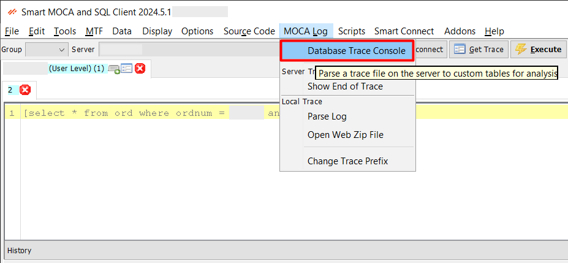
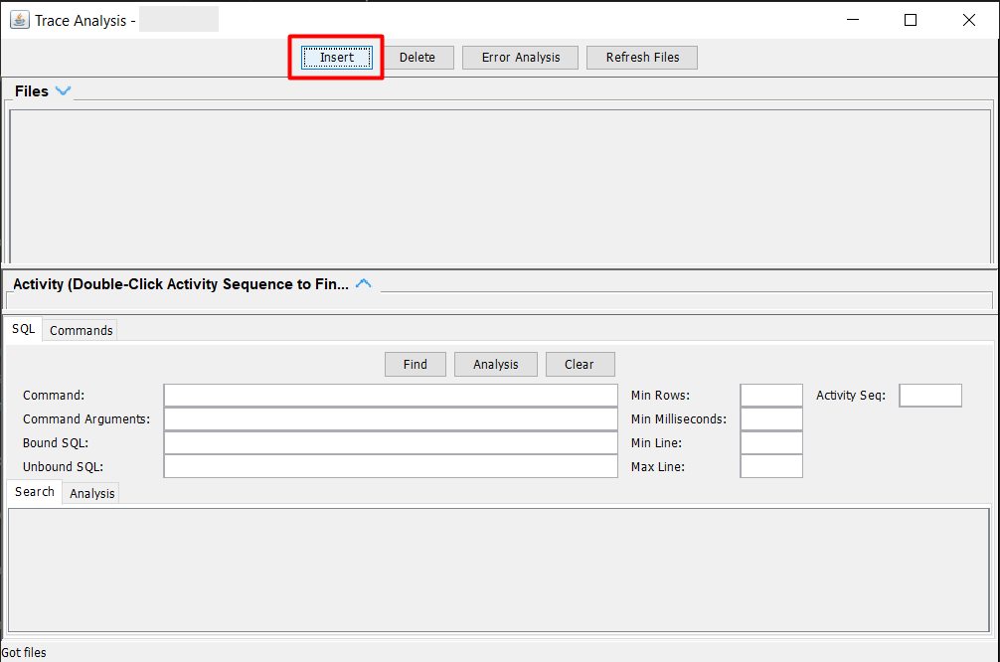

## Database Trace

**Database Tracing** is a powerful diagnostic feature that allows users to monitor and analyze database operations in real time. It helps in tracking SQL queries, identifying performance issues, and capturing detailed logs of database activity for troubleshooting and in-depth analysis.

- Navigate to **MOCALog** --> **Database Trace Console** to open **Trace Analysis** window.
  
  

- **Insert into DB**: 
  - Click on the **Insert** button in the **Trace Analysis** window.
  - Enter a **trace filename** (note: providing the full path to the log directory is not required).
  - After entering the filename, click **Insert into DB**.

  

  

- This action triggers the Log/Load into DB script, which performs the following:

  - Creates two temporary tables:
    - usr_temp_sql_trace_analysis
    - usr_temp_cmd_trace_analysis
  - Loads these tables with relevant entries from the specified trace file.

- **Load Recent:**
  - Click the Load Recent button to populate the trace selection dropdown.
  - This dropdown will display traces from the current day by default, allowing for quick access to the most recent entries.
   
  

- **Search Options:** 

  - Enable the **SQL?** checkbox to perform search operations in either of the temporary trace tables.

  - You can search using the following fields:

    - **Command:** usr_temp_cmd_trace_analysis.uc_cmd(Displays the command executed)

    - **Command Arguments:** usr_temp_cmd_trace_analysis.uc_args(Shows the arguments passed to the command)

    - **Bound SQL:** usr_temp_sql_trace_analysis.uc_bound_sql(SQL statements with all arguments and parameters bound)

    - **Unbound SQL:** usr_temp_sql_trace_analysis.uc_unbound_sql(SQL statements as written before parameter binding)

By leveraging these advanced DevOps features, users can efficiently manage files, maintain source code, handle change management, and perform comprehensive tracing and debugging within the Smart MOCA Client.

---
