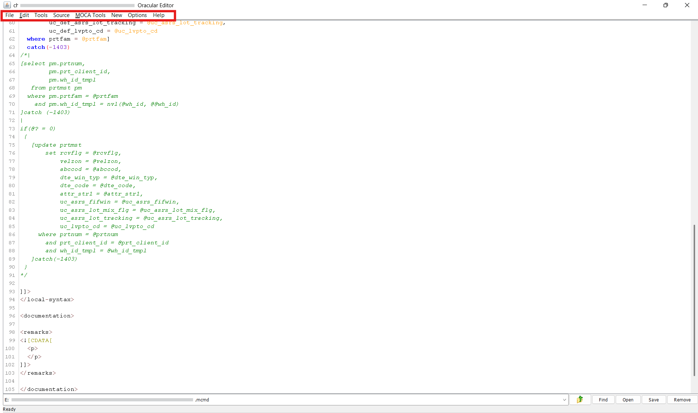

# Edit Server Files

Editing files within the Smart MOCA Client is a seamless process. Users can access files through the Edit Server Files option and modify them directly using the integrated text editor, which offers a user-friendly and efficient environment for file editing.

- Navigate to **Data** --> **Edit Server Files** or press **F2** to launch **File Browser**. 

  

- File Browser will get open where you can see all the directories and files.

- Refer to the [File-Browser](./file-browser.md) for a comprehensive guide on navigating and utilizing the File Browser effectively.

    

- You can then Open Command By Double Click on it.

- Key Features of the Built-in File Editor:
    - Provides syntax highlighting for improved readability and code clarity.
    - Displays line numbers to assist with navigation and referencing.
    - Supports efficient editing through a user-friendly interface.
    - Allows direct saving of changes to the file system without needing external tools.

    

### Functions in the File Browser

- At the top of the File Browser, several tabs are available to enhance user productivity:

    - **File:** Open, close, or save new and existing files.
    - **Edit:** Perform standard editing operations such as cut, copy, paste, convert text to uppercase or lowercase, and more.
    - **Tools:** Used for actions such as creating new directories.
    - **Source:** Allows users to shift text, convert character sets, or remove non-ASCII characters from the file content.
    - **MOCA Tools:** Offers options to add arguments, define exceptions, validate, and format MOCA commands.
    - **New:** Provides options to create new MOCA objects like commands, triggers, tables, and even modify schema by adding or dropping columns.
    - **Options:** Modify interface settings such as enabling enter key modifiers or adjusting font size multipliers.
    - **Help:** Provides assistance and reference material related to File Browser usage.

    

- **Upload/Download File**: These functions were developed to send files back and forth between a remote server if we did not have FTP access.

