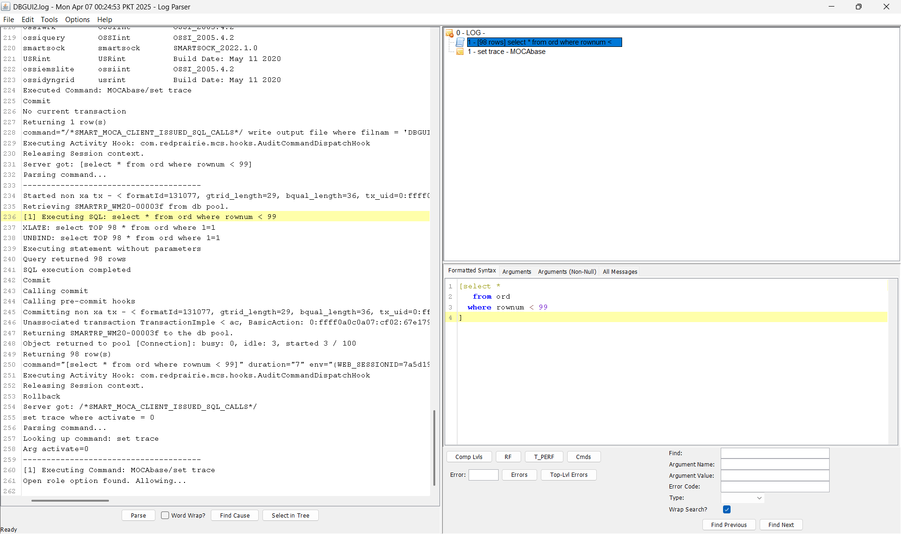
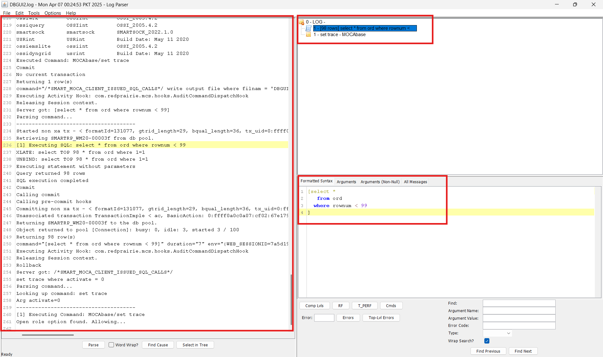
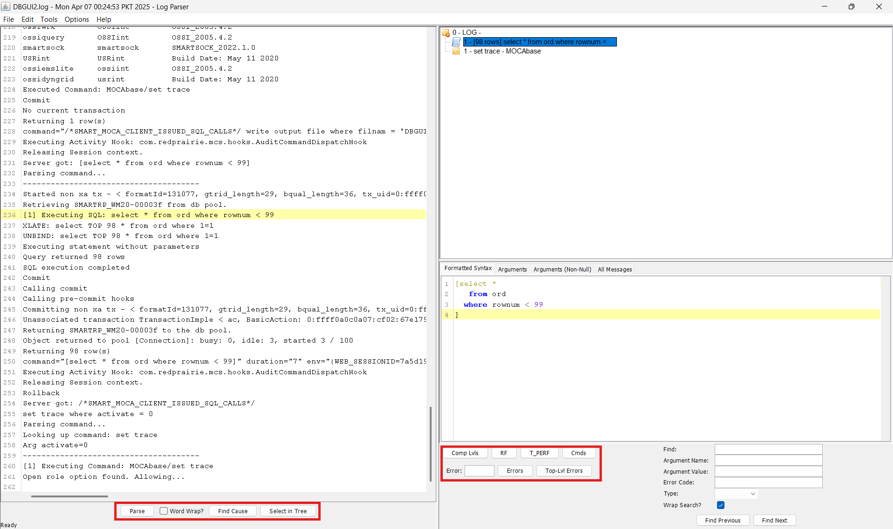
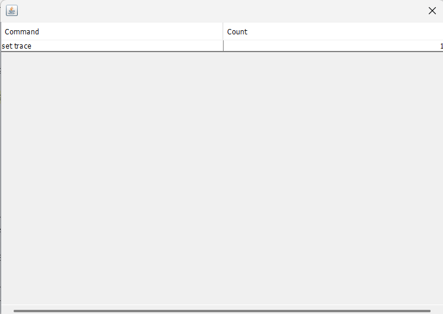
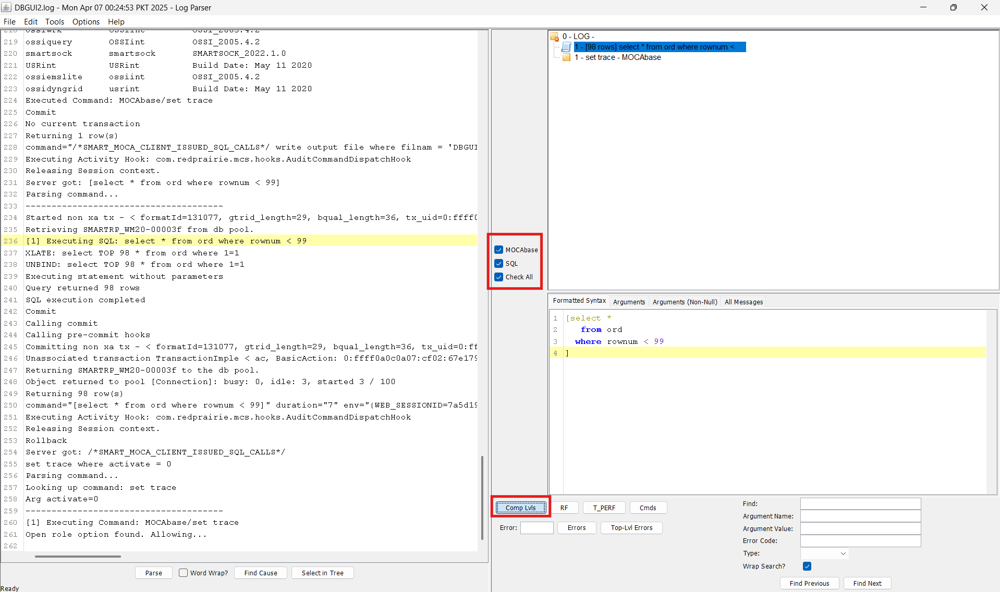
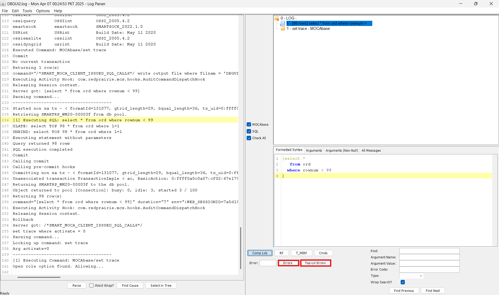
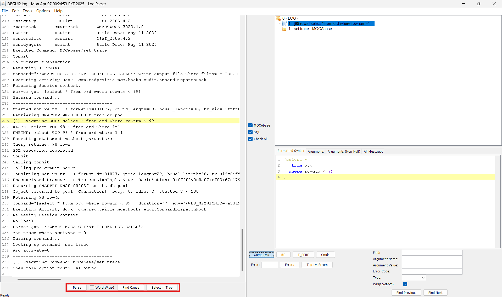
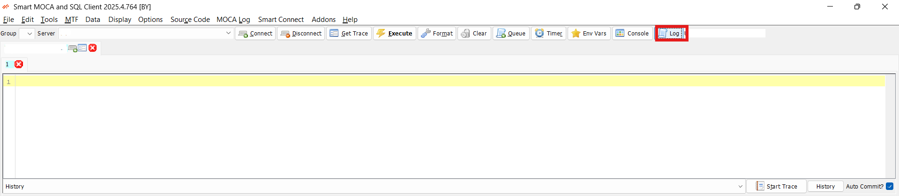
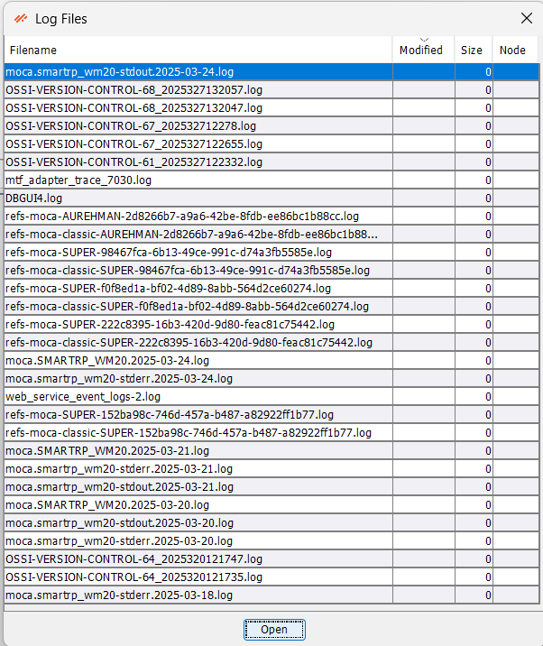

# Smart MOCA Trace

This section provides a step-by-step guide on how to generate and interpret a MOCA Trace. MOCA Trace is a powerful tool that allows developers and testers to understand the behavior of the system when a command is executed. It provides detailed, sequential logs which make it easier to identify issues, debug problems, and ensure system reliability.

There are three primary ways to generate a MOCA Trace:

1. By Clicking on **Start Trace** Button.
2. By entering the **Command** with the trace file name.
3. By using the **Log** button to open an existing trace file.

## Using Start Trace Button

- Click the **Start Trace** button to initiate trace recording. After that, execute the desired command that you want to trace.

    

- Once the command has been executed successfully, click on the **End Trace** button to stop trace.
    

- A confirmation dialog will appear. Click the **Yes** button to proceed. Your trace will now be generated and opened automatically.

    

### Understanding the Trace Output

- Uncheck all enabled **checkboxes** in both dialog windows.

- Click on the **Clear** button to remove previously stored data or settings.

    
    

- After clearing the checkboxes, click **OK** to proceed to the main trace view.

    

### Main Components of the Trace Window

1. **Console Trace (Left Panel):** Displays a sequential log of console events and asynchronous calls. This helps in debugging and understanding the backend activity.

2. **Command Hierarchy (Top Right Grid):** Shows the list of executed commands in a hierarchical structure along with their execution status. Commands can be expanded to view nested executions.

3. **Detailed Tabs (Bottom Right Grid):** This section includes several tabs:
    - **Format Syntax:** Displays the formatted syntax of the command.
    - **Arguments:** Lists all the arguments passed in the command.
    - **Arguments (Not Null):** Shows only those arguments which have assigned values.
    - **All Messages:** Displays all system messages generated during execution.

    

### Additional Trace Tools

- At the bottom of the Trace window, you’ll find additional buttons for in-depth analysis:

    - Comp Lvl: View or adjust trace component levels.
    - RF: Related to RF functionality.
    - T_PERF: Displays performance-related metrics.
    - Cmds: Lists all executed commands and their execution count.
    - Error/Top-lvl Error: Displays error messages generated during execution.
    - Search Functionality: Allows you to search within trace data.
    - Parse: Opens the parse log; you may need to uncheck default selections here.
    - Find Clause: Helps locate the root cause of failure.
    - Select in Tree: Highlights the selected command in the execution hierarchy tree.

    

**Examples:**
- **CMDs:** Displays all executed commands and the number of times each was called.

    

- **Comp lvls:** Allows you to check or uncheck trace levels based on your analysis needs.

    

- **Errors** and **Top-lvl Error:** Lists all errors and top-level failures that occurred during execution.

    

- Parse, Find Cause & Select Tree:

    - Parse: Opens parse logs with configurable checkboxes.
    - Find Cause: Pinpoints the exact cause of failure.
    - Select Tree: Displays the command's execution tree in the log window.

    

## Using the Command line

- You can manually write and execute a MOCA command that includes the trace file name to directly open the trace log.

    

- Once the command is executed, the trace will open automatically.

- For understanding the trace layout and tools, follow the same steps explained earlier in [Steps for Trace Understading](#understanding-the-trace-output).

## Using the Log Button

- Click on the **Log** button to open an existing trace file from your system.

    

- A file dialog will appear. Browse and select the desired trace file, then click **Open**.

    

- Once the log file is opened, the trace view will load.

- Refer again to the [Steps for Trace Understading](#understanding-the-trace-output) for detailed instructions on navigating and analyzing the trace.

