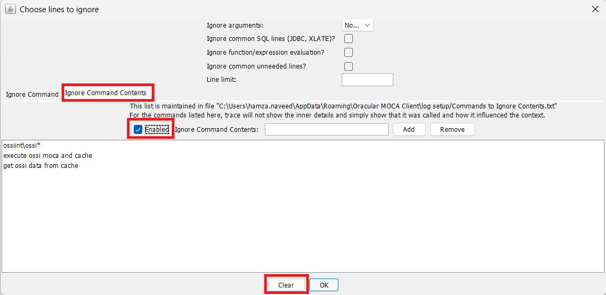
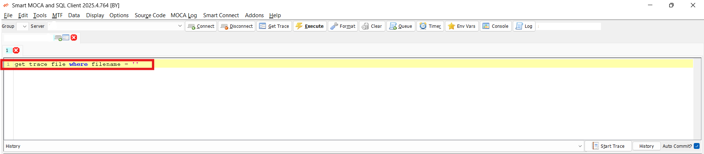

# Smart MOCA Trace

This section will guide you how to get Trace in MOCA. It helps us understand what’s happening in the system when a command runs. It shows step-by-step details, making it easier to find issues and fix them.

Following are the three steps for MOCA Trace.
1. By Clicking on **Start Trace** Button.
2. By Entering **Command**.
3. By **Log** Button.

## Using Start Trace Button

- Click on the **Start Trace** Button and execute Command for taking it's Trace.

    

- Once your Command executes succesfully then **End Trace**.

    

- A Dialog box will appear. Click on **Yes** button and your trace will be open.

    

### Steps for Trace Understading
- You can then uncheck the checkboxes and **clear** them using **clear** button on both dialog boxes.

    
    

- After clearing all of these, click on the **OK** button.

    

- There are three main components for explaining Trace.

    - On left side we have console trace which outputs the sequence of calls and asynchronous events leading to the current console used for debugging and understanding what is happening in your code.

    - On the right top grid, there is hierarchy of executed commands with execution status which can be expanded.

    - On the right bottom grid, we have below tabs:
        - Format syntax: Used for Formating syntax of the command.
        - Arguments: Shows all the Arguments that are used in it.
        - Arguments (Not-Null): Shows Arguments that have some value stored in it which are not null.
        - All Messages: Shows All the messages.

    

- Then we have some other functions at the bottom like:
    - Comp Lvl
    - RF
    - T_PERF
    - Cmds
    - Error
    - Search Functionality
    - Parse
    - Find Clause
    - Select in Tree etc.

    

- **CMDs** button can have the commands that are executed and the number of counts of these commands.

    

- **Comp lvls** button can have the levels for checking Trace check or uncheck levels that you want.

    

- **Errors** and **Top-lvl Error** buttons can show the errors in a log which are generated in the execution of commands.

    

- The **Parse** button will show you the Parse log where you have to uncheck the checked boxes.
- The **Find Cause** button will show you the exact cause of failure.
- **Select Tree** button will show you the execution tree in the log window.

    

## Using Command

- Write Command and place Trace filename inside it for opening Trace.

    

- After writing command and execute it Trace will be open.

- Follow [Steps for Trace Understading](./MOCA_Trace.md) again for understading of MOCA Trace.

## Using Log Button

- Click on the **log** button.

    

- A dialog box appears, Select your file and click on **Open**.

    

- After opening Log file Trace will be open.

- Follow [Steps for Trace Understading](./MOCA_Trace.md) again for understading of MOCA Trace.

