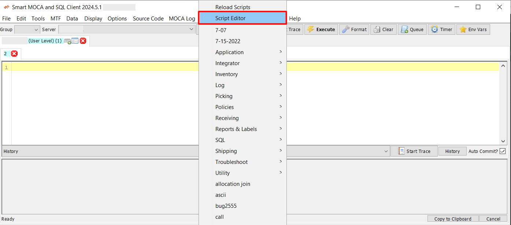

## Adhoc Access

The **Adhoc Access** feature in Smart MOCA Client provides users with the ability to execute commands, trace activities, and manage scripts efficiently. 

This documentation outlines the various functionalities and steps involved in using Adhoc Access.

## Executing Commands

- Type a command in the text box and hit **ENTER**, **Alt-E**, **F5**, or click the **Execute** button to execute. The status bar below will change to “Executing…” and will change again when execution is complete. 

  

- If any text is selected, that will be the command executed and not the entire contents of the text editor.

### Queue Command

Press **Queue Cmd** or **Ctrl-Q** to execute the next command immediately after the current one has ended.

  

### Cancelling Execution

Click the **Cancel** button in the lower-right corner of the screen. This will also cancel MLoad with CTL if running.

  

### Command Completion

Command completion was developed for commands that get a lot of use and can be successfully guessed, saving the user from typing the entire command out. 

- For example, if you begin your command with “[“, the program will guess that you are typing a select query and will fill out the command as “[select * from where rownum < 99]”. 
- If the guess is correct and you would like to accept the command as shown, hit **TAB**, and the caret will be moved to the position where you would enter the table name. 
- These stored commands are defined in `%ProgramData%\Oracular MOCA Client\MOCADev-Commands.txt`. 

## Controlling Adhoc Access

Controlling ad-hoc access is crucial for maintaining the security and integrity of your production environment. 

This section outlines how to use sys_audit and other security measures to monitor and control ad-hoc command executions.

### Monitoring Access with 'sys_audit'

The sys_audit system is designed to log and monitor all ad-hoc commands executed by users. This helps in keeping track of who is executing which commands, and when. 

  

Here's how you can utilize sys_audit for monitoring:

- **Enable Auditing:** Ensure that auditing is enabled in your system. This can usually be configured in the system settings or via specific configuration files.
- **Log Entries:** Each ad-hoc command executed is logged with details such as the username, command text, timestamp, and execution status. These logs can be reviewed to track user activities.
- **Regular Reviews:** Set up regular reviews of the audit logs to identify any suspicious or unauthorized activities. Automated alerts can also be configured for certain types of commands or access patterns.

### Controlling Production Access

Restricting ad-hoc access in production environments is essential to prevent unintended disruptions or security breaches. Here are some measures to control access:

- **Role-Based Access Control (RBAC):** Implement RBAC to ensure that only authorized users can execute ad-hoc commands in the production environment. Assign roles based on the principle of least privilege.
- **Access Policies:** Define and enforce access policies that specify who can perform ad-hoc executions and under what circumstances. These policies should be clearly documented and communicated to all users.
- **Approval Workflows:** Set up approval workflows for executing sensitive commands in production. This ensures that any potentially impactful commands are reviewed and approved by a designated authority before execution.
- **Logging and Alerts:** In addition to sys_audit, configure detailed logging and alert mechanisms for ad-hoc access. This includes real-time alerts for unauthorized access attempts or execution of high-risk commands.

By effectively monitoring and controlling ad-hoc access, you can maintain a secure and stable production environment, minimize the risk of unauthorized activities, and ensure compliance with organizational policies and standards.

## Scripts

The Scripts Concept in Smart MOCA Client allows users to streamline their workflow by creating and executing custom scripts. This functionality enhances productivity by automating repetitive tasks and providing quick access to commonly used commands.

Below, we explore various aspects of the Scripts Concept, including running shortcuts via #, script storage, and adding new scripts.

### Executing Shortcuts

The Smart MOCA Client supports running predefined shortcuts for frequently used commands using the `#` symbol. This feature saves time by allowing users to execute complex commands with simple, memorable shortcuts.

- To run a shortcut, type `#` followed by the shortcut name in the command text box and press ENTER. For example, typing #myShortcut will execute the command associated with myShortcut. 
  
  

### Where are the Scripts stored?

Scripts are stored in the `%ProgramData%\Oracular MOCA Client\Scripts` directory.

- This directory contains all user-created scripts and any predefined scripts provided with the application. Users can navigate to this directory to view, edit, or delete existing scripts.

### Adding New Scripts

Creating and adding new scripts to the Smart MOCA Client is straightforward. 

1. **Add file manually:**

    Script can be created manually by following below steps:

   - Navigate to the script storage directory: %ProgramData%\Oracular MOCA Client\Scripts.
   - Create a new text file with a .msql extension and save it. For example, 'Find_Command#cmd.msql'.
   - The file will have some of MOCA commands or script logic. Each line can contain a separate command or part of your script logic.

2. **Script Editor:**

    The Script Editor includes functionalities for saving scripts in groups, viewing script directory content, and saving scripts as macros.

    Script can be created manually by following below steps:

   - Navigate to the Script Editor from the Scripts menu and select "Script Editor" to open the editor interface.
  
      

   - In the editor window, type your script (i.e. MOCA commands or any custom script logic). The editor supports syntax highlighting and real-time error checking to ensure your scripts are accurate.
   - After writing your script, Assign a name to your script in text box, choose group from the provided list and press Save button.

      

### Viewing Script Directory Content

The Script Editor includes a directory viewer on the left side of the interface, displaying the content of the Scripts folder.

- The directory viewer shows all scripts stored in %ProgramData%\Oracular MOCA Client\Scripts.
- You can navigate through folders, view existing scripts, and organize your script files.
- Click on any script in the directory viewer to open it in the editor.
This allows you to quickly edit existing scripts or review their content.

### Saving Scripts as Macros

The Script Editor enables users to save their scripts as macros, making them easily accessible for repeated use.

- Write your script in the editor.and press "Save as Macro" button to save script as macro.
- Assign a shortcut key or a macro name for quick execution in pop up.

  
  
- Macros can be executed using the assigned shortcut or by selecting them from the macros menu.

## Command History

### Normal History

- Access a list of previously executed commands for reference and re-execution.

### Advanced History - Database

- A detailed guide on storing and retrieving command history from a database.

### Resultsets

- Manage and view the results of executed commands for analysis and reporting.

## Find Dialogs

### Main Find

- Use the main find dialog to search for commands, policies, and DDAs by filename or text content.

### Advanced Find

- Utilize advanced options to refine searches and locate specific commands or files.

### Right-click on File

- Find commands and options by right-clicking on files within the application.

## Trace Files

To turn on trace mode for a tab, hit **Alt-T** or click the **Start Trace** button in the center of the tab. Then, execute commands as normal until you are ready to stop tracing. Hit **Alt-T** again or click the **Stop Trace** button. You will be asked if you want to get the trace file now. If you select yes, the table will be filled with the trace file. All trace levels are included in the file. The index of a tab can be seen in the tooltip text of the “Start Trace” button. If the trace file is too large to be quickly opened, you will be given the option to retrieve the last X bytes of the file.

### Insert Trace into DB

Use the menu option **MOCA Log -> Database Trace with Script** to insert the trace into the database.

## Real-time Formatting

Use the menu option **Options -> Format in real-time?** to enable real-time formatting of c
