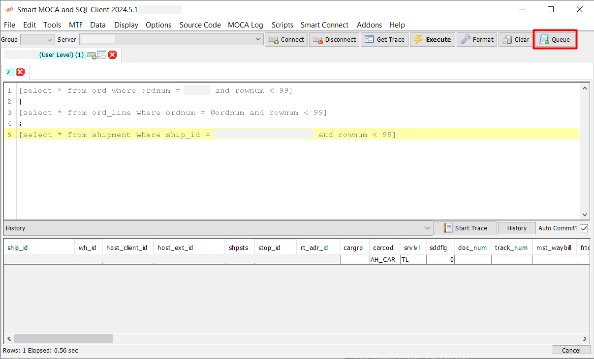
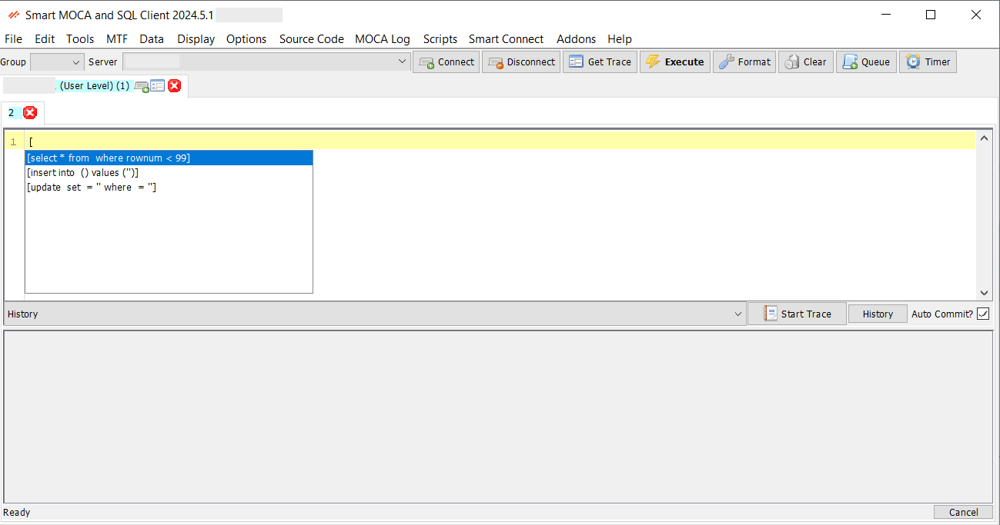
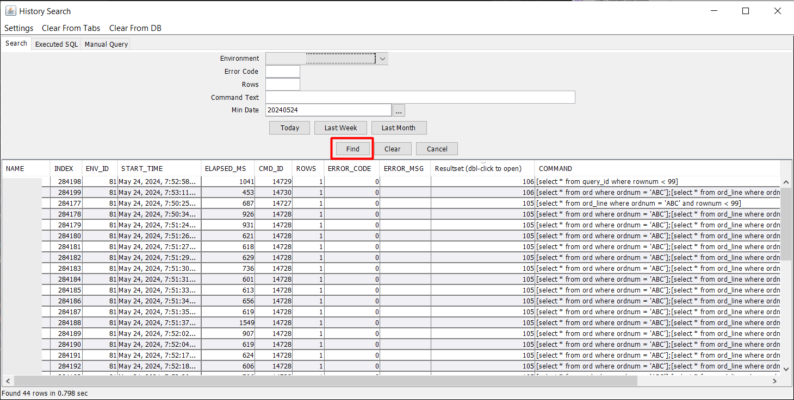

## Adhoc Access

The **Adhoc Access** feature in Smart MOCA Client provides users with the ability to execute commands, trace activities, and manage scripts efficiently. 

This documentation outlines the various functionalities and steps involved in using Adhoc Access.

## Command Execution and Formatting

Type a command in the text box and hit **ENTER**, **Alt-E**, **F5**, or click the **Execute** button to execute. The status bar below will change to “Executing…” and will change again when execution is complete. 

  

If any text is selected, that will be the command executed and not the entire contents of the text editor.

### Queue Command

Press **Queue Cmd** or **Ctrl-Q** to execute the next command immediately after the current one has ended.

  

### Cancelling Execution

Click the **Cancel** button in the lower-right corner of the screen. This will also cancel MLoad with CTL if running.

  

### Command Formatting

This feature helps maintain clean and standardized code, reducing errors and improving collaboration among developers. Users can format their code automatically according to predefined style guidelines. 

- **SQL Format**: SQL format can be switch using this option.

### Real-time formatting

Use menu option Options->Format in real-time?

---

## Command Completion

Command completion was developed for commands that get a lot of use and can be successfully guessed, saving the user from typing the entire command out. 

- For example, if you begin your command with “[“, the program will guess that you are typing a select query and will fill out the command as “[select * from where rownum < 99]”. 

  

- If the guess is correct and you would like to accept the command as shown, hit **TAB**, and the caret will be moved to the position where you would enter the table name. 
- These stored commands are defined in `%APPDATA%\Oracular MOCA Client\MOCADev-Commands.txt`. 

---

## Grid Functions

- **Ctrl-R:** Copy results to clipboard as "publish data" commands
- **Ctrl-I:** Copy results to clipboard as insert statements
- **Ctrl-U:** Copy results to clipboard as "sl_change gen_maint" commands

---

## Smart MOCA Client Editor

Smart Moca Client Editor" feature, details the keybindings and the functionalities available through the right-click popup menu within the text editor. Each menu option is explained with its behavior and conditions for usage.

### Keys

- **Ctrl-Left**: Shift Left
- **Ctrl-Right**: Shift Right

### Popup Menu

Right-click on the text area with some cells selected to access various options for inserting table data as text. 

Each function operates on the selected cells as described below:

#### TAB Key

- Before a where clause:
  - Adds ` = '' and `
  - If Shift is held, adds ` like '%' and `
  
- At the end of a single-quote terminated string:
  - Adds ` and = ''`
  - If Shift is held, adds ` and like '%'`
  
- String handling:
  - If there is a string like `''` or `'%'` ahead on the line, places the caret inside the string
  
- Shift held at the end of a column name (e.g., dtlnum| = ''):
  - Turns into `dtlnum = @dtlnum|`

#### Add Clause

- Inserts `and <column_name> = <value>` for each cell selected in the row.
- If multiple rows of the same column are selected, an `in` clause will be added instead.

#### Add Columns

- Inserts a comma-separated list of the selected column names in the table.

#### Add Values

- Inserts a comma-separated list of the selected values in the table.

#### Update Columns

- If the TextArea contains a `select` statement, this appends `| and sl_change gen_maint where pk_upper_case = 0 and table_name = '<table>'` plus any selected values from the table.

#### Get Command Arguments

- Select a command and this will find the `.mcmd` file and add all the arguments it finds.

#### Join to Another Table

- Select one table, choose this, and a list of tables will pop up to join to. You have the option to give the new table an alias.

#### Join Tables

- Select two or more tables, and a join by primary key will be appended if possible.
- If the names are separated by "join", it will use join syntax. If they are separated by ",", you will be asked which syntax you want.

#### Select Table by PK

- Adds the primary key (PK) as a clause with MOCA variables.

#### Explain Query

- Select a bit of SQL and choose this option to explain the query.

#### Paste In Clause

- Inserts copied values in the form of `IN` clause.

---

## Variable Commands

These are scripts that show up for use when right clicking the grid for certain variables.

- Stored in `%appdata%\Oracular MOCA Client\Var Commands`
- Actions for prtnum, ordnum, ship_id, etc are already defined.

  

- When right-clicking in the grid, if there are scripts in Var Commands\<varnam>, they will show up as menu items as seen above. 
- When you select the item, the tab’s text area will be filled in with the script, using the selected value.
- Columns can be designated as aliases of a different column by creating a file named “alias.txt” in the directory and specifying the column name to look for the scripts. For example, the “dstsub” directory will have a alias.txt file containing “subnum”.

## Tracing

MOCA Trace provides a detailed, step-by-step log of system activity during command execution. It’s used for debugging, analyzing performance, and understanding system behavior through an interactive interface with powerful diagnostic tools.

To learn more about Moca Trace, follow [Database Trace](./database-trace.md)

---

## Controlling Adhoc Access

Controlling ad-hoc access is crucial for maintaining the security and integrity of your production environment. 

This section outlines how to use sys_audit and other security measures to monitor and control ad-hoc command executions.

### Monitoring Access with 'sys_audit'

The sys_audit system is designed to log and monitor all ad-hoc commands executed by users. This helps in keeping track of who is executing which commands, and when. 

  

Here's how you can utilize sys_audit for monitoring:

- **Enable Auditing:** Ensure that auditing is enabled in your system. This can usually be configured in the system settings or via specific configuration files.
- **Log Entries:** Each ad-hoc command executed is logged with details such as the username, command text, timestamp, and execution status. These logs can be reviewed to track user activities.
- **Regular Reviews:** Set up regular reviews of the audit logs to identify any suspicious or unauthorized activities. Automated alerts can also be configured for certain types of commands or access patterns.

### Controlling Production Access

Restricting ad-hoc access in production environments is essential to prevent unintended disruptions or security breaches. Here are some measures to control access:

- **Role-Based Access Control (RBAC):** Implement RBAC to ensure that only authorized users can execute ad-hoc commands in the production environment. Assign roles based on the principle of least privilege.
- **Access Policies:** Define and enforce access policies that specify who can perform ad-hoc executions and under what circumstances. These policies should be clearly documented and communicated to all users.
- **Approval Workflows:** Set up approval workflows for executing sensitive commands in production. This ensures that any potentially impactful commands are reviewed and approved by a designated authority before execution.
- **Logging and Alerts:** In addition to sys_audit, configure detailed logging and alert mechanisms for ad-hoc access. This includes real-time alerts for unauthorized access attempts or execution of high-risk commands.

By effectively monitoring and controlling ad-hoc access, you can maintain a secure and stable production environment, minimize the risk of unauthorized activities, and ensure compliance with organizational policies and standards.

---

## Scripts

The Scripts Concept in Smart MOCA Client allows users to streamline their workflow by creating and executing custom scripts. This functionality enhances productivity by automating repetitive tasks and providing quick access to commonly used commands.

Below, we explore various aspects of the Scripts Concept, including running shortcuts via #, script storage, and adding new scripts.

### Executing Shortcuts

The Smart MOCA Client supports running predefined shortcuts for frequently used commands using the `#` symbol. This feature saves time by allowing users to execute complex commands with simple, memorable shortcuts.

- To run a shortcut, type `#` followed by the shortcut name in the command text box and press ENTER (i.e. to run Find_Command#cmd.msql, type #cmd <command_name>, run #mbuild.msql by typing #mbuild). 
  
  

### Where are the Scripts stored?

Scripts are stored in the `%APPDATA%\Oracular MOCA Client\Scripts` directory.

- The directory contains all user-created scripts and any predefined scripts provided with the application. Users can navigate to this directory to view, edit, or delete existing scripts.
- Place custom scripts in the Usr-Scripts folder. If a custom script has the same path as a script in the Scripts folder, it will override it (just like RP's usrint cmd lvl).

### Adding New Scripts

Creating and adding new scripts to the Smart MOCA Client is straightforward. 

1. **Add file manually:**

    Script can be created manually by following below steps:

   - Navigate to the script storage directory: %ProgramData%\Oracular MOCA Client\Scripts.
   - Create a new text file with a .msql extension and save it. For example, 'Find_Command#cmd.msql'.
   - The file will have some of MOCA commands or script logic. Each line can contain a separate command or part of your script logic.

2. **Script Editor:**

    The Script Editor includes functionalities for saving scripts in groups, viewing script directory content, and saving scripts as macros.

    Script can be created manually by following below steps:

   - Navigate to the Script Editor from the Scripts menu and select "Script Editor" to open the editor interface.
  
      

   - In the editor window, type your script (i.e. MOCA commands or any custom script logic). The editor supports syntax highlighting and real-time error checking to ensure your scripts are accurate.
   - After writing your script, Assign a name to your script in text box, choose group from the provided list and press Save button.

      

### Viewing Script Directory Content

The Script Editor includes a directory viewer on the left side of the interface, displaying the content of the Scripts folder.

- The directory viewer shows all scripts stored in %ProgramData%\Oracular MOCA Client\Scripts.
- You can navigate through folders, view existing scripts, and organize your script files.
- Click on any script in the directory viewer to open it in the editor.
This allows you to quickly edit existing scripts or review their content.

### Saving Scripts as Macros

The Script Editor enables users to save their scripts as macros, making them easily accessible for repeated use.

- Write your script in the editor.and press "Save as Macro" button to save script as macro.
- Assign a shortcut key or a macro name for quick execution in pop up.

  
  
- Macros can be executed using the assigned shortcut or by selecting them from the macros menu.

---

## Command History

The Command History feature in Smart MOCA Client provides an efficient way to track, manage, and re-execute previously run commands. This tool enhances productivity by allowing users to easily access their command history, view resultsets, and leverage advanced history storage options.

1. Normal History

   The Normal History functionality allows users to quickly access a list of commands they have previously executed. This is particularly useful for re-executing common commands or referencing past commands for troubleshooting.

  - Navigate to the History combobox within the Smart MOCA Client interface. The drown down will get open with list of executed queries.

    

  - Select any command from the list to view its details or to re-execute it with a single click.

2. Advanced History

   The Smart MOCA Client enables users to see advanced history of executed commands and load commands directly from the command history. This feature streamlines the process of finding and re-executing past commands from database.

   

   You can also add [Additional Information](./menu-overview/file.md) to search data accordingly in History Search window.

3. Resultsets

   The Resultsets allows users to manage and view the results of executed commands. This is crucial for analyzing command outputs, generating reports, and making data-driven decisions.

  - After executing a command, the resultset is automatically saved and can be accessed from the Resultsets column in window grid by double clicking on it.

    

---

## Find Dialogs

The Find Dialogs feature in Smart MOCA Client provides powerful search capabilities to enhance user productivity by allowing efficient navigation and modification of text and files within the application. 

1. Find/Replace

   This feature is designed to help users quickly locate and replace text within the text editor.

  - Navigate to Edit --> [Find/Replace](./menu-overview/edit.md) or use the shortcut Ctrl+F.

    

2. Advanced Find

   The Advanced Find functionality, accessible via the 'Open Find Dialog' option, provides comprehensive search capabilities across various file types, commands, policies, and more.

  - Navigate to Tools --> [Open Find Dialog](./menu-overview/tools.md) to open Find window.

    
    

3. Right-click on File

   Find commands and their path by right-clicking on files within the application.

   

