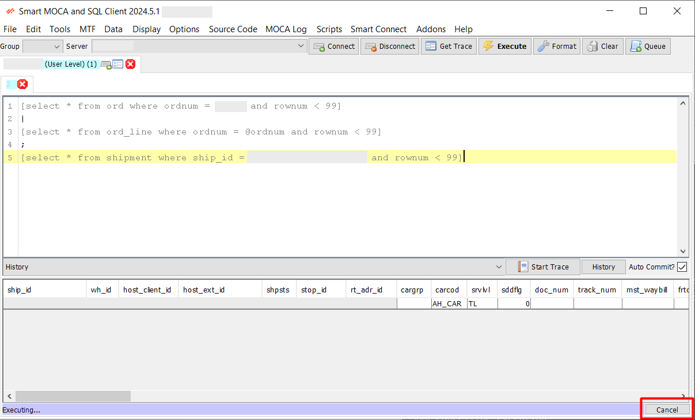

# Command Execution

Type a command in the text box and hit **ENTER**, **Alt+E**, **F5**, or click the **Execute** button to execute. The status bar below will change to “Executing…” and will change again when execution is complete. 

  

If any text is selected, that will be the command executed and not the entire contents of the text editor.

## Queue Command

Press **Queue Cmd** or **Ctrl+Q** to execute the next command immediately after the current one has ended.

  

## Cancelling Execution

Click the **Cancel** button in the lower-right corner of the screen. This will also cancel MLoad with CTL if running.

  

# Command Formatting

This feature helps maintain clean and standardized code, reducing errors and improving collaboration among developers. Users can format their code automatically according to predefined style guidelines. 

- **SQL Format**: SQL format can be switch using this option.

## Real-time formatting

Use menu option Options->Format in real-time?

