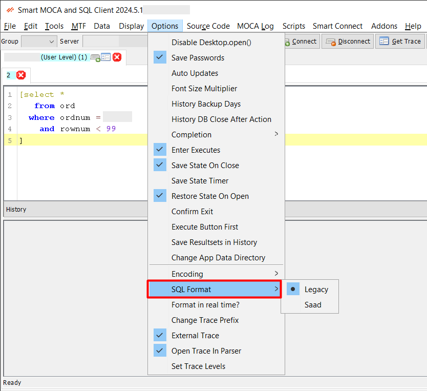

# Command Formatting

This feature helps maintain clean and standardized code, reducing errors and improving collaboration among developers. Users can format their code automatically according to predefined style guidelines. 

- **SQL Format**: SQL format can be switch using this option.

## Real-time formatting

Use menu option Options->Format in real-time?

