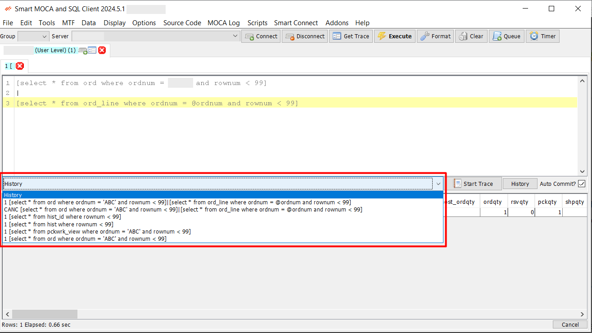
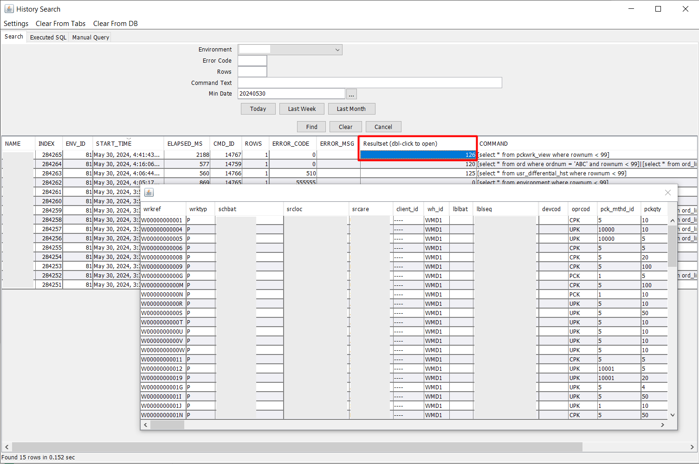

# Command History

The Command History feature in Smart MOCA Client provides an efficient way to track, manage, and re-execute previously run commands. This tool enhances productivity by allowing users to easily access their command history, view resultsets, and leverage advanced history storage options.

1. **Normal History**

   The Normal History functionality allows users to quickly access a list of commands they have previously executed. This is particularly useful for re-executing common commands or referencing past commands for troubleshooting.

  - Navigate to the History combobox within the Smart MOCA Client interface. The drown down will get open with list of executed queries.

    

  - Select any command from the list to view its details or to re-execute it with a single click.

2. **Advanced History**

   The Smart MOCA Client enables users to see advanced history of executed commands and load commands directly from the command history. This feature streamlines the process of finding and re-executing past commands from database.

   

   You can also add [Additional Information](./menu-overview/file.md) to search data accordingly in History Search window.

3. **Resultsets**

   The Resultsets allows users to manage and view the results of executed commands. This is crucial for analyzing command outputs, generating reports, and making data-driven decisions.

  - After executing a command, the resultset is automatically saved and can be accessed from the Resultsets column in window grid by double clicking on it.

    