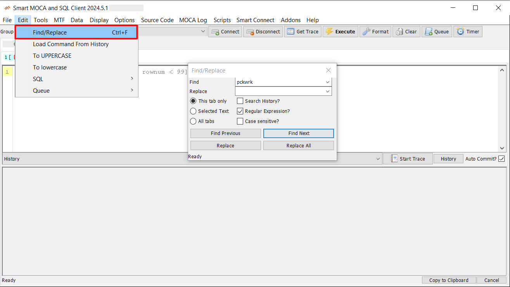

# Find Dialogs

The Find Dialogs feature in Smart MOCA Client provides powerful search capabilities to enhance user productivity by allowing efficient navigation and modification of text and files within the application. 

1. **Find/Replace**

   This feature is designed to help users quickly locate and replace text within the text editor.

  - Navigate to Edit --> [Find/Replace](./menu-overview/edit.md) or use the shortcut Ctrl+F.

    

2. **Advanced Find**

   The Advanced Find functionality, accessible via the 'Open Find Dialog' option, provides comprehensive search capabilities across various file types, commands, policies, and more.

  - Navigate to Tools --> [Open Find Dialog](./menu-overview/tools.md) to open Find window.

    
    

3. **Right-click on File**

   Find commands and their path by right-clicking on files within the application.

   