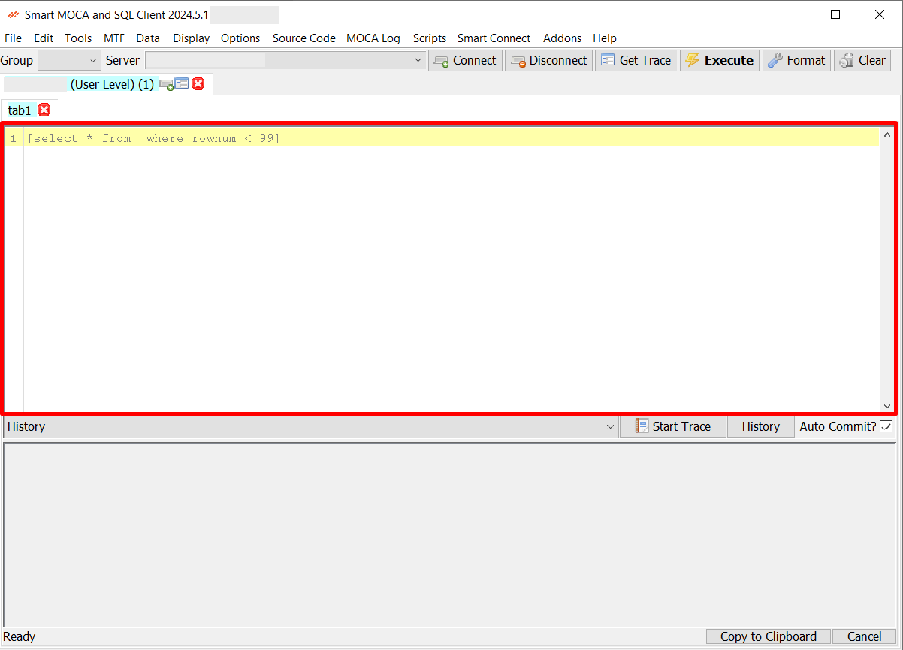
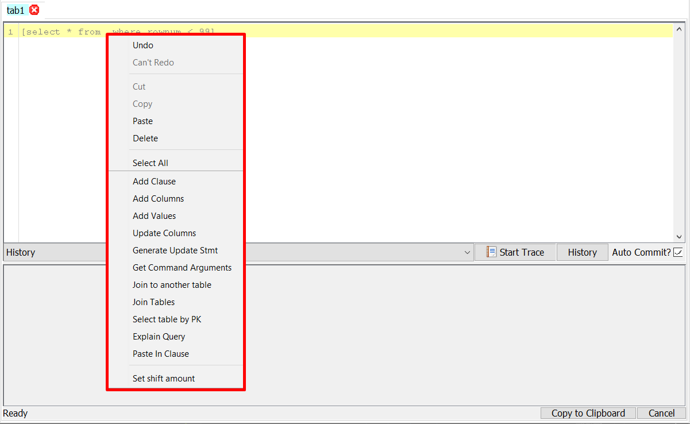
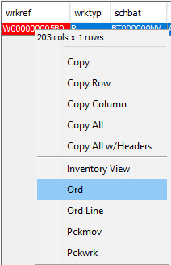

# Smart MOCA Client Editor

Smart Moca Client Editor" feature, details the keybindings and the functionalities available through the right-click popup menu within the text editor. Each menu option is explained with its behavior and conditions for usage.

## Functional Keys for Editor

| Key             | Function                                     |
|-----------------|----------------------------------------------|
| **Ctrl+Left**       | Shift Left                               |
| **Ctrl+Right**      | Shift Right                              |

## Functional Keys for Grid

| Key             | Function                                     |
|-----------------|----------------------------------------------|
| **Ctrl+R**         | Copy results to clipboard as "publish data" commands                                |
| **Ctrl+I**         | Copy results to clipboard as insert statements                              |
| **Ctrl+U**         | Copy results to clipboard as "sl_change gen_maint" commands                              |

---

## Popup Menu

Right-click on the text area with some cells selected to access various options for inserting table data as text. 

Each function operates on the selected cells as described below:

### Add Clause

- Inserts `and <column_name> = <value>` for each cell selected in the row.
- If multiple rows of the same column are selected, an `in` clause will be added instead.

### Add Columns

- Inserts a comma-separated list of the selected column names in the table.

### Add Values

- Inserts a comma-separated list of the selected values in the table.

### Update Columns

- If the TextArea contains a `select` statement, this appends `| and sl_change gen_maint where pk_upper_case = 0 and table_name = '<table>'` plus any selected values from the table.

### Get Command Arguments

- Select a command and this will find the `.mcmd` file and add all the arguments it finds.

### Join to Another Table

- Select one table, choose this, and a list of tables will pop up to join to. You have the option to give the new table an alias.

### Join Tables

- Select two or more tables, and a join by primary key will be appended if possible.
- If the names are separated by "join", it will use join syntax. If they are separated by ",", you will be asked which syntax you want.

### Select Table by PK

- Adds the primary key (PK) as a clause with MOCA variables.

### Explain Query

- Select a bit of SQL and choose this option to explain the query.

### Paste In Clause

- Inserts copied values in the form of `IN` clause.

---

## Variable Commands

These are scripts that show up for use when right clicking the grid for certain variables.

- Stored in `%appdata%\Oracular MOCA Client\Var Commands`
- Actions for prtnum, ordnum, ship_id, etc are already defined.

  

- When right-clicking in the grid, if there are scripts in Var Commands\<varnam>, they will show up as menu items as seen above. 
- When you select the item, the tab’s text area will be filled in with the script, using the selected value.
- Columns can be designated as aliases of a different column by creating a file named “alias.txt” in the directory and specifying the column name to look for the scripts. For example, the “dstsub” directory will have a alias.txt file containing “subnum”.