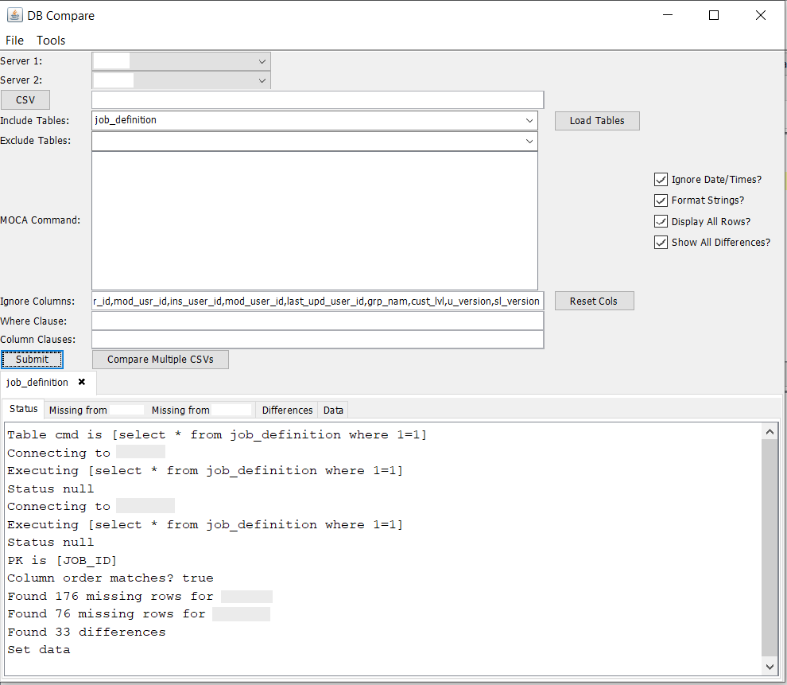
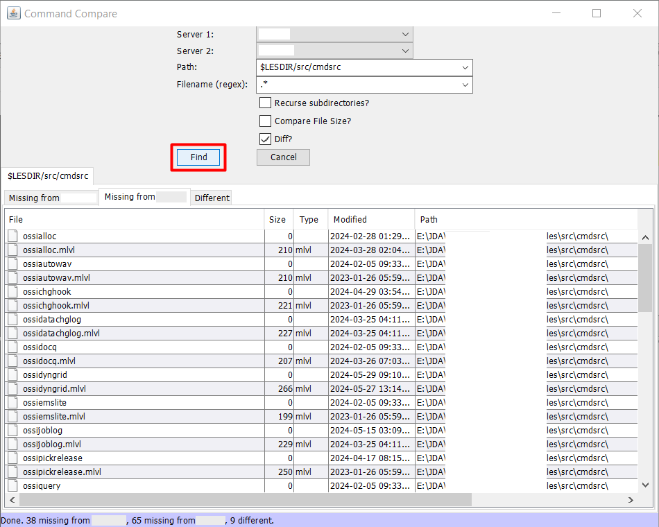
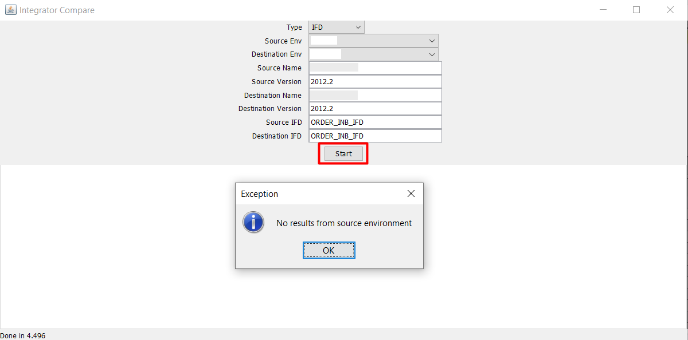
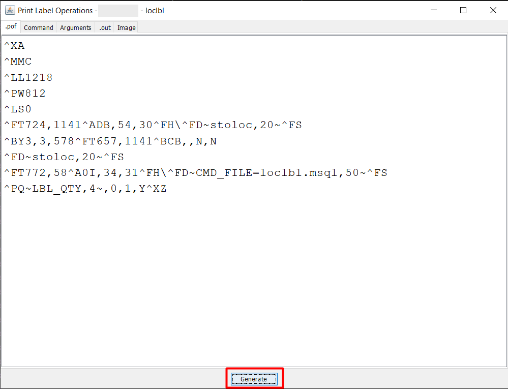

# Advance System Operations

The Advanced System Operations in the Smart MOCA Client offer a comprehensive suite of tools designed to enhance productivity, improve data management, and streamline various tasks. This section outlines the key features available under Advanced System Operations.

## File Browser

The File Browser in the Smart MOCA Client provides a comprehensive set of functionalities that support efficient file navigation, organization, and management.

### File Navigation

- Navigate to **Data** --> **Edit Server Files** or press **F2** to launch **File Browser**. 

  

- File Browser will get open where you can see all the directories and files.

- Within this window, users can easily view and manage **Files**, **Folders**, **Commands**, **Reports**, **Logs**, and more.

  

### File Structure

- The start directory is $LESDIR/src/cmdsrc.
- Within this directory, you’ll find key subfolders such as: 

    - **usrint:** Contains all custom commands developed by users for project-specific enhancements or extensions.

    - **varint:** Standard system commands provided by the application or created by system administrators. This directory should generally remain unmodified to maintain system stability.

    - **usrint.mlvl / varint.mlvl:** These define the command levels and execution sequences. For example, you can determine which custom or standard command runs first during a transaction or trigger.

    

To learn more about File browser, follow [File Browser](./file-browser.md).

---

## Oracular Editor

The Oracular Editor provides multiple ways to access and edit server-side files efficiently within the Smart MOCA Client. 

Below are three methods to open files:

1. **Using the Command Prompt** 
    - Enter **#cmd** followed by the file name. 
    - Once the file appears, right-click and select **"Open as file on server"** to launch it in the editor.

    

2. **Using the Edit Server Files Option** 
    - Navigate to **Data → Edit Server Files** or press **F2** to open the File Browser.

    

    - In the File Browser, browse through the directories and double-click on any command to open it in the editor.

    

3. **Using the Tools Menu** 

    - Go to **Tools → Open Find Dialog.**

    

  - In the dialog box, search by **command name**, **path**, or **file name**, then click **Find** to locate and open the file.

To learn more about Oracular Editor, follow [Edit server file](./file-browser.md#edit-server-files).

## Database Tracing

Database Tracing helps you track SQL activity in real time, making it easier to identify performance issues and troubleshoot database operations.

- Click the **Start Trace** button to initiate trace recording. After that, execute the desired command that you want to trace.

    

- Once the command has been executed successfully, click on the **End Trace** button to stop trace.
    

- A confirmation dialog will appear. Click the **Yes** button to proceed. Your trace will now be generated and opened automatically.

    

To learn more about Tracing, follow [Database Trace](./database-trace.md).

---

## Loading Data

The Smart MOCA Client provides robust features for loading data, accommodating both server-side and client-side operations. These features are designed to ensure efficient and seamless data loading processes.

### Server-Side MLoad (using mload.exe on the server)

The Server-side MLoad feature allows users to load data directly on the server using MLoad os commands. 

The .csv and .ctl file must reside on the server in db/data/load

- **Get Inserts/Updates/Result Set**: Get Inserts/Updates was developed to facilitate the moving of data from one environment to another. Get Inserts uses the active table to create an insert statement for each row of the table. Get Updates creates a sl_change gen_maint command for each row. All functions place the result in the clipboard for easy pasting to another window.

### Client-Side MLoad (NOT using mload.exe on the server) 

The Client-side Load feature provides several options for inserting, updating, loading, and unloading data within the current tab of the client interface.

- **MLoad current tab**: Allows you to load the data in the .csv’s selected into the environment of the current tab. Filenames are expected to be the table name to load, have the table name after 2 underscores (i.e. USR-DDA__dda_mst.csv), or have the table name then a dash (i.e prtmst-30870.csv). Any errors will displayed in a popup box.

- **MUnload current tab**: This works the same as MLoad, but removes the data instead.

- **MLoad with current tab as CTL**: Uses the tab’s text as though it were a .ctl file and processes each line of the file through it. This is useful for loading large CSVs as the entire file is not loaded, just line-by-line. The progress is shown in the status bar.

- **Get MLoad/MUnload commands**: Used for easily generating a script to load/unload.

---

## Compare

The Compare feature in the Smart MOCA Client enables users to compare various data sets and objects between different environments. This feature is essential for identifying discrepancies, ensuring data consistency, and facilitating migrations between environments. 
   
The Compare feature includes several specific options for different types of comparisons.

1. **DB Compare**: DB Compare allows users to compare missing or different data between two servers.
       
    - Navigate to Addons --> Smart Innovations --> Compare --> DB Compare. The DB Compare window will get open.

      

    - Now choose both servers and specify information on the basis of which you want comparison.

      

    - Review the comparison results to analyze discrepancies and ensure data consistency.
  
2. **Cmdsrc Compare**: CmdSrc Compare allows users to compare commands between two servers. This helps in identifying differences in command definitions and ensuring uniformity across environments.
       
    - Navigate to Addons --> Smart Innovations --> Compare --> Cmdsrc Compare. The Command Compare window will get open.

       

    - Now choose both servers and press 'Find' button. It will show the missing files on both servers in comparison to each other.

      

    - Review the comparison results to analyze discrepancies and ensure data consistency.

3. **Integrator Compare**: Integrator Compare allows users to compare integrator data between two environments. This is useful for ensuring that integrator configurations and data are consistent across different setups.
       
    - Navigate to Addons --> Smart Innovations --> Compare --> Integrator Compare. The Integrator Compare window will get open.

       

    - Now choose both servers and type of integrator object and then press 'Start' button. It will show the missing objects on both servers in comparison to each other.

      

    - Review the comparison results to analyze discrepancies and ensure data consistency.

4. **Integrator Migrator**: Integrator Migrator allows users to migrate integrator objects from one environment to another. This feature facilitates the transfer of integrator configurations and objects, ensuring that environments can be synchronized effectively.
       
    - Navigate to Addons --> Smart Innovations --> Compare --> Integrator Migrator. The Integrator Migrator window will get open.

       

    - Now choose both servers and type of integrator object and then press 'Start' button. It will migrate object from one server to another server.

      

    - Review the comparison results to analyze discrepancies and ensure data consistency.
  
---

## RP Console Tools
   
The RP Console in the Smart MOCA Client is a powerful tool designed for managing and interacting with the Reporting (RP) Console across multiple nodes of a cluster. It allows users to fetch console data from various nodes and consolidate it for comprehensive analysis and management.

- Navigate to **Addons --> Smart Innovations --> RP Console Tools**. The Console window will get open.

 

- The RP Console has an information regarding several segments: Connections, Sessions, DB Connections, and Native Processes.

 

---

## Report Preview

The Report Viewer in the Smart MOCA Client is a robust and user-friendly tool designed to facilitate the previewing of reports generated during report operations. This functionality allows users to review, verify, and validate the report’s layout, data content, and formatting before finalizing, publishing, or sharing it. By enabling a thorough preview, users can ensure accuracy and completeness, minimizing the risk of errors in the final output.

### Accessing Report Preview

- To open the Report Preview tool, navigate to the top menu and select:
    - **Addons → Smart Innovations → Report Preview**.

- This action will open the **Report Preview** window, where you can access and interact with available reports in your environment.

  

### Selecting and Previewing Reports

- In the Report Preview window, you will see a list of available reports.

- Select the report you wish to view by clicking on it from the list.

- If the report requires parameters (e.g., date range, document ID, or user input), fill in the necessary values in the designated fields.

- Once your selection and parameters are complete, click the **Preview** button.

  

### Viewing the Report

- After clicking Preview, the selected report will be rendered and displayed within the same window.

- You can scroll through the report using the vertical and horizontal scroll bars to examine each page and section in detail.

- This preview allows you to carefully review formatting, headers, footers, pagination, and the accuracy of the included data.

- If any adjustments are needed—such as correcting parameters, modifying layout, or updating content—you can return to the configuration screen, make changes, and re-preview the report before final submission or export.

  

---

## Print Label Operations

The Print Label Operations feature in the Smart MOCA Client enables users to generate and print labels with specified data, formats, and configurations. This functionality streamlines the label printing process by providing a user-friendly interface to define input parameters, preview the output, and ensure print accuracy before finalization.

It is especially useful in manufacturing, logistics, and inventory environments where label generation is frequent and accuracy is critical. 

### Accessing the Print Label Operations

- To access the label printing interface, navigate to the top menu:
    - **Addons** → **Smart Innovations** → **Print Label Operations**

- This will open the Labels window, where you can see a list of all available labels along with their:

    - Label Name
    - Format
    - Description
    - Default Printer

  

### Opening a Label for Printing

- In the Labels window, double-click on any label you wish to print.

- This will open the Print Label Operations window specific to that label.

  

### Generating and Previewing a Label

- In the Print Label Operations window, you’ll be prompted to enter specific arguments or commands required for generating the label. These arguments may include data such as:

    - Item codes
    - Batch numbers
    - Serial numbers
    - Quantities
    - Location codes

- After entering the necessary details, the corresponding label preview image will be displayed in the window.

  

- This preview helps you visually confirm that all data is placed correctly and formatted as expected, reducing the chance of errors during printing.

### Benefits of Print Label Operations

- Ensures accurate and consistent label printing
- Provides a live preview to verify label layout and content before printing
- Supports multiple formats and printers
- Simplifies the process of inputting required arguments through a clean and guided interface

This feature ensures high efficiency and accuracy in label printing workflows, allowing users to confidently generate and print labels with the correct information every time.

---

## ZPL Preview

The ZPL Viewer in the Smart MOCA Client is a powerful feature designed to help users preview the display of ZPL (Zebra Programming Language) label .out files. 

This tool allows for the visualization and adjustment of label output before sending it to a printer, ensuring accuracy and efficiency in label printing processes.

###  Accessing the ZPL Viewer

The ZPL Viewer can be accessed through multiple avenues within the Smart MOCA Client, providing flexibility and convenience for users. 

- Navigate to the location of the .out file using the File Browser/Find Dialog/#cmd.
- Right-click on the .out file. Select the 'View ZPL as label' option from the context menu to open the ZPL Viewer.

    

- Before previewing the label, the ZPL Viewer prompts you to send the file to a printer.

    

- By clicking 'No', ZPL viewer window will get open where you can see label output. You can also click the 'Display' button to generate and view the label preview.

    

By utilizing the ZPL Viewer, users can efficiently preview and adjust ZPL label outputs, reducing errors and ensuring high-quality label printing in their workflows.

Note: You can also use any online ZPL viewer like `Labelary` where you can see preview by pasting .out content in text window.

---