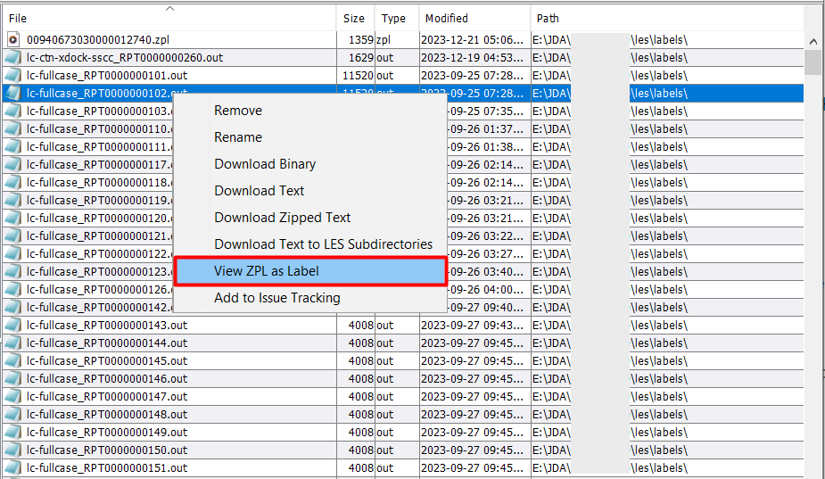
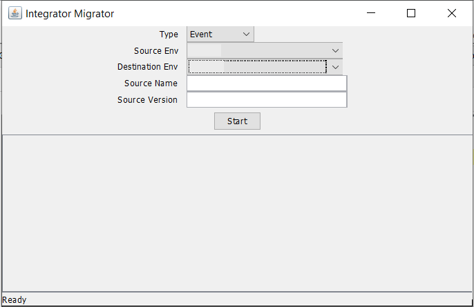

## Advance System Operations

The Advanced System Operations in the Smart MOCA Client offer a comprehensive suite of tools designed to enhance productivity, improve data management, and streamline various tasks. This section outlines the key features available under Advanced System Operations.

## File Browser

To enable the File Browser, please refer to the instructions provided in the [File Browser](./File-browser.md)

---

## Database Trace

To enable the Database Trace, please refer to the instructions provided in the [Database Trace](./Database-Trace.md)

---

## ZPL Preview

The ZPL Viewer in the Smart MOCA Client is a powerful feature designed to help users preview the display of ZPL (Zebra Programming Language) label .out files. 

This tool allows for the visualization and adjustment of label output before sending it to a printer, ensuring accuracy and efficiency in label printing processes.

###  Accessing the ZPL Viewer

The ZPL Viewer can be accessed through multiple avenues within the Smart MOCA Client, providing flexibility and convenience for users. 

- Navigate to the location of the .out file using the File Browser/Find Dialog/#cmd.
- Right-click on the .out file. Select the 'View ZPL as label' option from the context menu to open the ZPL Viewer.

    

- Before previewing the label, the ZPL Viewer prompts you to send the file to a printer.

    

- By clicking 'No', ZPL viewer window will get open where you can see label output. You can also click the 'Display' button to generate and view the label preview.

    

By utilizing the ZPL Viewer, users can efficiently preview and adjust ZPL label outputs, reducing errors and ensuring high-quality label printing in their workflows.

Note: You can also use any online ZPL viewer like `Labelary` where you can see preview by pasting .out content in text window.

---

## Loading Data

The Smart MOCA Client provides robust features for loading data, accommodating both server-side and client-side operations. These features are designed to ensure efficient and seamless data loading processes.

### Server-Side MLoad (using mload.exe on the server):

The Server-side MLoad feature allows users to load data directly on the server using MLoad os commands. 

The .csv and .ctl file must reside on the server in db/data/load

- **Get Inserts/Updates/Result Set**: Get Inserts/Updates was developed to facilitate the moving of data from one environment to another. Get Inserts uses the active table to create an insert statement for each row of the table. Get Updates creates a sl_change gen_maint command for each row. All functions place the result in the clipboard for easy pasting to another window.

### Client-Side MLoad (NOT using mload.exe on the server): 

The Client-side Load feature provides several options for inserting, updating, loading, and unloading data within the current tab of the client interface.

- **MLoad current tab**: Allows you to load the data in the .csv’s selected into the environment of the current tab. Filenames are expected to be the table name to load, have the table name after 2 underscores (i.e. USR-DDA__dda_mst.csv), or have the table name then a dash (i.e prtmst-30870.csv). Any errors will displayed in a popup box.

- **MUnload current tab**: This works the same as MLoad, but removes the data instead.

- **MLoad with current tab as CTL**: Uses the tab’s text as though it were a .ctl file and processes each line of the file through it. This is useful for loading large CSVs as the entire file is not loaded, just line-by-line. The progress is shown in the status bar.

- **Get MLoad/MUnload commands**: Used for easily generating a script to load/unload.

---

## Compare

The Compare feature in the Smart MOCA Client enables users to compare various data sets and objects between different environments. This feature is essential for identifying discrepancies, ensuring data consistency, and facilitating migrations between environments. 
   
The Compare feature includes several specific options for different types of comparisons.

1. **DB Compare**: DB Compare allows users to compare missing or different data between two servers.
       
    - Navigate to Addons --> Smart Innovations --> Compare --> DB Compare. The DB Compare window will get open.

      

    - Now choose both servers and specify information on the basis of which you want comparison.

      

    - Review the comparison results to analyze discrepancies and ensure data consistency.
  
2. **Cmdsrc Compare**: CmdSrc Compare allows users to compare commands between two servers. This helps in identifying differences in command definitions and ensuring uniformity across environments.
       
    - Navigate to Addons --> Smart Innovations --> Compare --> Cmdsrc Compare. The Command Compare window will get open.

       

    - Now choose both servers and press 'Find' button. It will show the missing files on both servers in comparison to each other.

      

    - Review the comparison results to analyze discrepancies and ensure data consistency.

3. **Integrator Compare**: Integrator Compare allows users to compare integrator data between two environments. This is useful for ensuring that integrator configurations and data are consistent across different setups.
       
    - Navigate to Addons --> Smart Innovations --> Compare --> Integrator Compare. The Integrator Compare window will get open.

       

    - Now choose both servers and type of integrator object and then press 'Start' button. It will show the missing objects on both servers in comparison to each other.

      

    - Review the comparison results to analyze discrepancies and ensure data consistency.

4. **Integrator Migrator**: Integrator Migrator allows users to migrate integrator objects from one environment to another. This feature facilitates the transfer of integrator configurations and objects, ensuring that environments can be synchronized effectively.
       
    - Navigate to Addons --> Smart Innovations --> Compare --> Integrator Migrator. The Integrator Migrator window will get open.

       

    - Now choose both servers and type of integrator object and then press 'Start' button. It will migrate object from one server to another server.

      

    - Review the comparison results to analyze discrepancies and ensure data consistency.
  
---

## RP Console
   
The RP Console in the Smart MOCA Client is a powerful tool designed for managing and interacting with the Reporting (RP) Console across multiple nodes of a cluster. It allows users to fetch console data from various nodes and consolidate it for comprehensive analysis and management.

- Navigate to Addons --> Smart Innovations --> RP Console Tools. The Console window will get open.

 

- The RP Console has an information regarding several segments: Connections, Sessions, DB Connections, and Native Processes.

 

---

## Report Preview

To enable the Report Preview, please refer to the instructions provided in the [Report Preview](./Report-Preview.md).

## Print Label Operations

To enable the Print Label Operations, please refer to the instructions provided in the [Print Label Operations](./Print-Label-Operations.md).

