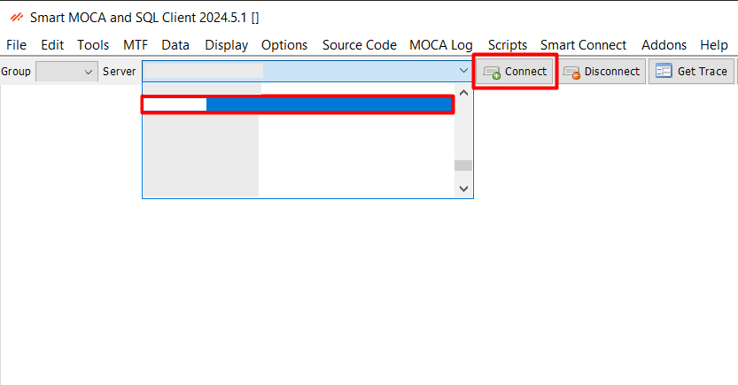
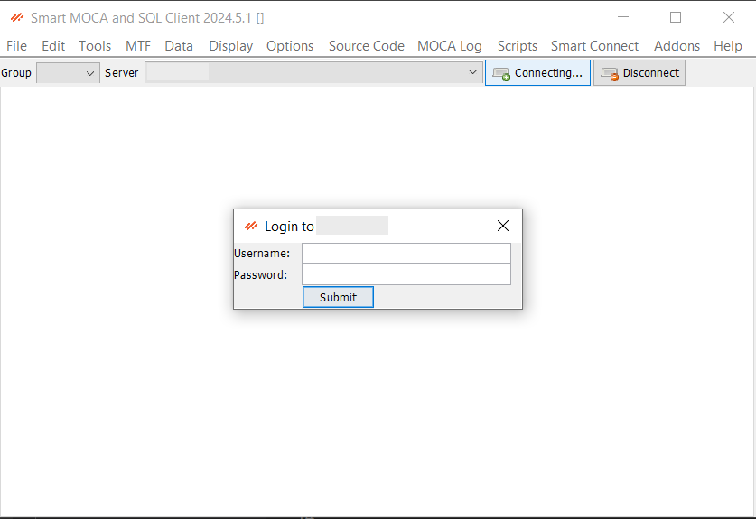
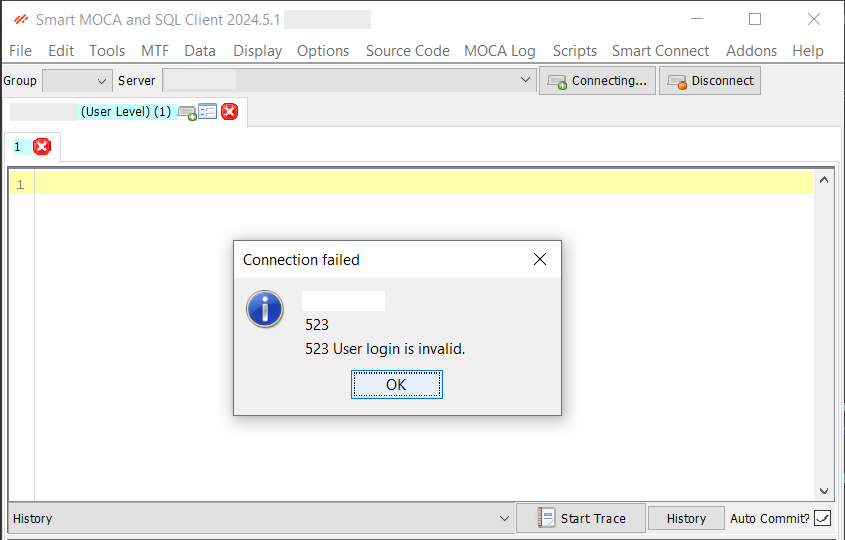

## Connections

Managing your connections efficiently is crucial for seamless access to your Blue Yonder data and other connected resources. 

This section will guide you through adding servers, and connecting to them.

### How to Connect?

- Choose a server name from the list loaded by the server dialog. 

  

- Click the Connect button or press Alt+C.

- If the server does have a username or password defined, you will be prompted to enter them. The program will attempt to make a connection. This may take some time.

  

- If the connection is successful, a new tab will open below.

  

- If the connection fails, a dialog will pop up indicating the error.

  

### Add/Update/Remove Server

Add, remove or modify server details by following below steps:

- Navigate to File -> Edit Servers to open the server configuration dialog. 

  
 
- This screen allows to manage connection information of servers. 
  
  
  
- To add/edit, simply choose Level as **User**, add server details and press “Add/Update” button.

  

- The server will be added successfully and it will be available in Server dropdown for connection.

  

**Important Note:** 

- The host URL structure should be in the proper format: `http(s)://<base BY instance>/service` (**/service** is mendatory).
- If a non-standard HTTP/HTTPS port is used, it must be included in the host URL (e.g., http://example.com:8080/service). If using standard ports, the port does not need to be entered.
- Servers already configured in RedPrairie will automatically load from the file `C:\Users\\%AppData%\Roaming\Oracular MOCA Client\DLXClientConfig.xml`
- Critical servers start with Auto-Commit turned off and the user is prompted to confirm each execution.

### Connection Grouping

Organize your connection groups to streamline the configuration and handling of multiple server connections. This ensures that you can easily manage your servers, perform necessary updates, and maintain consistent access to your data.

Follow [Connection Grouping](./menu-overview/file.md) to see complete section of connection grouping.

---

## Password Security

Smart MOCA Client ensures password security by prompting users to enter security key. 

### Pin on Startup

A pin functionality appears on startup to quickly access frequently used servers and settings. The security key acts like a master key to secure your saved passwords in case your computer is compromised for some reasons.

#### Usage

- If you have the security key set, you will be asked for it once on startup.
- If it maches then you will have an access to your saved passwords.
- If it does not match, then saved passwords cannot be used.

  

- If you do not set the security key, then you will not be able to save passwords.
- If you forget security key, you can reset it by entering a new value and mark 'Replace key?' checkbox, but existing saved passwords will be cleared.
