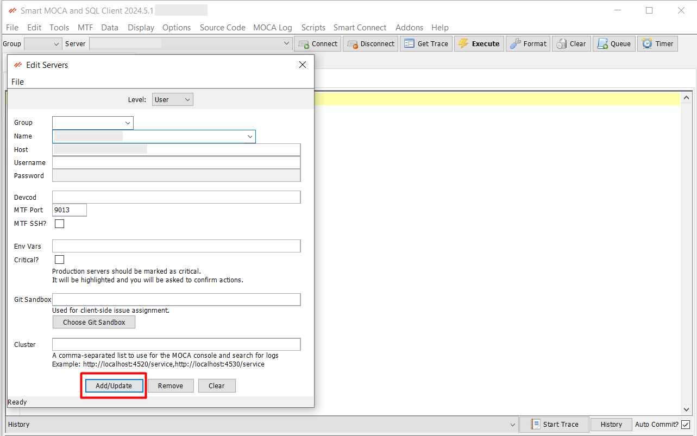

## Connections

Managing your connections efficiently is crucial for seamless access to your Blue Yonder data and other connected resources. Organize your connection groups to streamline the configuration and handling of multiple server connections. This ensures that you can easily maintain connection groups, allowing you to organize and configure multiple server connections efficiently.

### How to Connect?

- Choose a server name from the list loaded by the server dialog. 

- Click the Connect button or press Alt-C.

- If the server does have a username or password defined, you will be prompted to enter them. The program will attempt to make a connection. This may take some time.

- If the connection is successful, a new tab will open below.

- If the connection fails, a dialog will pop up indicating the error.

### Adding Servers

Add, remove, or modify server details to ensure seamless access to your Blue Yonder data and other connected resources.

- Select File -> Edit Servers to open the server configuration dialog. This screen also allows us to manage connection information of servers. To edit, simply add your desired information and press “Add/Update” button.

  

- For a 2010 server (e.g., "http://localhost:4500/service"), enter the URL as the host. The port does not need to be entered.

- Servers already configured in RedPrairie are automatically loaded from the file C:\Documents and Settings\All Users\Application Data\RedPrairie\DLXClient\DLXClientConfig.xml.

- Critical servers start with Auto-Commit turned off, prompting
