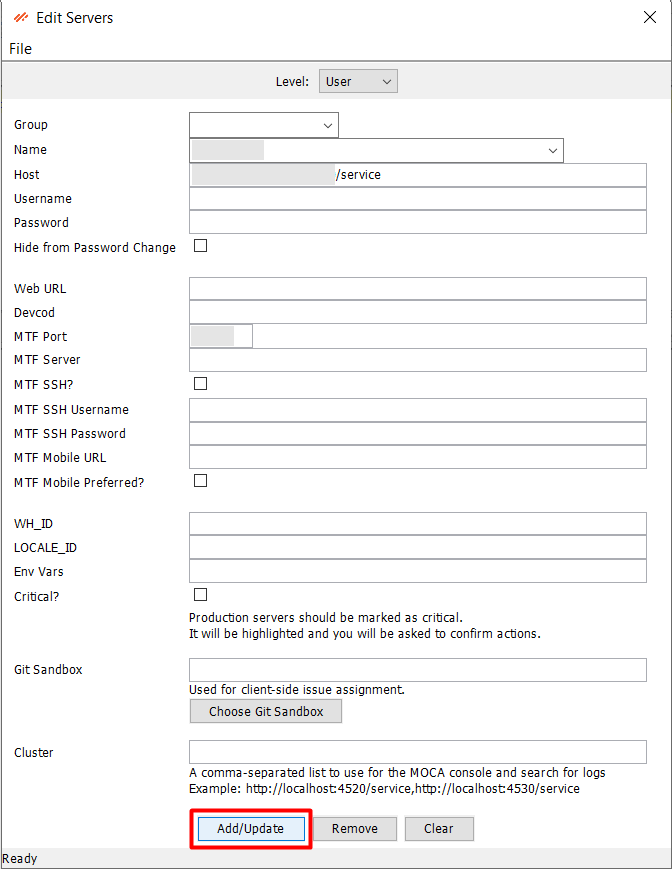

# Add/Update/Remove Server

Add, remove or modify server details by following below steps:

- Navigate to File -> Edit Servers to open the server configuration dialog. 

  
 
- This screen allows to manage connection information of servers. 
  
  
  
- To add/edit, simply choose Level as **User**, add server details and press “Add/Update” button.

  

- The server will be added successfully and it will be available in Server dropdown for connection.

  

**Important Notes:** 

- The host URL structure should be in the proper format: `http(s)://<base BY instance>/service` (**/service** is mandatory).
- If a non-standard HTTP/HTTPS port is used, it must be included in the host URL (e.g., http://example.com:8080/service). If you are using standard ports, the port does not need to be entered.
- Servers already configured in RedPrairie will automatically load from the file `C:\Users\\%AppData%\Roaming\Oracular MOCA Client\DLXClientConfig.xml`
- Critical servers start with Auto-Commit turned off, and the user is prompted to confirm each execution.
