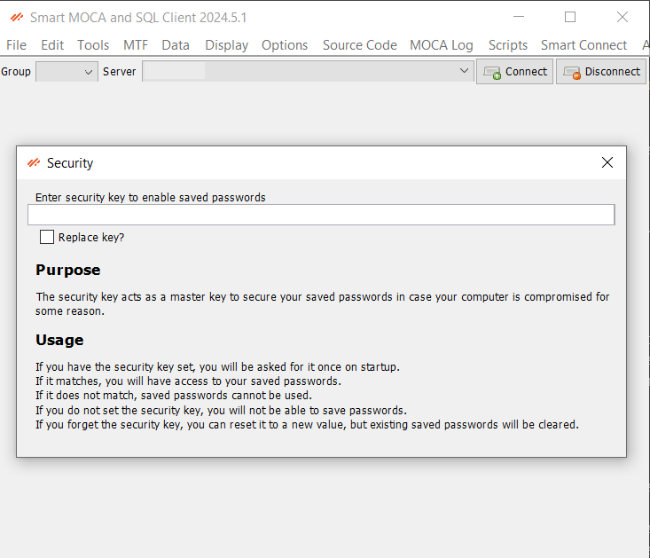
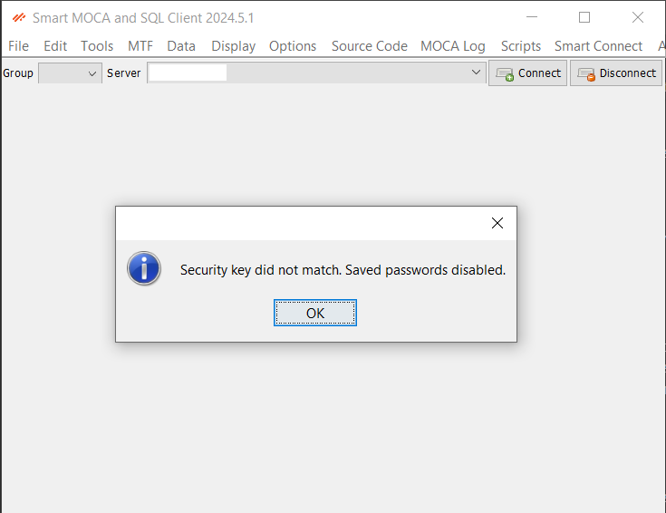

# Secure Server Connections

The Smart MOCA Client safeguards your credentials by encrypting every saved password with a security key. Only users who know this key can unlock the stored passwords.

## PIN Prompt on Startup

A pin functionality appears on startup to quickly access frequently used servers and settings. The security key acts like a master key to secure your saved passwords in case your computer is compromised for some reasons.

### Usage

- If you have the security key set, you will be asked for it once on startup.
- If it maches then you will have an access to your saved passwords.
- If it does not match, then saved passwords cannot be used.

  

- If you do not set the security key, then you will not be able to save passwords.
- If you forget security key, you can reset it by entering a new value and mark 'Replace key?' checkbox, but existing saved passwords will be cleared.
