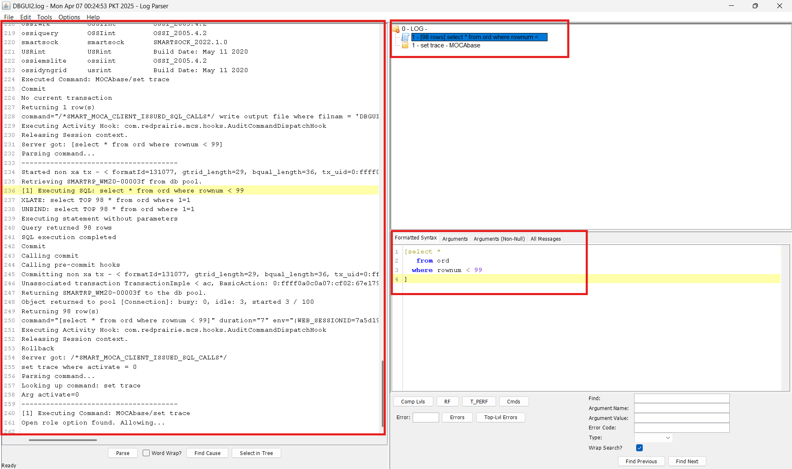
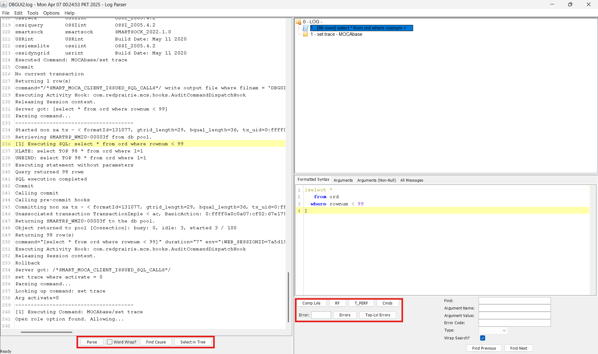
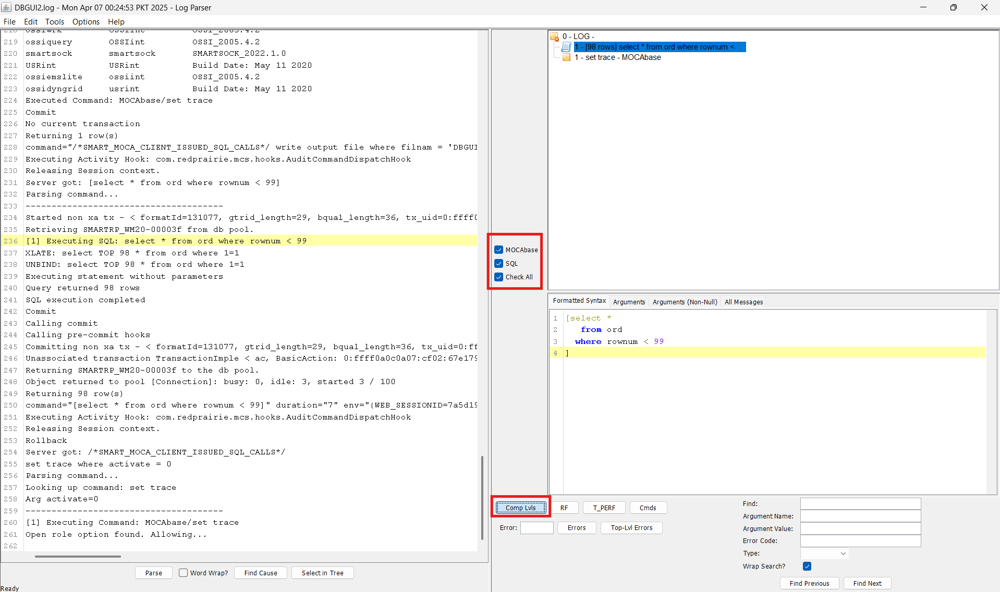
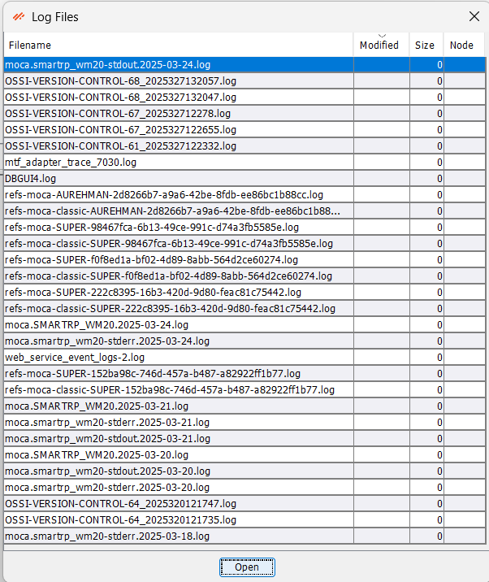
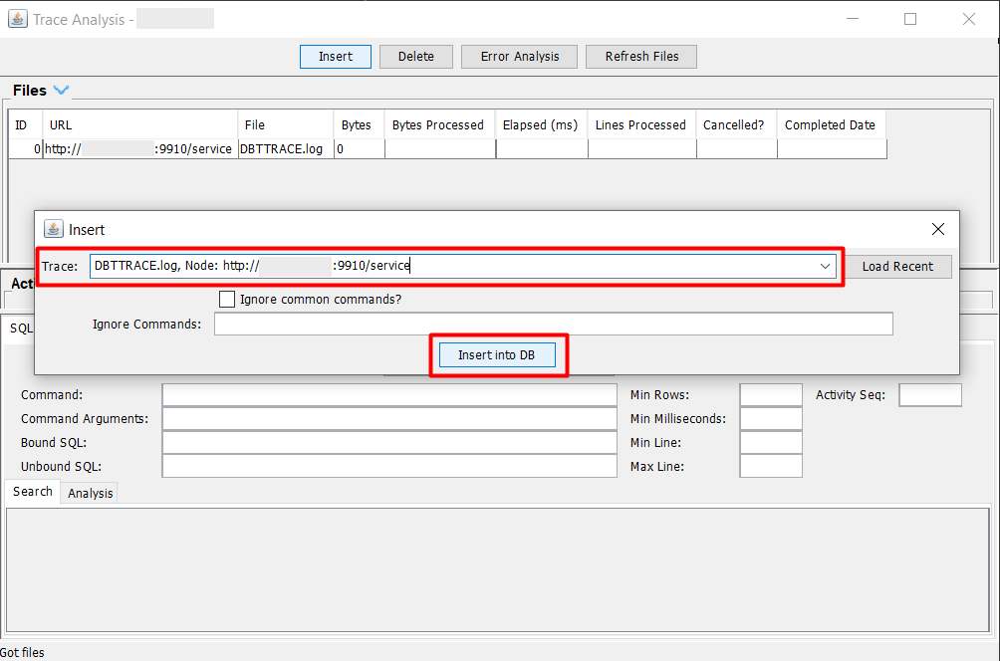
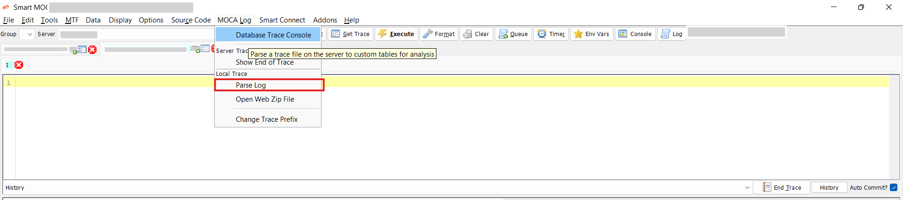

# Database Trace

This section provides a step-by-step guide on how to generate and interpret a MOCA Trace. MOCA Trace is a powerful tool that allows developers and testers to understand the behavior of the system when a command is executed. It provides detailed, sequential logs which make it easier to identify issues, debug problems, and ensure system reliability.

There are three primary ways to generate and read the MOCA Trace:

1. By Clicking on **Start Trace** Button.
2. By entering the **Command** with the trace file name.
3. By using the **Log** button to open an existing trace file.

## Using Start Trace Button

- Click the **Start Trace** button to initiate trace recording. After that, execute the desired command that you want to trace.

    

- Once the command has been executed successfully, click on the **End Trace** button to stop trace.
    

- A confirmation dialog will appear. Click the **Yes** button to proceed. Your trace will now be generated and opened automatically.

    

### Understanding the Trace Output

- Uncheck all enabled **checkboxes** in both dialog windows.

- Click on the **Clear** button to remove previously stored data or settings.

    
    

- After clearing the checkboxes, click **OK** to proceed to the main trace view.

    

### Main Components of the Trace Window

1. **Console Trace (Left Panel):** Displays a sequential log of console events and asynchronous calls. This helps in debugging and understanding the backend activity.

2. **Command Hierarchy (Top Right Grid):** Shows the list of executed commands in a hierarchical structure along with their execution status. Commands can be expanded to view nested executions.

3. **Detailed Tabs (Bottom Right Grid):** This section includes several tabs:
    - **Format Syntax:** Displays the formatted syntax of the command.
    - **Arguments:** Lists all the arguments passed in the command.
    - **Arguments (Not Null):** Shows only those arguments which have assigned values.
    - **All Messages:** Displays all system messages generated during execution.

    

### Additional Trace Tools

- At the bottom of the Trace window, you’ll find additional buttons for in-depth analysis:

    - **Comp Lvl:** View or adjust trace component levels.
    - **RF:** Related to RF functionality.
    - **T_PERF:** Displays performance-related metrics.
    - **Cmds:** Lists all executed commands and their execution count.
    - **Error/Top-lvl Error:** Displays error messages generated during execution.
    - **Search Functionality:** Allows you to search within trace data.
    - **Parse:** Opens the parse log, you may need to uncheck default selections here.
    - **Find Clause:** Helps locate the root cause of failure.
    - **Select in Tree:** Highlights the selected command in the execution hierarchy tree.

    

**Examples:**
- **CMDs:** Displays all executed commands and the number of times each was called.

    

- **Comp lvls:** Allows you to check or uncheck trace levels based on your analysis needs.

    

- **Errors** and **Top-lvl Error:** Lists all errors and top-level failures that occurred during execution.

    

- **Parse**, **Find Cause** and **Select Tree:**

    - Parse: Opens parse logs with configurable checkboxes.
    - Find Cause: Pinpoints the exact cause of failure.
    - Select Tree: Displays the command's execution tree in the log window.

    

## Using the Command line

- You can manually write and execute a MOCA command that includes the trace file name to directly open the trace log.

    

- Once the command is executed, the trace will open automatically.

- For understanding the trace layout and tools, follow the same steps explained earlier in [Steps for Trace Understading](#understanding-the-trace-output).

## Using the Log Button

- Click on the **Log** button to open an existing trace file from your system.

    

- A file dialog will appear. Browse and select the desired trace file, then click **Open**.

    

- Once the log file is opened, the trace view will load.

- Refer again to the [Steps for Trace Understading](#understanding-the-trace-output) for detailed instructions on navigating and analyzing the trace.

## Moca Log

The **MOCA Log** section in the Smart MOCA Client provides a set of tools for analyzing, parsing, and interacting with trace and log files generated by the MOCA.

- To access the log tools, click on **MOCA Log** from the main toolbar to open the **Log Menu**.

    

### Database Trace Console:

**Database Tracing** is a powerful diagnostic feature that allows users to monitor and analyze database operations in real time. It helps in tracking SQL queries, identifying performance issues, and capturing detailed logs of database activity for troubleshooting and in-depth analysis.

- Navigate to **MOCALog** --> **Database Trace Console** to open **Trace Analysis** window.
  
  

- **Insert into DB**: 
  - Click on the **Insert** button in the **Trace Analysis** window.
  - Enter a **trace filename** (note: providing the full path to the log directory is not required).
  - After entering the filename, click **Insert into DB**.

  

  

- This action triggers the Log/Load into DB script, which performs the following:

  - Creates two temporary tables:
    - usr_temp_sql_trace_analysis
    - usr_temp_cmd_trace_analysis
  - Loads these tables with relevant entries from the specified trace file.

- **Load Recent:**
  - Click the Load Recent button to populate the trace selection dropdown.
  - This dropdown will display traces from the current day by default, allowing for quick access to the most recent entries.
   
  

- **Search Options:** 

  - Enable the **SQL?** checkbox to perform search operations in either of the temporary trace tables.

  - You can search using the following fields:

    - **Command:** usr_temp_cmd_trace_analysis.uc_cmd(Displays the command executed)

    - **Command Arguments:** usr_temp_cmd_trace_analysis.uc_args(Shows the arguments passed to the command)

    - **Bound SQL:** usr_temp_sql_trace_analysis.uc_bound_sql(SQL statements with all arguments and parameters bound)

    - **Unbound SQL:** usr_temp_sql_trace_analysis.uc_unbound_sql(SQL statements as written before parameter binding)

    By leveraging these advanced DevOps features, users can efficiently manage files, maintain source code, handle change management, and perform comprehensive tracing and debugging within the Smart MOCA Client.

### Show End of Trace:
The **Show End of Trace** function allows users to quickly view the tail end of a trace file.
- This is particularly useful when monitoring the most recent entries in a log to troubleshoot live or recent events.

    

    **How to Use:**
    - Enter the name of the trace file in the input field.
    - Click on OK to load and view the most recent portion of the file.

    

### Parse Log:
The **Parse Log** tool opens a dedicated window for parsing a selected trace or log file. 
- Within this interface, users can configure parsing options, such as excluding certain default selections, to tailor the analysis output.

    

    **Steps:**
    - Uncheck default selections (e.g., unnecessary checkboxes) to refine the parsing criteria.
    - Open the trace file for parsing based on the updated options.

    
    

    **Purpose:**

    - Breaks down trace files into structured formats for detailed analysis.
    - Filters out noise and focuses on the most relevant sections of the log.

### Open Web Zip File

The **Open Web Zip File** option enables users to open a .zip file containing logs or traces that were downloaded or saved from a web-based interface or external source.

- Opens ZIP files with logs or traces from external sources.

    

    **Usage:**

    - Browse your local system to select and open the zipped file.
    - Useful when logs are exported from different environments or shared for offline analysis.

    **Benefits:**

    - Provides an easy way to access and inspect archived log data.
    - Supports seamless integration with logs retrieved via web portals or diagnostic exports.

### Change Trace Prefix
The Change Trace Prefix tool allows users to modify the prefix of a trace file. 

- This feature is helpful for organizing trace files by naming conventions or distinguishing between multiple logs during troubleshooting.

    

    **How to Use:**

    - Enter the name of the trace file for which the prefix needs to be changed.
    - Click on OK to apply the new prefix.

    

    **Advantages:**

    - Simplifies log management by maintaining consistent and identifiable file names.
    - Avoids overwriting or confusion between different trace sessions.
    - Helps in categorizing logs by function, user, or session.

