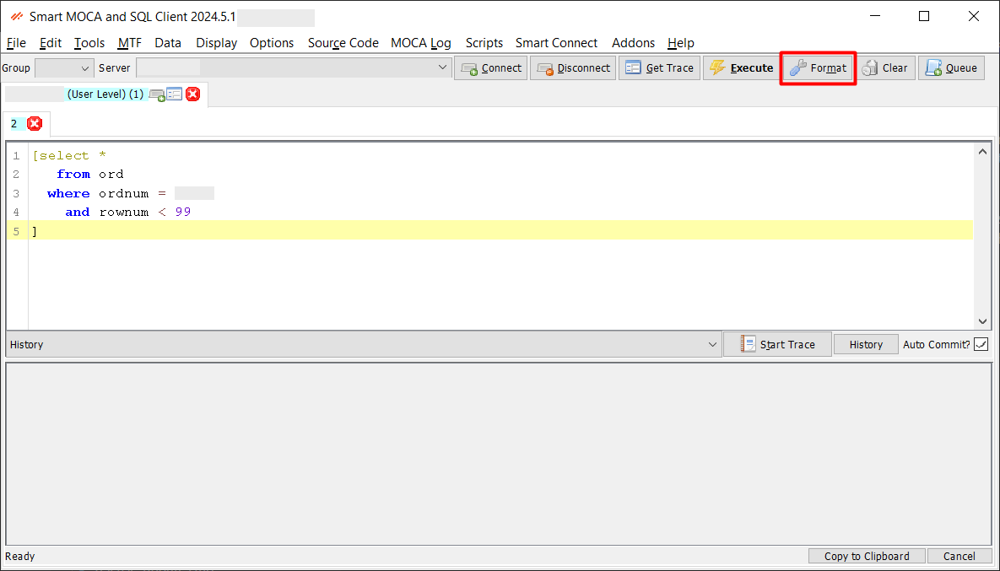

## DevOps

The Smart MOCA Client offers a robust set of DevOps features designed to streamline file system management, source code maintenance, change management, and more. 

This document outlines these features and their functionalities.

## Maintaining File System Objects

### Oracular File Manager

- **Centralized File Management:** The File Browser allows users to navigate and manage various file system objects like commands, reports, logs, and scripts from a centralized interface.

- **Structured Directory Access:** Key directories such as usrint (for custom commands) and varint (for system commands) are organized for easy access and proper separation of user-created and system-defined files.

- **Rich Editing & Development Tools:** Integrated tools and tabs support file operations (open, edit, save), command validation, schema modifications, text formatting, and MOCA-specific development actions.

- **Execution Level Control:** Users can define and control execution levels and sequences using directories like usrint.mlvl and varint.mlvl, which dictate the order of command execution during triggers or transactions.

- **User-Friendly Interface:** Offers an intuitive, tab-driven environment with powerful features for browsing, editing, and organizing files, making it easier to maintain and extend MOCA-based applications.

To learn more about Oracular File Manager, follow [Oracular File Manager](./oracular-file-manager.md)

---

### Edit Server Files

- **Easy Access to File Editing:** Users can open the **File Browser** via the **Data → Edit Server Files** menu or by pressing **F2** to view and edit server-side files directly within Smart MOCA.

- **User-Friendly Editor:** The built-in editor supports **syntax highlighting, line numbers, and direct save**, allowing efficient and error-free editing without external tools.

- **Command Access:** Files such as MOCA commands can be opened with a double-click, edited, and saved directly from the File Browser interface.

- **Advanced Functionality Tabs:** Multiple tabs at the top (File, Edit, Tools, Source, MOCA Tools, New, Options, Help) offer features for creating objects, formatting commands, modifying schema, and customizing the editor environment.

- **File Transfer Capabilities:** The **Upload/Download** functions allow users to transfer files between the local system and the server even in the absence of FTP access.

To learn more about File Browser, follow [Edit-Server-Files](./edit-server-files.md)

---

## Maintaining Source Code

### Code Formatting Capabilities

This feature helps maintain clean and standardized code, reducing errors and improving collaboration among developers. Users can format their code automatically according to predefined style guidelines. 

- **SQL Format**: SQL format can be switch using this option.

### Real-time formatting

Use menu option Options->Format in real-time?

---

## Issue Assignment

- **Centralized Issue Management:** Issue Assignment allows teams to track, assign, and manage development issues or bugs efficiently throughout the project lifecycle.

- **Structured Interface with Multiple Tabs:** The interface is divided into key tabs **Input, Data, Files, Seamles, and Commit Changes** each focused on specific aspects of issue tracking and resolution.

- **Comprehensive Tracking:** Users can record issue details, monitor database and file-level changes, and track integration updates, ensuring thorough documentation and control.

- **Enhanced Collaboration and Accountability:** Assigning issues to users with unique IDs, setting statuses, and describing problems promotes team accountability and streamlined communication.

- **Version Control and Change Commit:** With the **Commit Changes** feature, all updates linked to an issue can be finalized and versioned, supporting robust change management and audit trails.

To learn more about File Browser, follow [Issue-Assignment](./issue-assignment.md)

---

## MOCA Command Tree

Feature to view the hierarchy of MOCA commands. 

- Navigate to Addons --> Smart Innovations --> View Moca Command Tree. The 'Command Tree Viewer' containing text area to enter code and 'Generate' button to generate tree.

  

- Now enter block of code and press 'Generate' button. At bottom window, tree will be generated.

  

- Press 'Transfer' button if you want to transfer code to another server.

  

---

## Report Preview

- **Purposeful Report Validation:** The Report Preview tool allows users to visually review reports before finalization, ensuring accuracy in layout, data, and formatting to minimize errors.

- **Easy Access:** Users can launch the tool via **Addons → Smart Innovations → Report Preview**, opening a dedicated window to manage and preview reports.

- **Interactive Parameter Input:** For reports that require user input (e.g., date ranges, IDs), parameter fields are available to customize the data being displayed.

- **Live Rendering of Reports:** After selection and parameter input, clicking **Preview** displays the report in real-time, allowing thorough examination of each section.

- **Efficient Review and Revisions:** Users can scroll, inspect formatting and data, and return to make edits as needed—offering a flexible, iterative way to perfect reports before export or distribution.

To learn more about Report Preview, follow [Report Preview](./report-preview.md)

---

## Label Viewer

- **Streamlined Label Printing Interface:** Accessed via Addons → Smart Innovations → Print Label Operations, this tool offers a centralized window to manage and print various predefined label formats.

- **Detailed Label List View:** Users can view and select from a list of available labels, each with its name, format, description, and default printer, helping quickly identify the right label for printing.

- **User-Guided Data Input:** Upon selecting a label, users are prompted to enter specific arguments (like item code, quantity, batch number, etc.), ensuring accurate data population.

- **Live Label Preview:** A real-time preview displays the label layout and content, allowing users to validate positioning and formatting before printing to avoid errors.

- **Optimized for Operational Efficiency:** Designed for high-accuracy environments like manufacturing and logistics, the feature supports various printers and formats, enhancing speed, reliability, and output quality.

To learn more about Print Label Operations, follow [Print Label Operations](./print-label-operations.md)

---

## Trace

- **Multiple Ways to Generate a Trace:** You can start a MOCA Trace by using the Start Trace button, running a command with a trace filename, or by opening an existing log using the Log button.

- **Step-by-Step Recording and Execution:** Tracing involves starting the trace, executing a command, and stopping it to automatically generate a detailed execution log for debugging.

- **Interactive Trace Window:** The trace viewer shows logs in real time with panels for command hierarchy, argument details, formatted syntax, and system messages—making it easier to analyze the system's behavior.

- **Powerful Diagnostic Tools:** The bottom toolbar includes tools like Comp Lvl, T_PERF, Errors, Parse, and Find Cause to help identify issues, measure performance, and explore command executions.

- **Command-Line and Manual File Access:** Traces can also be generated or accessed using command-line input or by selecting an existing trace file from your system, offering flexibility for advanced users.

To learn more about Moca Trace, follow [Smart MOCA Trace](./moca-trace.md)

---

## DB Trace

- **Real-Time SQL Monitoring:** Database Trace allows users to analyze SQL operations in real time, helping identify performance issues and troubleshoot database activity.

- **Accessing the Tool:** Navigate to MOCALog → Database Trace Console to open the Trace Analysis window.

- **Insert and Load Trace Data:** Use the Insert button to load trace logs into temporary tables (usr_temp_sql_trace_analysis, usr_temp_cmd_trace_analysis) for structured analysis. The Load Recent button quickly populates recent trace files for review.

- **Search and Filter Options:** Enables users to search trace data using fields like Command, Arguments, Bound SQL, and Unbound SQL, with the option to enable SQL-specific queries.

- **Streamlined Debugging & Change Tracking:** Helps DevOps teams effectively trace issues, monitor SQL execution paths, and maintain robust change tracking within the Smart MOCA Client.

To learn more about Moca Trace, follow [DataBase Trace](./moca-log.md#database-trace-console)

