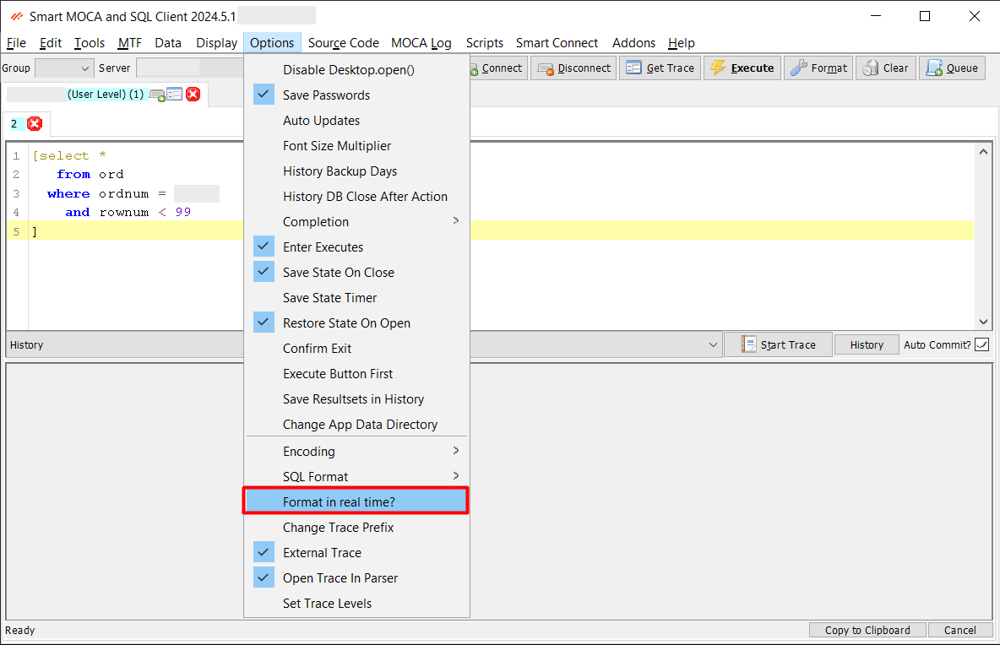

## DevOps

The Smart MOCA Client offers a robust set of DevOps features designed to streamline file system management, source code maintenance, change management, and more. 

This document outlines these features and their functionalities.

## Maintaining File System Objects

### File Navigation

To enable the File Browser, please refer to the instructions provided in the [File-browser](./File-browser.md)

---

### Edit Server Files

To enable the Edit Server Files, please refer to the instructions provided in the [Edit-Server-Files](./Edit-Server-Files.md)

---

## Maintaining Source Code

### Code Formatting Capabilities

This feature helps maintain clean and standardized code, reducing errors and improving collaboration among developers. Users can format their code automatically according to predefined style guidelines. 

- **SQL Format**: SQL format can be switch using this option.

  

### Real-time formatting

Use menu option Options->Format in real-time?

---

## Issue Assignment

The **Issue Assignment** feature in Smart MOCA Client is a comprehensive tool designed to helps to assign, track, and manage issues throughout the development and deployment process. Users can assign issues to team members, set priorities, and monitor progress to ensure timely resolution.

Following are the main components of Issue Assignment screen:

1.  **Input**: It is used to give input while create/change issue having user ID, issue sequence, status, and description etc.

2.  **Data**: It is used to track changes to database tables. It provides a detailed view of all modifications, ensuring that data-related issues are managed effectively.

3.  **Files**: It is used to track changes to files. This includes source code, configuration files, and any other file types relevant to the project. It helps in maintaining a clear history of changes and facilitates easy rollback if necessary.

    

4.  **Seamles**: It is specifically designed to track changes related to the Integrator module. It helps in managing and monitoring integration tasks.

5.  **Commit Changes**: It allows users to commit files associated with an issue, ensuring that changes are properly recorded and versioned.

---

## MOCA Command Tree

Feature to view the hierarchy of MOCA commands. 

- Navigate to Addons --> Smart Innovations --> View Moca Command Tree. The 'Command Tree Viewer' containing text area to enter code and 'Generate' button to generate tree.

  

- Now enter block of code and press 'Generate' button. At bottom window, tree will be generated.

  

- Press 'Transfer' button if you want to transfer code to another server.

  

---

## Report Preview

[Report Preview](./advance-operations.md) ensures that users can review and validate report content, layout, and accuracy before publishing or distributing the final version.

---

## Label Viewer

The [Print Label Operations](./advance-operations.md) feature provides functionality for printing labels with specified content.

---

## Trace

Follow [Smart MOCA Trace](./MOCA_Trace.md) to enable tracing.

---

## DB Trace

Follow [DataBase Trace](./Database-Trace.md) for trace analysis .

