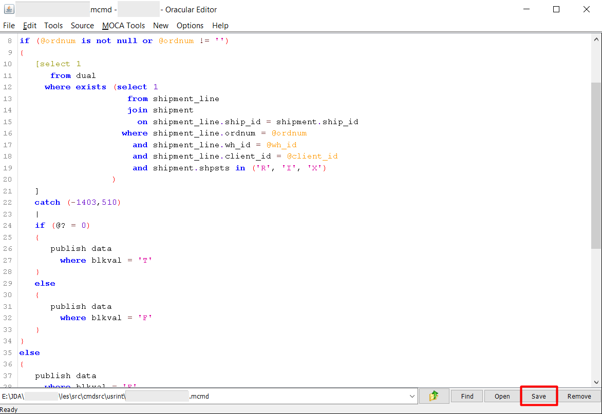

## DevOps

The Smart MOCA Client offers a robust set of DevOps features designed to streamline file system management, source code maintenance, change management, and more. 

This document outlines these features and their functionalities.

## Maintaining File System Objects

### File Navigation

File navigation can be done via [File Browser](./advance-operations.md) which is developed to provide a way of reading the files on a remote server if we did not have telnet access. 

- The start directory is $LESDIR/src/cmdsrc.

### Edit Server Files

Editing files in the Smart MOCA Client is straightforward. Users can open files from the Edit Server Files and make changes using the built-in text editor. 

The editor provides syntax highlighting, line numbers, and other features to facilitate efficient editing. Changes can be saved directly back to the file system.

- **Upload/Download File**: These functions were developed to send files back and forth between a remote server if we did not have FTP access.

---

## Maintaining Source Code

### Code Formatting Capabilities

This feature helps maintain clean and standardized code, reducing errors and improving collaboration among developers. Users can format their code automatically according to predefined style guidelines. 

- **SQL Format**: SQL format can be switch using this option.

  

### Real-time formatting

Use menu option Options->Format in real-time?

---

## Issue Assignment

This feature helps to assign, track, and manage issues throughout the development and deployment process. Users can assign issues to team members, set priorities, and monitor progress to ensure timely resolution.

---

## MOCA Command Tree

Feature to view the hierarchy of MOCA commands. 

- Navigate to Addons --> Smart Innovations --> View Moca Command Tree. The 'Command Tree Viewer' containing text area to enter code and 'Generate' button to generate tree.

  

- Now enter block of code and press 'Generate' button. At bottom window, tree will be generated.

  

- Press 'Transfer' button if you want to transfer code to another server.

  

---

## Report Preview

[Report Preview](./advance-operations.md) ensures that users can review and validate report content, layout, and accuracy before publishing or distributing the final version.

---

## Label Viewer

The [Print Label Operations](./advance-operations.md) feature provides functionality for printing labels with specified content.

---

## Trace

Follow [Tracing](./adhoc-access.md) to enable tracing.

---

## DB Trace

Follow [DB Tracing](./advance-operations.md) for trace analysis .

