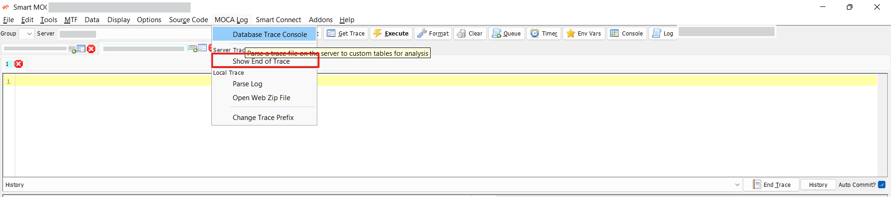
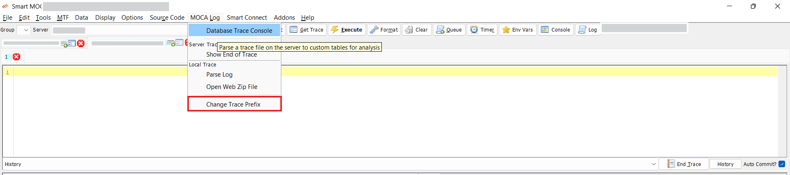

## DevOps

The Smart MOCA Client offers a robust set of DevOps features designed to streamline file system management, source code maintenance, change management, and more. 

This document outlines these features and their functionalities.

## DB Trace

**Database Tracing** is a powerful diagnostic feature that allows users to monitor and analyze database operations in real time. It helps in tracking SQL queries, identifying performance issues, and capturing detailed logs of database activity for troubleshooting and in-depth analysis.

### Database Trace Console

- Navigate to **MOCALog** --> **Database Trace Console** to open **Trace Analysis** window.
  
  

- **Insert into DB**: 
  - Click on the **Insert** button in the **Trace Analysis** window.
  - Enter a **trace filename** (note: providing the full path to the log directory is not required).
  - After entering the filename, click **Insert into DB**.

  

  

- This action triggers the Log/Load into DB script, which performs the following:

  - Creates two temporary tables:
    - usr_temp_sql_trace_analysis
    - usr_temp_cmd_trace_analysis
  - Loads these tables with relevant entries from the specified trace file.

- **Load Recent:**
  - Click the Load Recent button to populate the trace selection dropdown.
  - This dropdown will display traces from the current day by default, allowing for quick access to the most recent entries.
   
  

### Moca Log and Trace

The **MOCA Log** section in the Smart MOCA Client provides a set of tools for analyzing, parsing, and interacting with trace and log files generated by the MOCA.

- To access the log tools, click on **MOCA Log** from the main toolbar to open the **Log Menu**.

    

-  **Show End of Trace:**
    - The **Show End of Trace** function allows users to quickly view the tail end of a trace file.
    - This is particularly useful when monitoring the most recent entries in a log to troubleshoot live or recent events.

    

- **Parse Log:**
    - The **Parse Log** tool opens a dedicated window for parsing a selected trace or log file. 
    - Within this interface, users can configure parsing options, such as excluding certain default selections, to tailor the analysis output.

    

- **Open Web Zip File:**

  - The **Open Web Zip File** option enables users to open a .zip file containing logs or traces that were downloaded or saved from a web-based interface or external source.

  - Opens ZIP files with logs or traces from external sources.

   

- **Change Trace Prefix:**
  - The Change Trace Prefix tool allows users to modify the prefix of a trace file. 

  - This feature is helpful for organizing trace files by naming conventions or distinguishing between multiple logs during troubleshooting.

  

To learn more about Database Trace, follow [Database Trace](./database-trace.md)

## Change Management

### Issue Assignment
The **Issue Assignment** feature in Smart MOCA Client helps manage tasks and bugs by assigning them to team members, setting priorities, and tracking progress. It streamlines issue resolution and supports efficient project management across the development lifecycle.

To learn more about Issue Assignment, follow [Issue Assignment](./issue-assignment.md)

## Rollout Management

### Rollout
A **Rollout** in the Smart MOCA Client is a deployment package that bundles commands, files, tables, triggers, and configurations, enabling seamless delivery of updates or new features as part of a release.

To learn more about Rollouts, follow [Rollout](./rollouts.md)

---

## Report Viewer

The Report Viewer in the Smart MOCA Client allows users to preview and validate reports for layout, data accuracy, and formatting before finalizing or sharing, ensuring error-free output.

To learn more about Report Viewer, follow [Report Viewer](./advance-operations.md#report-preview)

---

## Label Viewer

The Print Label Operations feature in the Smart MOCA Client simplifies label generation by allowing users to define inputs, preview output, and ensure print accuracy—ideal for manufacturing, logistics, and inventory use.

To learn more about Label Viewer, follow [Label Viewer](./advance-operations.md#print-label-operations)

## MOCA Command Tree

Feature to view the hierarchy of MOCA commands. 

- Navigate to Addons --> Smart Innovations --> View Moca Command Tree. The 'Command Tree Viewer' containing text area to enter code and 'Generate' button to generate tree.

  

- Now enter block of code and press 'Generate' button. At bottom window, tree will be generated.

  

- Press 'Transfer' button if you want to transfer code to another server.

  

