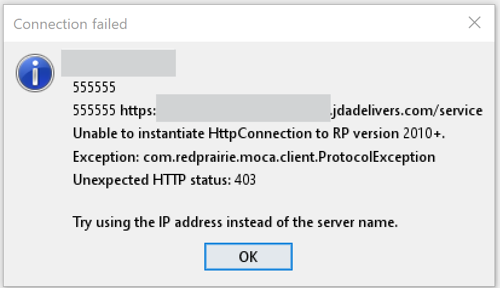

## Smart MOCA Client FAQs

+ **Question 1:** What is MOCA Client? +

  MOCA Client is a developer productivity tool designed specifically for Blue Yonder development. It allows you to connect to Blue Yonder databases, execute queries, and manage multiple connections simultaneously without having to close and restart the application.

+ **Question 2:** How is MOCA Client different from WinMSQL? +

  Unlike WinMSQL, MOCA Client allows you to open multiple connection tabs simultaneously, cancel query execution without closing the window, and provides a more modern, intuitive interface designed for developer productivity.  

+ **Question 3:** How can I download the moca.jar file in the Smart MOCA Client? +

  Following are the methods to download `moca.jar` in Smart MOCA Client:
  
  1. **Download upon Server Connection:** Upon the first server connection, the Smart MOCA Client detects the absence of moca.jar and following popup appears:
     
      
     
  2. **Download via Tools Menu:** If you have skipped **Download upon Server Connection**, then you can download the moca.jar later by navigating to **Tools --> Download moca.jar**.
     
      

+ **Question 4:** `moca.pending_jar` is downloaded but does not rename after restarting Smart MOCA Client. How can I fix this? +

  If moca.pending_jar is not renaming after you restart Smart MOCA Client, try the following steps:
  
    - **Ensure No Active MOCA Processes** – Close all instances of Smart MOCA Client before restarting.
  
    - **Check File Permissions** – Verify that you have necessary permissions to rename files in the installation directory.
  
    - **Manually Rename the File** – If the issue persists, manually rename moca.pending_jar to moca.jar and restart the client.

+ **Question 5:** After upgrading to Smart MOCA Client, changes made to files during development are not registering in the Issue Assignment. Why? +

  In older versions, **MOCAExecute.isIssueManagementInstalled()** could return an incorrect value of false if it was called before establishing a proper connection to the environment.
  To resolve this:
  
    - Navigate to Tools → Clear Server Information in the menu.
  
    - Edit a file in the server to register in issue assignment.

  This will update the configuration, and the correct value (IssueMgmt=true) will be written to: %APPDATA%\Roaming\Oracular MOCA Client\Environments\<Environment>\moca.properties.

  If above solution does not work, then manually change the moca.properties file from **IssueMgmt=false** to **IssueMgmt=true**.

+ **Question 6:** The Moca Client Launcher shortcut is not being created on the desktop or Start Menu, or an error is occurring during the process. How can I fix this? +

  In case shortcuts are not created, following shortcut can be used to launch Smart MOCA Client:
  
  

+ **Question 7:** User is receiving a 403 error when connecting to the BY SaaS environment on 1.8 Java version. What could be the issue? +

  The error typically indicates that the server is refusing the connection, which may be due to compatibility issues with the Java version in use. The BY SaaS environment requires Java 17 or newer for successful connectivity. Please upgrade your Java version to 17 or later and try connecting again.
  
  

