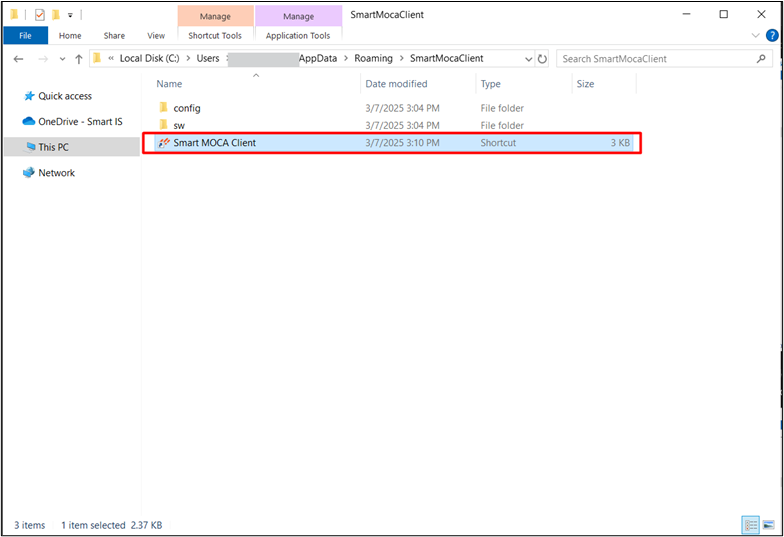

## Smart MOCA Client FAQs

+ The Moca Client Launcher shortcut is not being created on the desktop or Start Menu, or an error is occurring during the process. How can I fix this? +

  In case shortcuts are not created, following shortcut can be used to launch Smart MOCA Client:

1. The Moca Client Launcher shortcut is not being created on the desktop or Start Menu, or an error is occurring during the process. How can I fix this?

    In case shortcuts are not created, following shortcut can be used to launch Smart MOCA Client.
    

2. How can I download the moca.jar file in the Smart MOCA Client?

    Following are the methods to download `moca.jar` in Smart MOCA Client:
   1. **Download upon Server Connection:** Upon the first server connection, the Smart MOCA Client detects the absence of moca.jar and following popup appears:
      
   2. **Download via Tools Menu:** If you have skipped **Download upon Server Connection**, then you can download the moca.jar later by navigating to **Tools --> Download moca.jar**.
      

3. moca.pending_jar is downloaded but did not rename after restarting Smart MOCA Client. How can I fix this?**

    If moca.pending_jar is not renaming after restarting Smart MOCA Client, try the following steps:
      - **Ensure No Active MOCA Processes** – Close all instances of Smart MOCA Client before restarting.
      - **Check File Permissions** – Verify that you have necessary permissions to rename files in the installation directory.
      - **Manually Rename the File** – If the issue persists, manually rename moca.pending_jar to moca.jar and restart the client.

4. After upgrading to Smart MOCA Client, changes made to files during development are not registering in the Issue Assignment. Why?**

    In older versions, **MOCAExecute.isIssueManagementInstalled()** could return an incorrect value of false if it was called before establishing a proper connection to the environment.
    To resolve this:
      - Navigate to Tools → Clear Server Information in the menu.
      - Edit a file in the server to register in issue assignment.

    This will update the configuration, and the correct value (IssueMgmt=true) will be written to:
%APPDATA%\Roaming\Oracular MOCA Client\Environments\<Environment>\moca.properties.
If above solution does not work, then manually change the moca.properties file from **IssueMgmt=false** to **IssueMgmt=true**.

