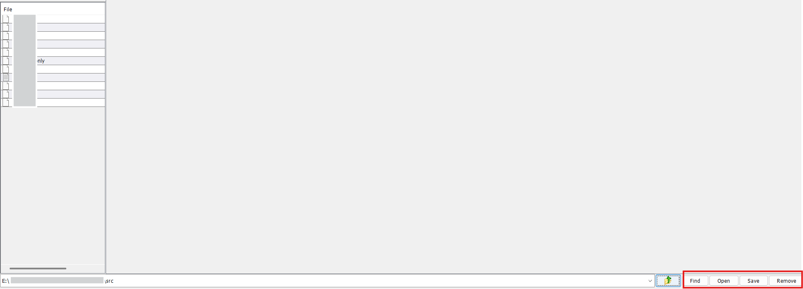
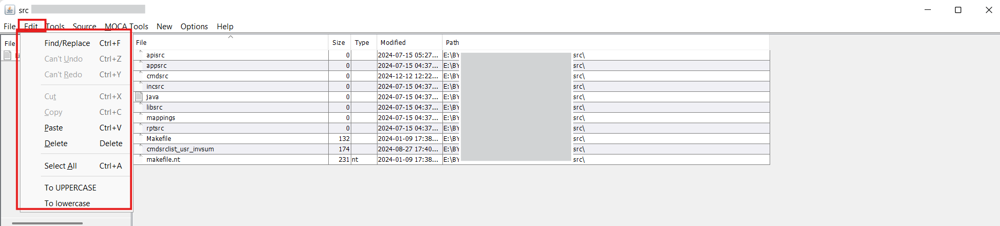
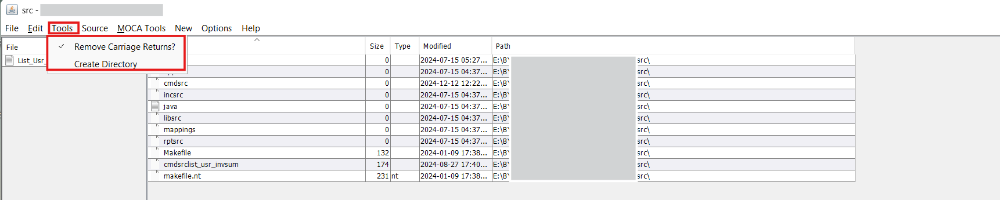
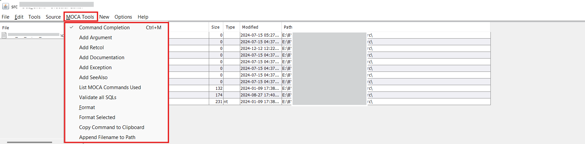
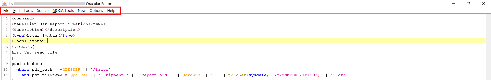
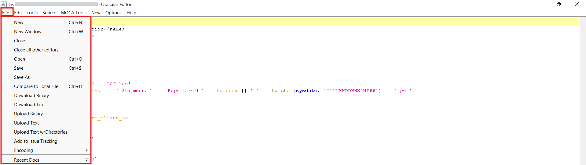
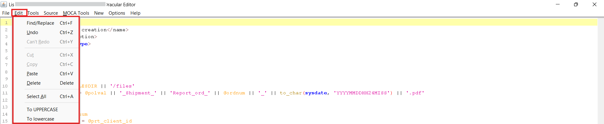
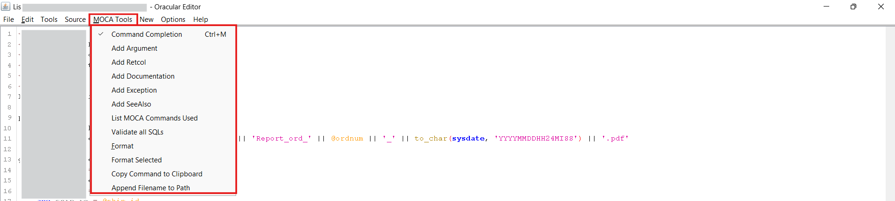
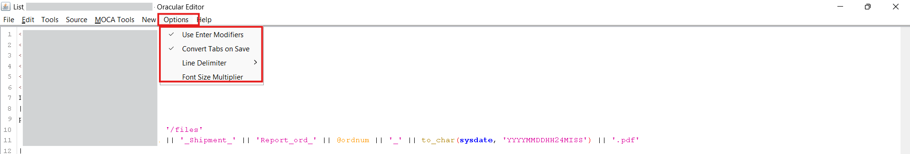

# File Browser
The File Browser in the Smart MOCA Client provides a comprehensive set of functionalities that support efficient file navigation, organization, and management.

## Maintaining File System Objects
This section outlines how users can effectively utilize the File Browser for accessing and managing file system objects like commands, reports, logs, and custom scripts.

### File Navigation

- Navigate to **Data** --> **Edit Server Files** or press **F2** to launch **File Browser**. 

  

- File Browser will get open where you can see all the directories and files.

- Within this window, users can easily view and manage **Files**, **Folders**, **Commands**, **Reports**, **Logs**, and more.

  

### Buttons in File Browser

- **Find:** This button is used to find File using path.
- **Open:** This button is used to open File.
- **Save:** This button is used to save the file.
- **Remove:** This button is used to Remove the file from Directory.

    

### Menu in the File Browser

- At the top of the File Browser, several tabs are available to enhance user productivity:

    

    - **File:** 
        - **Open:** It is used for opening file.
        - **Close:** It is used for closing of the file.
        - **Save new and existing files:** It is used for saving the new file created and the existing file in which you have done changes.
        - **Compare to Local File:** It is used for comapring the file with the local file.
        - **Add to Issue Tracking:** It is used for Adding into the issue tracking.
        - **Upload text and Download text:** It is used for uploading the text into the file and also for downloading text from the file.

        

    - **Edit:** 
        - Perform standard editing operations such as cut, copy, paste, convert text to uppercase or lowercase into the file.

        

    - **Tools:** 
        - Used for actions such as creating new directories.

        

    - **Source:** 
        - Allows users to shift text, convert character sets, or remove non-ASCII characters from the file content.

    - **MOCA Tools:** 
        - Offers options to add arguments, define exceptions, validate, and format MOCA commands into the file.
        - Also for **Appending filename to Path** in file browser.

        

    - **New:** 
        - **New Commands:** It is used for creating new Command files.
        - **New Triggers:** It is used for creating new Trigger files.
        - **New Tables:** It is used for creating new tables into database.
        - **Modify schema by adding or dropping columns:** It is used for adding or dropping tables and columns from database schema.
        - **Sequence:** It is used for providing sequence.

        

    - **Options:**
        - Modify interface settings such as enabling enter key modifiers or adjusting font size multipliers.

    - **Help:**
        - Provides assistance and reference material related to File Browser usage.

## Understanding Directories and File Structure.

- The start directory is $LESDIR/src/cmdsrc.
- Within this directory, you’ll find key subfolders such as: 

    - **usrint:** Contains all custom commands developed by users for project-specific enhancements or extensions.

    - **varint:** Standard system commands provided by the application or created by system administrators. This directory should generally remain unmodified to maintain system stability.

    - **usrint.mlvl / varint.mlvl:** These define the command levels and execution sequences. For example, you can determine which custom or standard command runs first during a transaction or trigger.

    

### Working with usrint Directory

- For any customizations or new command development, the usrint directory is used.

- This is where modified versions of existing commands or entirely newly created commands can be placed.

    

### Working with varint Directory

- varint directory serves as the location for all predefined system commands

- This directory should remain unchanged to preserve the integrity of system defaults.

    

- usrint and varint lvls can define the levels for command and trigger execution, which command to be executed first and which is next.

## Edit Server Files

Editing files within the Smart MOCA Client is a seamless process. Users can access files through the Edit Server Files option and modify them directly using the integrated text editor, which offers a user-friendly and efficient environment for file editing.

- Navigate to **Data** --> **Edit Server Files** or press **F2** to launch **File Browser**. 

  

- File Browser will get open where you can see all the directories and files.

    

- You can then Open Command By Double Click on it.

- Key Features of the Built-in File Editor:
    - Provides syntax highlighting for improved readability and code clarity.
    - Displays line numbers to assist with navigation and referencing.
    - Supports efficient editing through a user-friendly interface.
    - Allows direct saving of changes to the file system without needing external tools.

    

### Menu in the File Browser

- At the top of the File Browser, several tabs are available to enhance user productivity:

    

    - **File:** 
        - **Open:** It is used for opening file.
        - **Close:** It is used for closing of the file.
        - **Save new and existing files:** It is used for saving the new file created and the existing file in which you have done changes.
        - **Compare to Local File:** It is used for comapring the file with the local file.
        - **Add to Issue Tracking:** It is used for Adding into the issue tracking.
        - **Upload text and Download text:** It is used for uploading the text into the file and also for downloading text from the file.

        

    - **Edit:** 
        - **Cut:** It is used to cut something inside command.
        - **Copy:** It is used for copying something into the command
        - **Paste:** It is used for paste something into the command.
        - **Convert text to uppercase or lowercase:** It is used for converting the letters into uppercase and lowercase.

        

    - **Tools:** 
        - Used for actions such as creating new directories.

    - **Source:** 
        - **Shift text:** It is used for shifting command left and right and also set shift ammount.
        - **Convert character sets:** It is used for converting Character sets in command
        - **Remove non-ASCII characters:** It is used for removing non-ASCII characters from the command.
        
        
        

    - **MOCA Tools:** 
        - **Add arguments:** It is used for adding arguments into the command and save it.
        - **Define exceptions:** It is used for adding exceptions into the command.
        - **Validate and format MOCA commands:** It is used for validating and providing format to the command.
        - Also for **Appending filename to Path** in file browser.

        

    - **Options:**
        - Modify interface settings such as enabling enter key modifiers or adjusting font size multipliers.

        

    - **Help:**
        - Provides assistance and reference material related to File Browser usage.

---