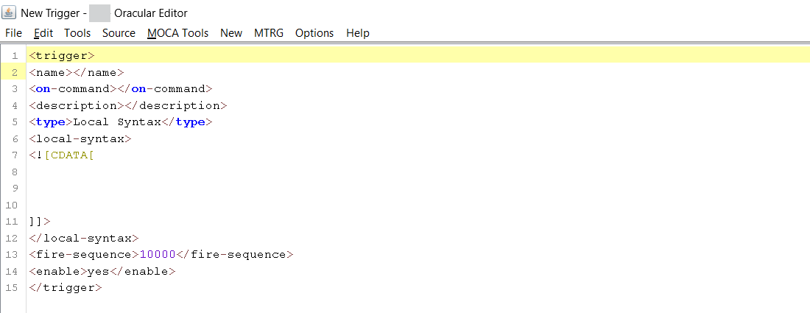
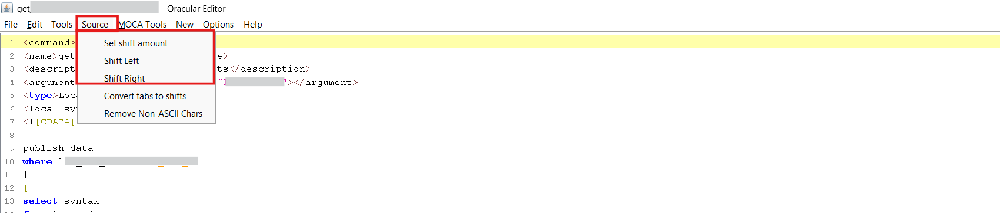
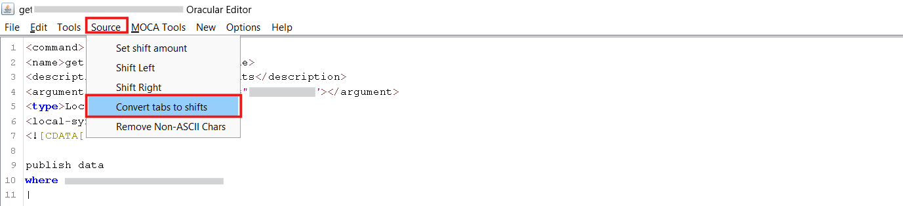
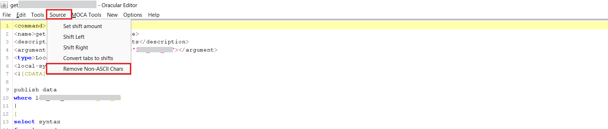
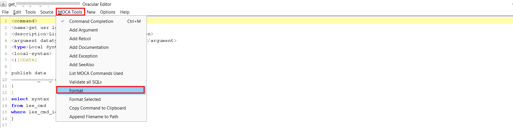

# File Browser
The File Browser in the Smart MOCA Client provides a comprehensive set of functionalities that support efficient file navigation, organization, and management.

## Maintaining File System Objects
This section outlines how users can effectively utilize the File Browser for accessing and managing file system objects like commands, reports, logs, and custom scripts.

### File Structure

- The start directory is $LESDIR/src/cmdsrc.
- Within this directory, you’ll find key subfolders such as: 

    - **usrint:** Contains all custom commands developed by users for project-specific enhancements or extensions.

    - **varint:** Standard system commands provided by the application or created by system administrators. This directory should generally remain unmodified to maintain system stability.

    - **usrint.mlvl / varint.mlvl:** These define the command levels and execution sequences. For example, you can determine which custom or standard command runs first during a transaction or trigger.

    

#### Working with usrint Directory

- For any customizations or new command development, the usrint directory is used.

- This is where modified versions of existing commands or entirely newly created commands can be placed.

    

#### Working with varint Directory

- varint directory serves as the location for all predefined system commands

- This directory should remain unchanged to preserve the integrity of system defaults.

    

- usrint and varint lvls can define the levels for command and trigger execution, which command to be executed first and which is next.

### File Navigation

- Navigate to **Data** --> **Edit Server Files** or press **F2** to launch **File Browser** where you can see all the directories and files.

  

- Within this window, users can easily view and manage **Files**, **Folders**, **Commands**, **Reports**, **Logs**, and more.

  

### Buttons Functionality

- **Find:** This button is used to find File using path.
- **Open:** This button is used to open File.
- **Save:** This button is used to save the File.
- **Remove:** This button is used to Remove the File from Directory.

### File Operations

The following operations are available for managing files and directories:

- **Upload File:** It is used for uploading Existing file from the system and Opens it.

    

- **Upload Text:** Upload plain text files to the server from System.

- **Upload Text w/Directories:** Upload text files along with their directory structure.

- **Upload Binary:** Upload binary files to the server from System.

    

- **Download Text:** Download files as plain text.

- **Download Binary:** Download files in binary format.

    

- **Create Directory:** It is used for creating directory.

    
       
- **Create New:** It is used for creating new command, triggers, tables and columns.

    

    - **Create New Command:** It is used for creating new commands into System.

        

    - **Create New Trigger:** It is used for creating new Triggers into System.

        

    - **Create New Table:** It is used for creating new Tables into System.

        

    - **Create New Column:** It is used for creating new Columns into Tables.

        

    - **Drop Column:** It is used for Dropping Columns from tables.

        

    - **Sequence:** Create a new sequence for database objects.

        

## Edit Server Files

Editing files within the Smart MOCA Client is a seamless process. Users can access files through the Edit Server Files option and modify them directly using the integrated text editor, which offers a user-friendly and efficient environment for file editing.

- Navigate to **Data** --> **Edit Server Files** or press **F2** to launch **File Browser**. 

  

- File Browser will open where you can see all the directories and files.

    

- You can then open command by double clicking on it.

### Key Features of the Built-in File Editor

- Provides syntax highlighting for improved readability and code clarity.
- Displays line numbers to assist with navigation and referencing.
- Supports efficient editing through a user-friendly interface.
- Allows direct saving of changes to the file system without needing external tools.

    

### Edit File Operations
The following operations are available for managing files and directories:

- **Find/Replace:** It is used for finding any word inside the command or trigger.

    

- **Convert text to uppercase or lowercase:** It is used for converting the letters into uppercase and lowercase.

    

- **Shift text:** To adjust the indentation of command lines, navigate to the Source menu.
    - Select **Shift Left** to move the selected lines to the left.
    - Select **Shift Right** to move the lines to the right.
    - To specify a custom shift distance, click **Set Shift Amount**, enter the desired value, and confirm by clicking **OK**.

    

- **Convert tabs to shift:** Replaces tab characters with individual spaces to maintain proper indentation and prevent misalignment in the command structure.

    

- **Remove non-ASCII characters:** Clean files by removing any non-ASCII (special/unreadable) characters.
        
    
        

- **MOCA Tools:** The **MOCA Tools** menu provides a set of features to enhance and standardize command development by allowing users to add arguments, documentation, return columns (retcols), and exceptions, as well as format the command structure for consistency.

    

    - **Add arguments:** Enables users to define and add input arguments required for the command’s execution.

        

    - **Define exceptions:** Allows users to add exception handling within the command to manage errors.

        

    - **Add Documentation:** Facilitates the inclusion of detailed documentation to describe the purpose, functionality, and usage of the command.

        

    - **Add Retcol:** Used to define return columns (retcols) by specifying their names and data types, ensuring proper output structure.

        

- **Format:** Automatically formats the command script to enhance readability and maintain coding standards.

    

- **Font Size Multiplier:** Allows users to increase or decrease the font size of the command editor for improved readability and comfort during editing.
        
    

- **Help:** Provides assistance and reference material related to File Browser usage.
