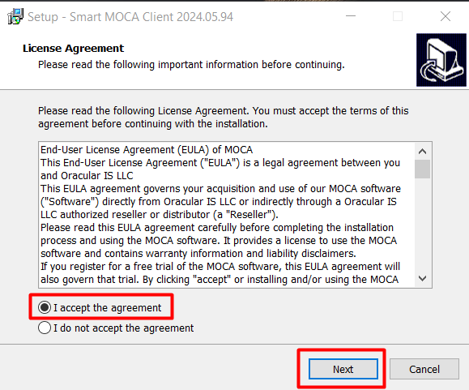

## Getting Started

Welcome to Smart MOCA Client! This section will guide you through the initial steps to get you up and running with our powerful and intuitive software. Follow these instructions to ensure a smooth installation and setup process.

### System Requirements

Before you begin, make sure your system meets the following minimum requirements:

- Operating System:
    <dd>- Windows 7 or later</dd>
- Processor:
    <dd>- Intel Core i3 or equivalent
- Memory:
    <dd>- 4 GB RAM</dd>
- Storage:
    <dd>- 500 MB available space</dd>
- Internet Connection: 
    <dd>- Required for initial setup and updates</dd>

> Installation

  1. Download the Installer
       
      - 
 Visit the Smart IS website and navigate to Our Products > MOCA Client.

        
      - 
 Click the "Get MOCA Client" button. Complete the form that appears with your information to download the latest version of the installer. The download will start automatically.

        

  2. Run the Installer
      - 
 Locate the downloaded file (mocaclient20240594.exe) and double-click to run the installer.

        
      - 
 Follow the on-screen instructions to complete the installation process.

        
  
  3. Launch the Application
      - 
 Once installed, launch Smart MOCA Client by double-clicking the desktop icon or searching for it in the start menu. Once an application gets started, you will see below interface:

        
