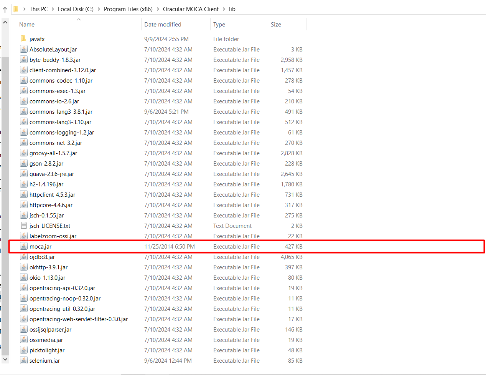

## Get started with Smart Moca Client

This section will guide you through the initial steps to get you up and running with our powerful and intuitive software. 

Follow these instructions to ensure a smooth installation and setup process.

## System Requirements

Before you begin, make sure your system meets the following minimum requirements:

- Operating System:
    <dd>- Windows 7 or later</dd>
- Processor:
    <dd>- Intel Core i3 or equivalent
- Memory:
    <dd>- 4 GB RAM</dd>
- Storage:
    <dd>- 500 MB available space</dd>
- Internet Connection: 
    <dd>- Required for initial setup and updates</dd>

## Installation

  1. Download the Installer
       
      - Visit the [Smart IS](https://www.smart-is.com/what-we-do/smart-product/smart-is-moca-client/) website and navigate to Our Products > MOCA Client.
       
        

      - Click the "Get MOCA Client" button. Complete the form that appears with your information to download the latest version of the installer.

        

      - After filling out the form, you will receive an email with a link to the download page.

        

      - Now open an email you received from Smart IS and click the **Download MOCA Client** link provided in the email to navigate to the download page download the latest version of the installer by clicking Download Moca Client button.

        

  2. Run the Installer
   
      - Locate the downloaded file (mocaclient<**version**>.exe) and double-click to run the installer.

        

      - Follow the on-screen instructions to complete the installation process.
        
        
  
  3. Launch the Application
   
      - Once installed, launch Smart MOCA Client by double-clicking the desktop icon or searching for it in the start menu. Once an application gets started, you will see below interface:
  
        

---

## Handling moca.jar in Smart MOCA Client

On initial Smart MOCA Client installation, by default system includes **`ossimoca.jar`** in the `C:\Program Files (x86)\Oracular MOCA Client\lib` directory instead of moca.jar. 

  

However, it is recommended to use BlueYonder's moca.jar instead of ossimoca.jar.

Following are the methods to use an official moca.jar:

### 1. Get moca.jar from Smart Moca Client

There are two methods to download moca.jar from Smart Moca Client as: 

- **Method 1:** Download During Initial Connection

  - Upon the first server connection, the Smart MOCA Client detects the absence of moca.jar and uses ossimoca.jar temporarily with a following message appear as a popup:

    

  - When you will click the button, the system will begin downloading the moca.pending_jar file into the $MOCADIR. 

    
    
    

  <mark>**Note:** *Please launch Smart Moca Client as an Administrator to download moca.jar successfully.*</mark>

- **Method 2:** Download via Tools Menu

  - If you skip the initial download then you can download the moca.jar later by navigating to Tools --> Download moca.jar.

    

  - On click, the download process will start immediately by displaying the following dialog:

    
    
    

  - After the download completes, close Moca Client and reopen it as an administrator. Now system will automatically rename moca.pending_jar to moca.jar and show following popup:

    
    

  - Now when you will restart an application, the sytem will use `moca.jar` instead of ossimoca.jar.

  This method provides a convenient alternative to ensure the moca.jar file is downloaded and installed properly.

### 2. Manual placement of 'moca.jar'

Follow the steps below to manually place moca.jar:

1. Navigate to the $MOCADIR/lib, located in your Moca Installation folder.
2. Remove the existing `ossimoca.jar` file.
3. Place Blueyonder's `moca.jar` file in the same location.

    

This process will allow you to use the necessary moca.jar file with the Smart MOCA Client.

#### **Important Note on Reinstallation**

During the reinstallation of Smart MOCA Client, the installer will not place the `ossimoca.jar` file in the `lib` folder if the moca.jar file is already present. However, if no moca.jar file is found, the installer will automatically add ossimoca.jar to the directory.

By managing these files correctly, you can ensure compatibility with various versions of Blue Yonder and other systems.

