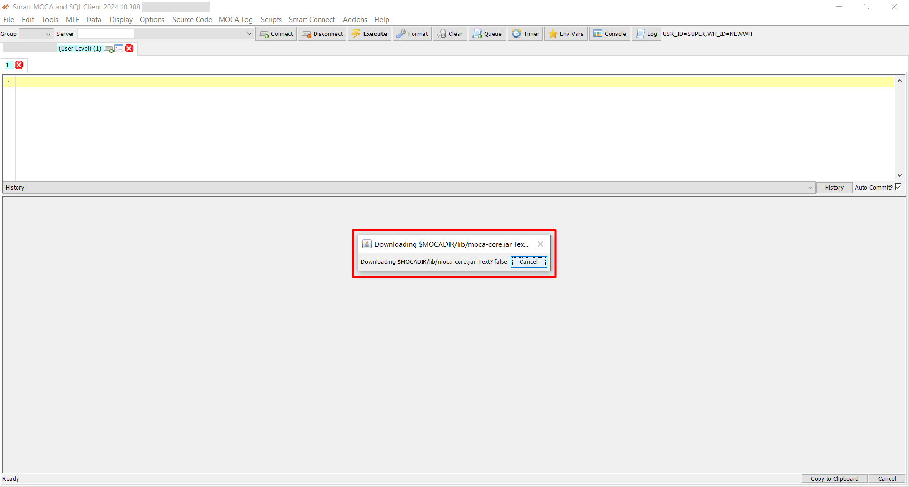

## Get started with Smart Moca Client

This section will guide you through the initial steps to get you up and running with our powerful and intuitive software. 

Follow these instructions to ensure a smooth installation and setup process.

## System Requirements

Before you begin, make sure your system meets the following minimum requirements:

- Operating System:
    <dd>- Windows 7 or later</dd>
- Processor:
    <dd>- Intel Core i3 or equivalent
- Memory:
    <dd>- 4 GB RAM</dd>
- Storage:
    <dd>- 500 MB available space</dd>
- Internet Connection: 
    <dd>- Required for initial setup and updates</dd>

## Installation

  1. Download the Installer
       
      - Visit the [Smart IS](https://www.smart-is.com/what-we-do/smart-product/smart-is-moca-client/) website and navigate to Our Products > MOCA Client.
       
        

      - Click the "Get MOCA Client" button. Complete the form that appears with your information to download the latest version of the installer.

        

      - After filling out the form, you will receive an email with a link to the download page.

        

      - Now open an email you received from Smart IS and click the **Download MOCA Client** link provided in the email to navigate to the download page download the latest version of the installer by clicking Download Moca Client button.

        

  2. Run the Installer
   
      - Locate the downloaded file (mocaclient<**version**>.exe) and double-click to run the installer.

        

      - Follow the on-screen instructions to complete the installation process.
        
        
  
  3. Launch the Application
   
      - Once installed, launch Smart MOCA Client by double-clicking the desktop icon or searching for it in the start menu. Once an application gets started, you will see below interface:
  
        

---

## Handling moca.jar in Smart MOCA Client

On initial Smart MOCA Client installation, by default system includes **`ossimoca.jar`** in the `C:\Program Files (x86)\Oracular MOCA Client\lib` directory instead of moca.jar. 

  

However, it is recommended to use BlueYonder's moca.jar instead of ossimoca.jar.

### Downloading the moca.jar file

Below are the two methods to download the official moca.jar file:

#### **Method 1:** Download During Initial Connection

Upon the first server connection, the Smart MOCA Client detects the absence of moca.jar and uses ossimoca.jar temporarily with following message appear as a popup:

When you click the button, the system begins downloading the moca.jar file into the $MOCADIR/lib directory. 

After the download completes, the moca.jar file replaces ossimoca.jar in the $MOCADIR/lib directory.

#### **Method 2:** Download via Tools Menu

If you skip the initial download or need to download the moca.jar later, then navigate to Tools --> Download moca.jar.

The download process will start immediately by displaying the following dialog:

This method provides a convenient alternative to ensure the moca.jar file is downloaded and installed properly.

