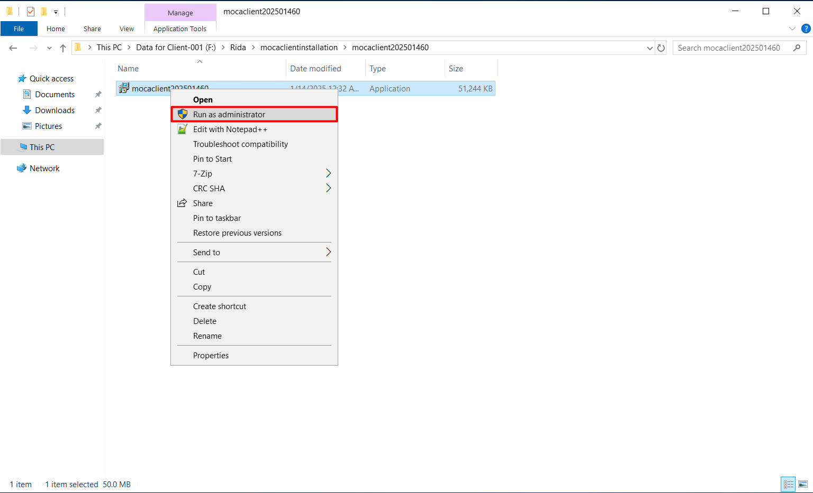
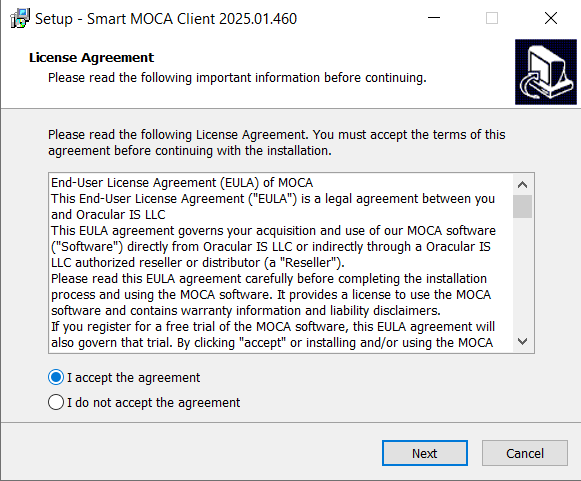
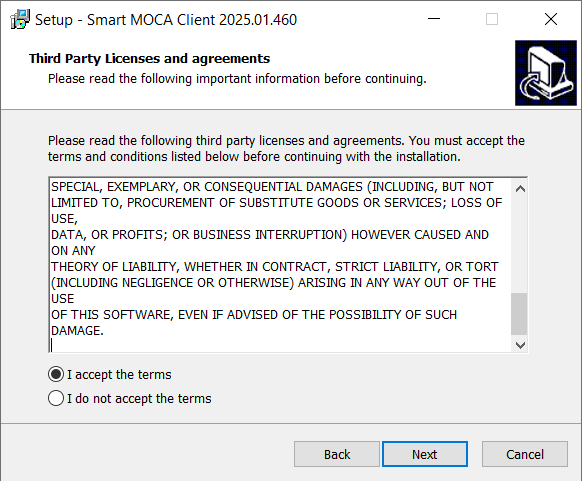
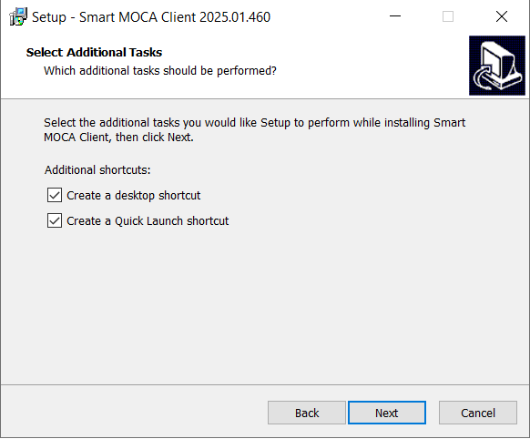
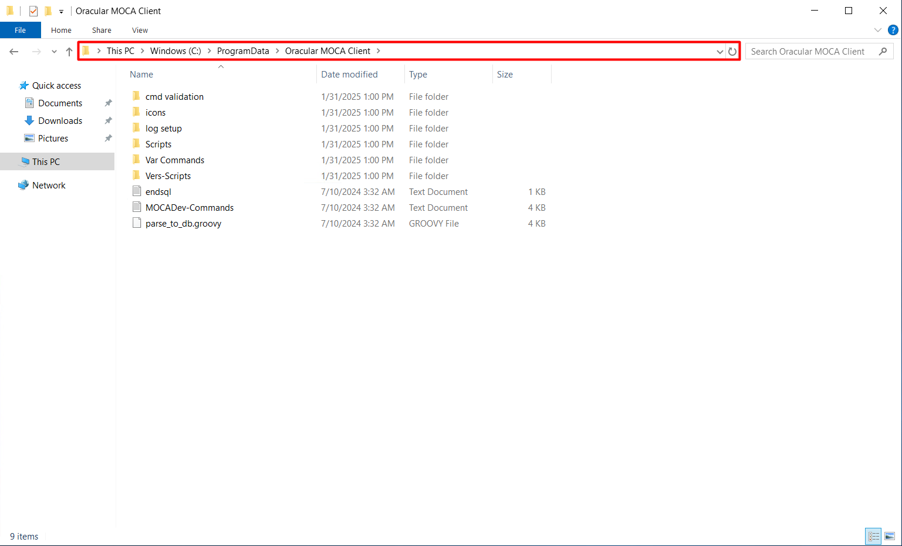
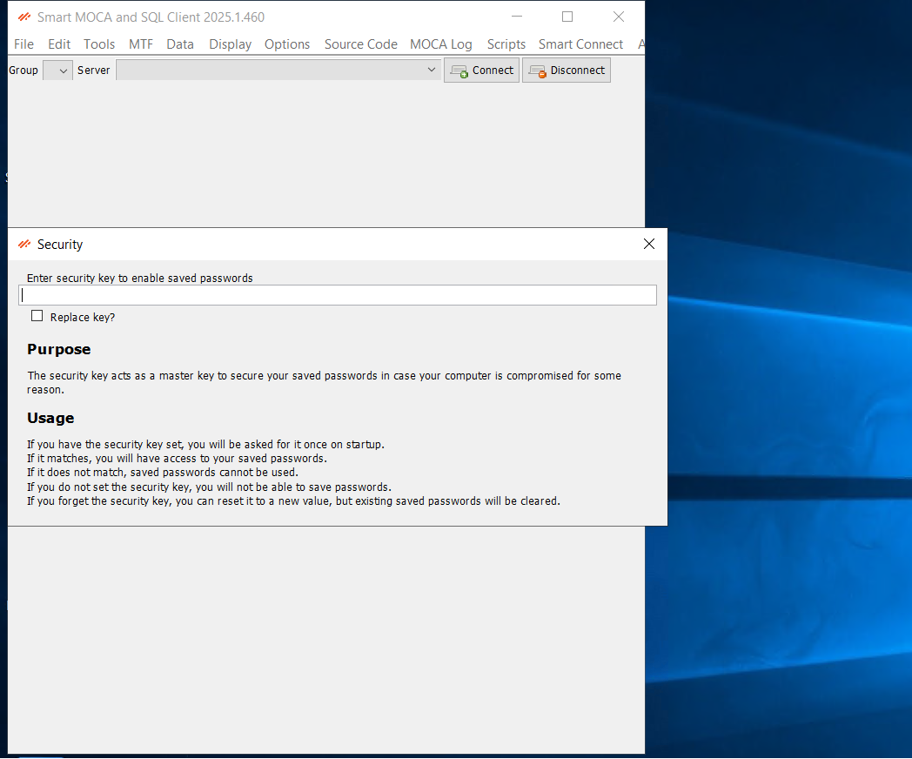
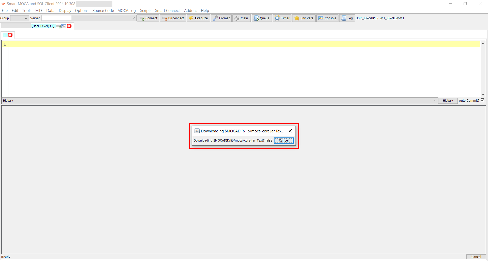
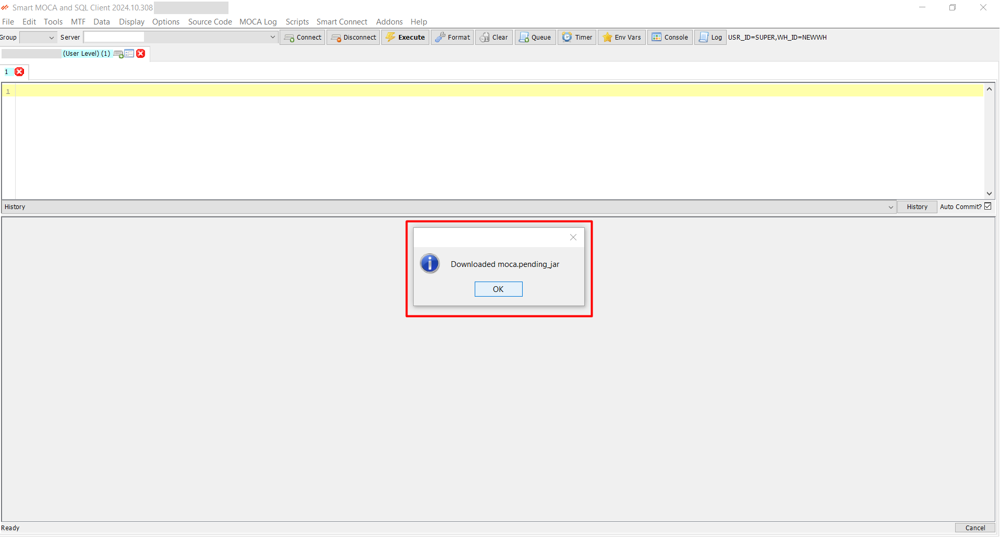
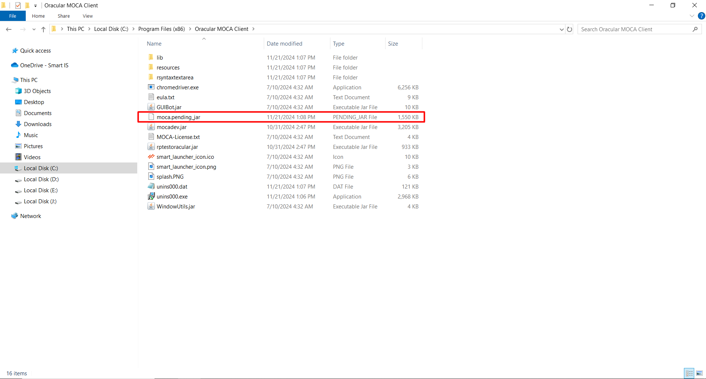
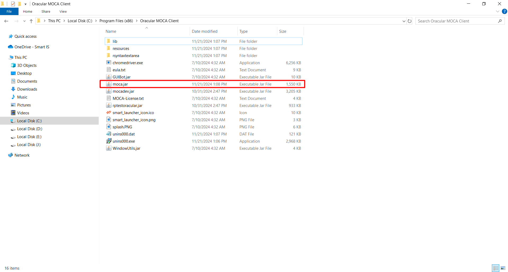

## Get started with Smart Moca Client

This section will guide you through the initial steps to get you up and running with our powerful and intuitive software. 

Follow these instructions to ensure a smooth installation and setup process.

## System Requirements

Before you begin, make sure your system meets the following minimum requirements:

- Operating System:
    <dd>- Windows 7 or later</dd>
- Processor:
    <dd>- Intel Core i3 or equivalent
- Memory:
    <dd>- 4 GB RAM</dd>
- Storage:
    <dd>- 500 MB available space</dd>
- Internet Connection: 
    <dd>- Required for initial setup and updates</dd>

## Installation

### Download the Installer
       
- Visit the [Smart IS](https://www.smart-is.com/what-we-do/smart-product/smart-is-moca-client/) website and navigate to Our Products > MOCA Client.
       
  

- Click the "Get MOCA Client" button. Complete the form that appears with your information to download the latest version of the installer.

  

- After filling out the form, you will receive an email with a link to the download page.

  

- Now open an email you received from Smart IS and click the **Download MOCA Client** link provided in the email to navigate to the download page and click on **Download Moca Client** button.

  

### Run the Installer
   
- Unzip the downloaded zip folder (mocaclient<**version**>.zip) and open it. 
 
  
 
- Now right click on (mocaclient<**version**>.exe) file and run this installer by clicking on **Run as Administrator**.

  

### Installation Options

Following are the two options for an installation: 

1. Install for all users (Recommended)
2. Install for me only

#### 1. **Install for all users (Recommended)**

- Choose an option `Install for all users(recommended)` and it will be installed at the location `C:\Program Files (x86)` to be accessible for all users.
      
  

- Now follow the on-screen instructions to complete the installation process.

  
  
  
  
  
  
   
   

  **Verify Installation**

  The folder named as `Oracular MOCA Client` should be created at following paths:

  
  
  
  
### Launch Smart Moca Client
   
- Once installed, launch Smart Moca client by double-clicking on desktop icon or search for it in the start menu.

- Once an application gets started, you will see below interface:

  

- Follow [Password Security](./connections.md) for an information about **Security** popup.

## Add Server

Follow [Add/Update/Remove Server](./connections.md) to add server in Smart Moca Client.

## Handling moca.jar in Smart MOCA Client

On first Smart MOCA Client installation, by default system includes **`labelzoom-ossi.jar`** in the `C:\Program Files (x86)\Oracular MOCA Client\lib` directory instead of moca.jar. 

  

However, it is recommended to use BlueYonder's moca.jar instead of ossimoca.jar.

Following are the methods to use an official moca.jar:

### 1. Get moca.jar from Smart Moca Client

- Right-click on moca client launcher from desktop or start menu and click on **Run as adminstrator**.

  

There are two methods to download `moca.jar` from Smart Moca Client as: 

**Method 1:** Download upon Server Connection

- Upon the first server connection, the Smart MOCA Client detects the absence of moca.jar and uses ossimoca.jar temporarily with a following message appear as a popup:

  

- When you will click the button, the system will begin downloading the moca.pending_jar file into the $MOCADIR. 

  
  
  

**Method 2:** Download via Tools Menu

- If you have skipped [Get moca.jar from Smart Moca Client](#1-get-mocajar-from-smart-moca-client), then you can download the moca.jar later by navigating to **Tools --> Download moca.jar**.

  

- On click, the download process will start immediately by displaying the following dialog:

  
  
  

- After the download completes, close Moca Client and reopen it as an **administrator**. Now system will automatically rename moca.pending_jar to moca.jar and show following popup:

  
  

- Now when you will restart an application, the sytem will use `moca.jar` instead of ossimoca.jar.

This method provides a convenient alternative to ensure the moca.jar file is downloaded and installed properly.

<mark>**Note:** *Please launch Smart Moca Client as an Administrator and connect to server to download moca.jar successfully.*</mark>

### 2. Manual placement of 'moca.jar'

Follow the steps below to manually place moca.jar:

1. Navigate to the `C:\Program Files (x86)\Oracular MOCA Client/lib` and remove the existing `ossimoca.jar` file.

    

2. Now place Blueyonder's `moca.jar` file at `C:\Program Files (x86)\Oracular MOCA Client`.

    

This process will allow you to use the necessary moca.jar file with the Smart MOCA Client.

**Important Note on Reinstallation**

During the reinstallation of Smart MOCA Client, the installer will not place the `labelzoom-ossi.jar` file in the `lib` folder if the moca.jar file is already present. However, if no moca.jar file is found, the installer will automatically add labelzoom-ossi.jar to the directory.

By managing these files correctly, you can ensure compatibility with various versions of Blue Yonder and other systems.

## Typical Installation Issues - Smart Moca Client 

1. Download moca.jar without launching moca client as an administrator and get following error:

    

    **Solution:**

     - Right-click on moca client launcher from desktop or start menu and click on **Run as adminstrator** to download moca.jar.

2. Download moca.jar by navigating `Tools->Download moca.jar` without adding server connections and get following error:

    

    **Solution:**

     - Follow [Add/Update/Remove Server](./connections.md) to add server information for the connection in Smart Moca Client.

3. Get following error while downloading moca.jar:

    

    **Solution:**

     - It is needed to restart Moca Client twice as `Run as administrator` as mentioned in [Get moca.jar from Smart Moca Client](#1-get-mocajar-from-smart-moca-client). 

4. moca.jar is downloaded but moca client is not using it and you are getting issues related moca.jar like tracing etc.

    

    **Solution:**

     - Restart moca client as an Administrator atleast once to use moca.jar and verify by navigating **Help -> About Smart MOCA and SQL Client**. 

    

5. Moca client launcher shortcut is not created at desktop/start menu or it is throwing an error.

    **Solution:**

     - Create shortcut using mocadev.jar or launch directly. 

      

6. Navigate to Addons -> Warehouse Migrator and get following error:

    

    **Solution:**

     - Follow [Smart Apps](https://apps.smart-is.com/profile) to save gnerated appkey in moca client by navigating **Smart Connect -> Cloud Connect**.

      

7. Get following error on adding server:

    

    **Solution:**

     - Restart moca clinet and again add server information.

