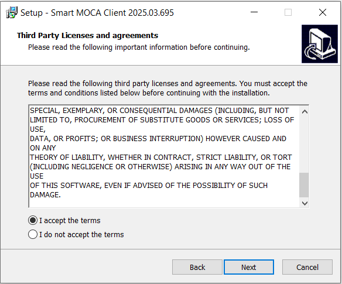
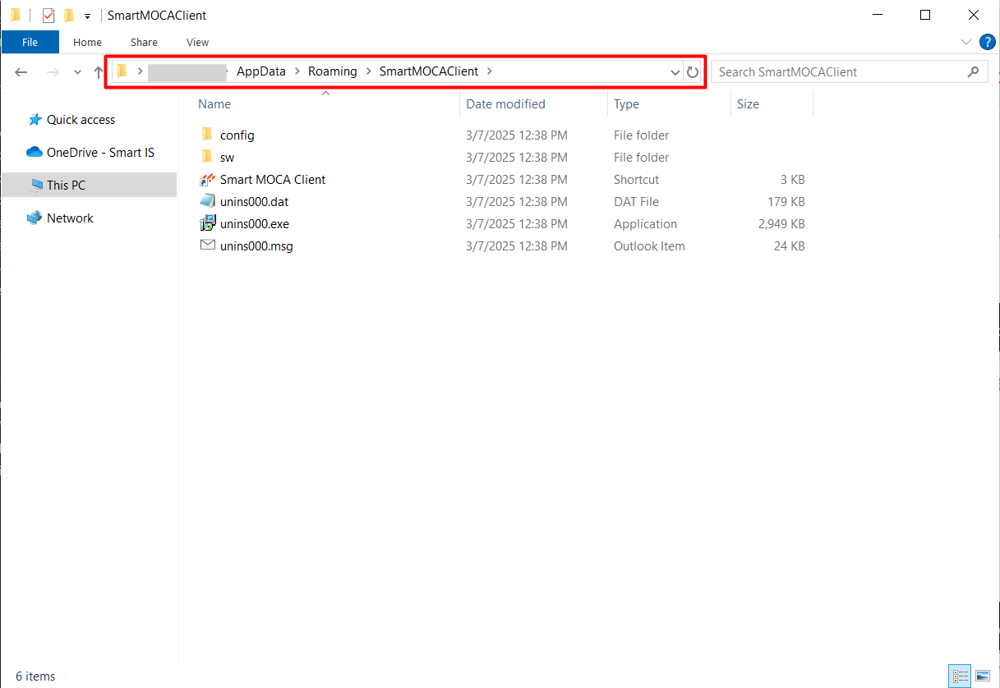
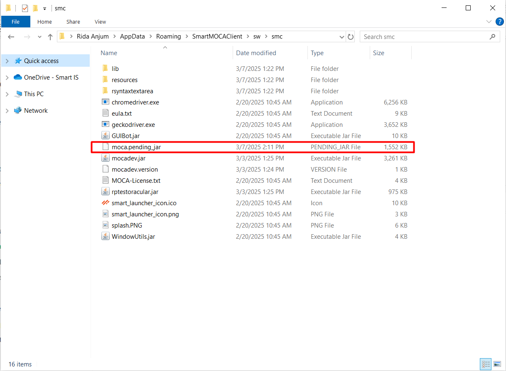

## Get started with Smart Moca Client

This section will guide you through the initial steps to get you up and running with our powerful and intuitive software. 

Follow these instructions to ensure a smooth installation and setup process:

## System Requirements

Before you begin, make sure your system meets the following minimum requirements:

- Operating System:
    <dd>- Windows 7 or later</dd>
- Processor:
    <dd>- Intel Core i3 or equivalent
- Memory:
    <dd>- 4 GB RAM</dd>
- Storage:
    <dd>- 500 MB available space</dd>
- Internet Connection: 
    <dd>- Required for initial setup and updates</dd>

## Download Smart Moca Client
       
- Visit the [Smart IS](https://www.smart-is.com/what-we-do/smart-product/smart-is-moca-client/) website and navigate to Our Products > MOCA Client.
       
  

- Click the **Get MOCA Client** button and complete the form that appears with your information to download the latest version of the installer.

  

- After filling out the form, you will receive an email with a link to the download page.

  

- Now open an email you received from Smart IS and Select the **Download MOCA Client** link provided in the email to navigate to the download page.

  

**Installation Options**
  
Following are the two options for an installation: 

1. Installer
2. Portable 

### Download the Installer
  
- On download page, select **Installer** and click on **Download** button.

  

- After clicking **"Download"**, the Installion setup will begin downloading.

  

#### Run the Installer
   
- Unzip the downloaded zip folder (mocaclient-setup<**version**>.zip) and open it.
 
  
 
- Now double click on (mocaclient<**version**>.exe) file and run this installer.

  

- Now follow the on-screen instructions to complete the installation process.

  
  
  
  
  
  
   
   
 
#### Verify Installation

- The folder named as `Oracular MOCA Client` and `SmartMOCAClient` should be created at following path:

  
  

### Download the Portable 

- On download page, select **Portable** and click on **Download** button.

  

- After clicking **"Download"**, the portable setup will begin downloading.
  
  

#### Run the Portable

- Unzip the downloaded zip folder (mocaclient-portable<**version**>.zip) and open it.
   
  

- Now double click on Run Setup and it will Download **Smart MOCA Client** using powershell.

  
  

#### Verify Installation

Follow [Verify Installation](#verify-installation) to verify correct installation of Smart MOCA Client.
  
## Launch Smart MOCA Client
   
- Once installed, launch Smart Moca client by double-clicking on desktop icon or search for it in the start menu.

  

  <mark>**Note:** In case shortcuts are not created, following shortcut can be used to launch Smart MOCA Client.</mark>

   

- Once an application gets started, you will see below interface:

  

Note: *Follow [Password Security](./connections.md) for an information about **Security** popup*.

## Add Server

Follow [Add/Update/Remove Server](./connections.md) to add server in Smart Moca Client.

## Use moca.jar instead of labelzoom.jar

It is recommended to use BlueYonder's moca.jar instead of labelzoom.jar.

Following are the methods to use `moca.jar` in Smart MOCA Client:

1. Download upon Server Connection
2. Download via Tools Menu
3. Manual placement of 'moca.jar' file

### Download upon Server Connection

- Upon the first server connection, the Smart MOCA Client detects the absence of moca.jar and following popup appears:

  

- Click on the **Download and Use the moca.jar from this environment** button and the system will begin downloading the moca.pending_jar file .

  
  
  

- Now click on **OK** button and **restart** Smart MOCA Client. The system will automatically rename **moca.pending_jar** to **moca.jar** and will use moca.jar instead of labelzoom.jar.

  

- Finally verify the usage of moca.jar by navigating **Help --> About Smart MOCA and SQL Client**.

  

### Download via Tools Menu

- If you have skipped [Download upon Server Connection](#download-upon-server-connection), then you can download the moca.jar later by navigating to **Tools --> Download moca.jar**.

  

### Manual placement of 'moca.jar'

Follow the steps below to manually place moca.jar:

1. Close Smart MOCA Client application and place Blueyonder's `moca.jar` in `C:\Users\\AppData\Roaming\SmartMOCAClient\sw\smc`.

    

This process will allow you to use the necessary moca.jar file with the Smart MOCA Client.

<mark>**Note:** *moca.jar should be compatible with current java version.*</mark>

