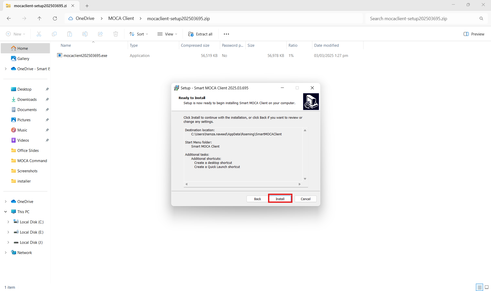
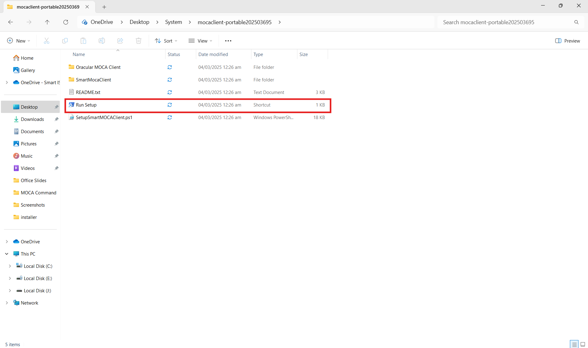
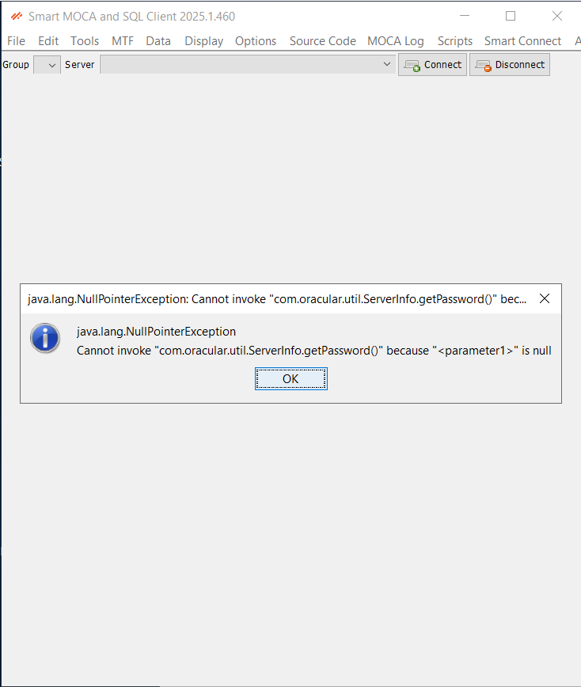
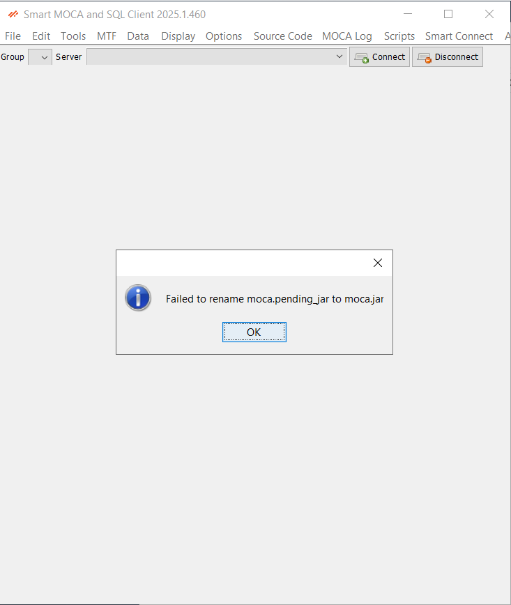
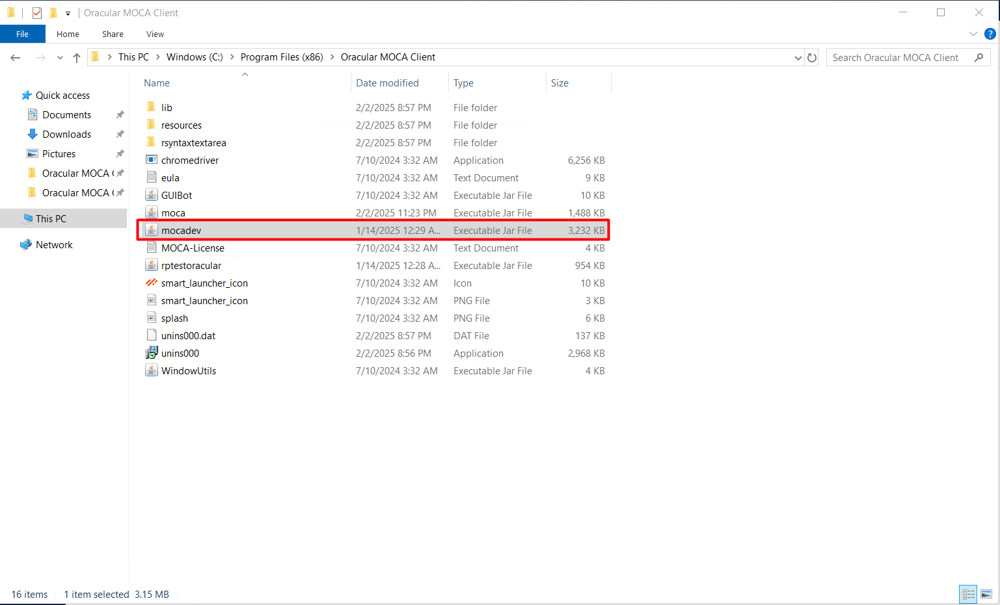

## Get started with Smart Moca Client

This section will guide you through the initial steps to get you up and running with our powerful and intuitive software. 

Follow these instructions to ensure a smooth installation and setup process.

## System Requirements

Before you begin, make sure your system meets the following minimum requirements:

- Operating System:
    <dd>- Windows 7 or later</dd>
- Processor:
    <dd>- Intel Core i3 or equivalent
- Memory:
    <dd>- 4 GB RAM</dd>
- Storage:
    <dd>- 500 MB available space</dd>
- Internet Connection: 
    <dd>- Required for initial setup and updates</dd>

## Installation Options

Following are the two options for an installation: 

1. Installer Package
2. Portable Version

### Download the Installer
       
- Visit the [Smart IS](https://www.smart-is.com/what-we-do/smart-product/smart-is-moca-client/) website and navigate to Our Products > MOCA Client.
       
  

- Click the "Get MOCA Client" button. Complete the form that appears with your information to download the latest version of the installer.

  

- After filling out the form, you will receive an email with a link to the download page.

  

- Now open an email you received from Smart IS and Select the **Download MOCA Client** link provided in the email to navigate to the download page and then select **Installer** and click on **Download Moca Client** button.

  
- After Clicking on download Moca Installer will be downloaded.
  

### Run the Installer
   
- Move towards the location where Installer file is downloaded.
 
  
 
- Now Double Click on the setup and Install MOCA.
- Now follow the on-screen instructions to complete the installation process.

      
  
  
  
  
  
  
  
 

  **Verify Installation**

  The folder named as `Oracular MOCA Client` and `SmartMOCAClient` should be created at following path:

  
  
  
### Launch Smart Moca Client
   
- Once installed, launch Smart Moca client by double-clicking on desktop icon or search for it in the start menu.

- Once an application gets started, you will see below interface:

  

- Follow [Password Security](./connections.md) for an information about **Security** popup.

## Add Server

Follow [Add/Update/Remove Server](./connections.md) to add server in Smart Moca Client.

## Downloading moca.jar in Smart MOCA Client

### 1. Download upon Server Connection

- After **Completing installation** and Run **Smart MOCA Client** their is a popup for downloading moca.jar

  

- Click on the Download and a moca.pending_jar is downloaded.

  

- Please Close **Smart MOCA client** and Restart it you will see moca.jar is downloaded.

  

### 2. Manual placement of 'moca.jar'

Follow [Manual placement of 'moca.jar'](./Legacy.md#2-manual-placement-of-mocajar) for manual placement of moca.jar

### Download the Portable 
- Visit the [Smart IS](https://www.smart-is.com/what-we-do/smart-product/smart-is-moca-client/) website and navigate to Our Products > MOCA Client.
       
  

- Click the "Get MOCA Client" button. Complete the form that appears with your information to download the latest version of the installer.

  

- After filling out the form, you will receive an email with a link to the download page.

  

- Now open an email you received from Smart IS and Select the **Download MOCA Client** link provided in the email to navigate to the download page and then select **Portable** and click on **Download Moca Client** button.

  
- After Clicking on download Moca Installer will be downloaded.
  

### Run the Portable

- Move towards the location where Portable.zip file is downloaded.
 
  
 
- Now Extract the zip file for Downloading **Smart MOCA Client**.

  

- Extracted folder will be open and files are ready to use.

  

- Click on Run setup it will Download **Smart MOCA Client** using powershell

  

  **Verify Installation**

  The folder named as `Oracular MOCA Client` and `SmartMOCAClient` should be created at following path:

  
  
  
### Launch Smart Moca Client
   
- Once installed, launch Smart Moca client by double-clicking on desktop icon or search for it in the start menu.

- Once an application gets started, you will see below interface:

  

- Follow [Password Security](./connections.md) for an information about **Security** popup.

## Add Server

Follow [Add/Update/Remove Server](./connections.md) to add server in Smart Moca Client.

## Downloading moca.jar in Smart MOCA Client

### 1. Download upon Server Connection

- After **Completing installation** and Run **Smart MOCA Client** their is a popup for downloading moca.jar

  

- Click on the Download and a moca.pending_jar is downloaded.

  

- Please Close **Smart MOCA client** and Restart it you will see moca.jar is downloaded.

  

### 2. Manual placement of 'moca.jar'

Follow [Manual placement of 'moca.jar'](./Legacy.md#2-manual-placement-of-mocajar) for manual placement of moca.jar

## Typical Installation Issues - Smart Moca Client 

1. Download moca.jar without launching moca client as an administrator and get following error:

    

    **Solution:**

     - Right-click on moca client launcher from desktop or start menu and click on **Run as adminstrator** to download moca.jar.

2. Download moca.jar by navigating `Tools->Download moca.jar` without adding server connections and get following error:

    

    **Solution:**

     - Follow [Add/Update/Remove Server](./connections.md) to add server information for the connection in Smart Moca Client.

3. Get following error while downloading moca.jar:

    

    **Solution:**

     - It is needed to restart Moca Client twice as `Run as administrator` as mentioned in [Get moca.jar from Smart Moca Client](#1-get-mocajar-from-smart-moca-client). 

4. moca.jar is downloaded but moca client is not using it and you are getting issues related moca.jar like tracing etc.

    

    **Solution:**

     - Restart moca client as an Administrator atleast once to use moca.jar and verify by navigating **Help -> About Smart MOCA and SQL Client**. 

    

5. Moca client launcher shortcut is not created at desktop/start menu or it is throwing an error.

    **Solution:**

     - Create shortcut using mocadev.jar or launch directly. 

      

6. Navigate to Addons -> Warehouse Migrator and get following error:

    

    **Solution:**

     - Follow [Smart Apps](https://apps.smart-is.com/profile) to save gnerated appkey in moca client by navigating **Smart Connect -> Cloud Connect**.

      

7. Get following error on adding server:

    

    **Solution:**

     - Restart moca client and again add server information.
