# Get started with Smart MOCA Client-Current

Guide for connecting to a server using the latest MOCA Client interface.

## Download Smart MOCA Client
       
- Visit the [Smart IS](https://www.smart-is.com/what-we-do/smart-product/smart-is-moca-client/) website and navigate to **Our Products > MOCA Client.**
       
  

- Click the **Get MOCA Client** button and complete the form that appears with your information to download the latest version of the installer.

  

- After filling out the form, you will receive an email with a link to the download page.

  

- Now open an email you received from Smart IS and Select the **Download MOCA Client** link provided in the email to navigate to the download page.

  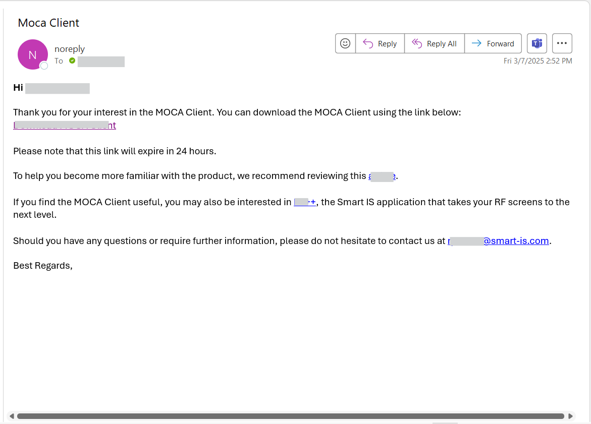

**Installation Options**
  
The following are the three options for installation: 

1. EXE Installer  
2. Portable  
3. MSI Installer  

---

### Download the EXE Installer
  
- On the download page, select **Installer** and click on **Download** button.

  

- After clicking **"Download"**, the installation setup will begin downloading.

  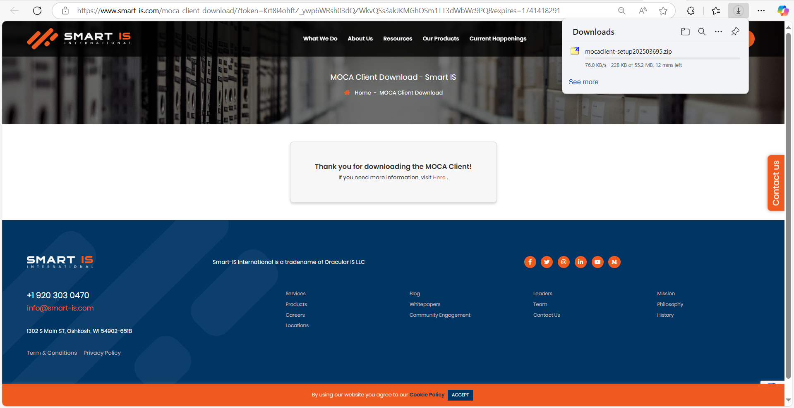

#### Run the EXE Installer
   
- Unzip the downloaded zip folder (mocaclient-setup<**version**>.zip) and open it.
 
  
 
- Now double click on (mocaclient<**version**>.exe) file and run this installer.

  

- Now follow the on-screen instructions to complete the installation process.

  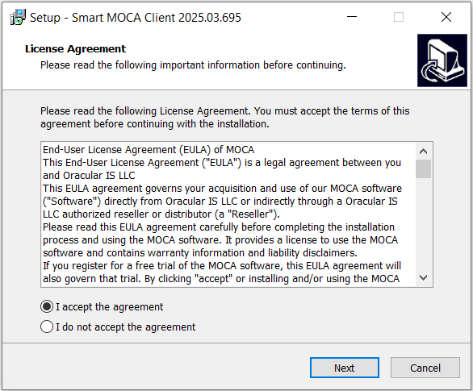
  
  
  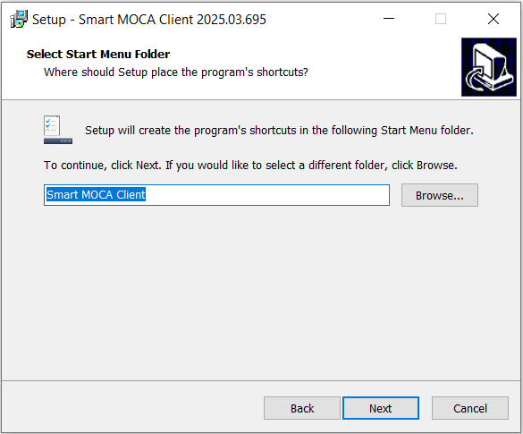
  
  
   
  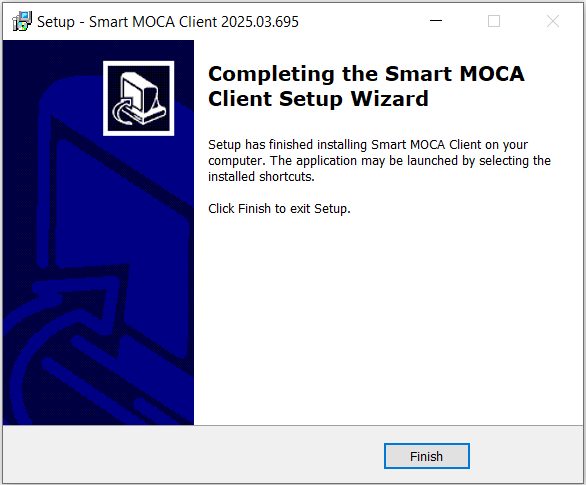 
 
#### Verify Installation

- The folder named `Oracular MOCA Client` and `SmartMOCAClient` should be created at the following path:

  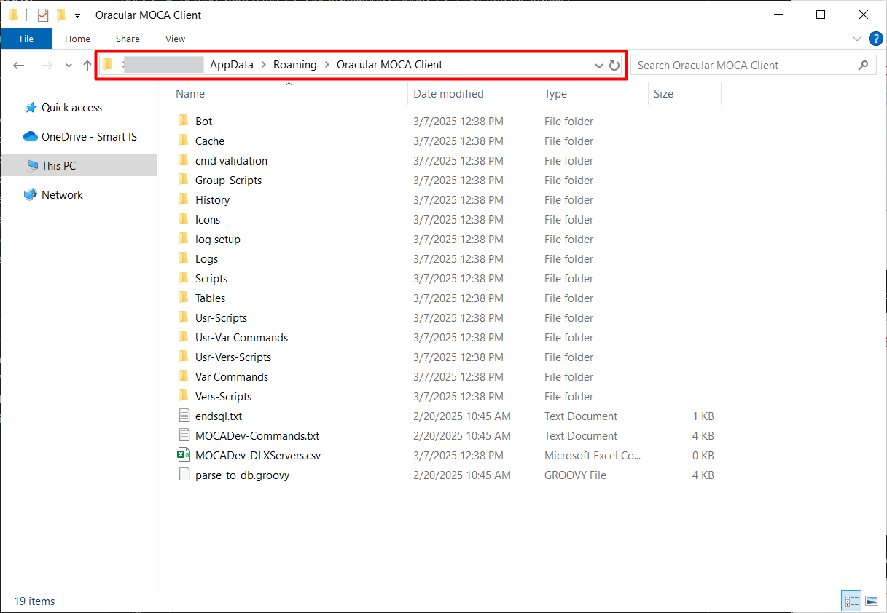
  

- Once the installation process via the Installer is complete, you can verify it by checking the designated installation directory.

---

### Download the Portable 

- On the download page, select **Portable** and click on **Download** button.

  

- After clicking **"Download"**, the portable setup will begin downloading.
  
  

#### Run the Portable

- Unzip the downloaded zip folder (mocaclient-portable<**version**>.zip) and open it.
   
  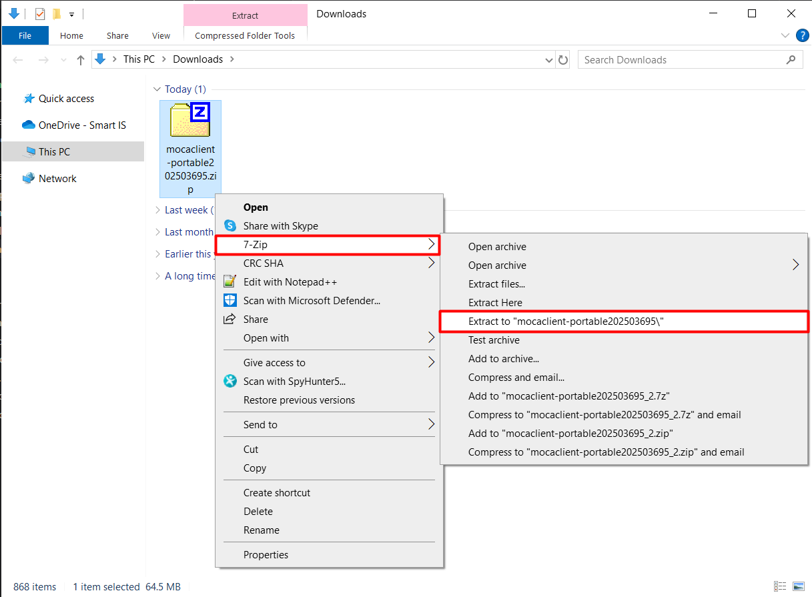

- Now double click on Run Setup and it will Download **Smart MOCA Client** using PowerShell.

  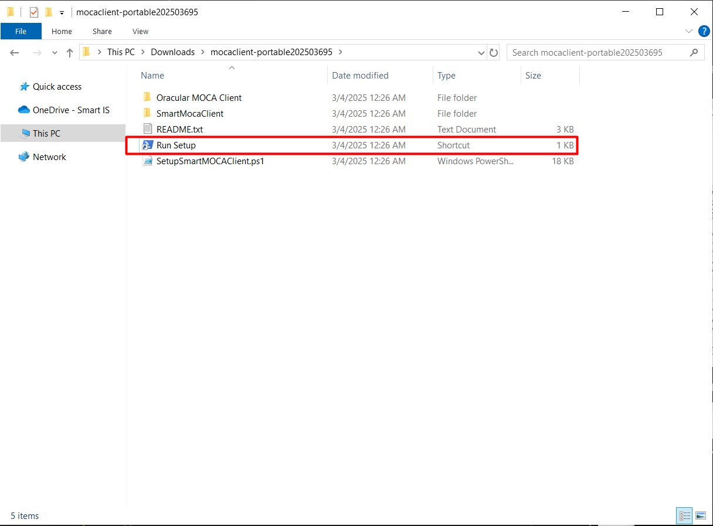
  

#### Verify Installation

Follow [Verify Installation](#verify-installation) to verify correct installation of Smart MOCA Client.

---

### Download the MSI Installer
  
- On the download page, select **MSI Installer** and click on **Download** button.

  

- After clicking **"Download"**, the MSI setup will begin downloading.

  

#### Run the MSI Installer
   
- Unzip the downloaded zip folder (mocaclient-msi<**version**>.zip) and open it.
 
  
 
- Now double click on (mocaclient<**version**>.msi) file and run this installer.

  

- Follow the on-screen instructions to complete the installation process.

  
  
  
  
  
  
   
   

#### Verify Installation

- The folder named `Oracular MOCA Client` and `SmartMOCAClient` should be created at the following path:

  
  

- Once the MSI installation process is complete, you can verify it by checking the designated installation directory.

---

## Silent Installation Parameters

| Parameter Name | Description                                                                 | Sample Value                               | Required |
|----------------|-----------------------------------------------------------------------------|--------------------------------------------|----------|
| `ACCEPT_EULA`  | Accepts the End User License Agreement. The installer will abort if not set. | `1` (must be provided in silent install)    | Yes      |
| `AUTOUPDATE`   | Enables or disables automatic updates for the Smart MOCA Client.            | `YES` / `NO`                               | No       |
| `INSTALLDIR`   | Overrides the default installation directory. If not set, AppData is used.  | `C:\Users\<User>\AppData\SmartMocaClient`  | No       |
| `JAVA_PATH`    | Specifies the path to the Java installation directory (bin folder expected).| `C:\Program Files\Eclipse Adoptium\jdk-17` | Yes      |

---

### Silent Installation Examples

#### EXE Installer


```powershell
mocaclient-setup.exe /silent ACCEPT_EULA=1 AUTOUPDATE=YES INSTALLDIR="C:\CustomPath\SmartMocaClient" JAVA_PATH="C:\Program Files\Eclipse Adoptium\jdk-17"
```
---


### Launch Smart MOCA Client
   
- Once installed, launch Smart MOCA Client by double-clicking on the desktop icon or searching for it in the start menu.

  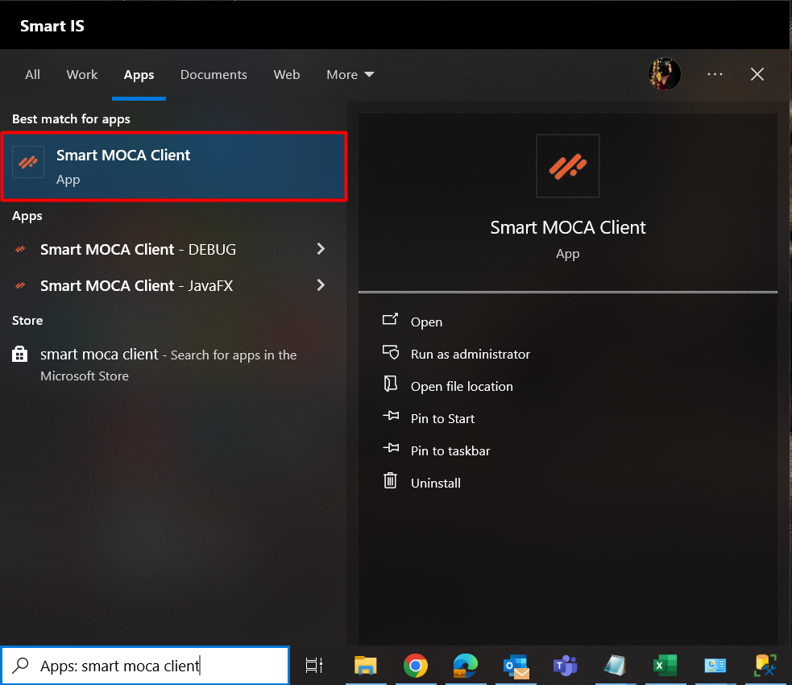

  <mark>**Note:** In case shortcuts are not created, the following shortcut can be used to launch Smart MOCA Client.</mark>

  

- Once the application starts, you will see the following interface:

  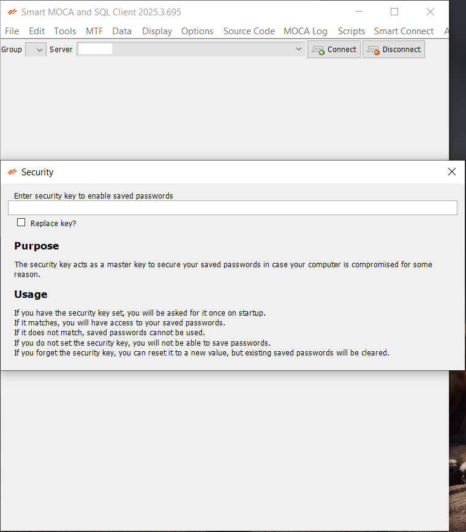

Note: *Follow [Password Security](../connections/secure-server-connections.md) for details about the **Security** popup*.


## Add Server

Follow [Add/Update/Remove Server](./connections/add-connect-remoteserver.md) to add server in Smart MOCA Client.


## Download `moca.jar`

Following are the methods to download `moca.jar` in Smart MOCA Client:

1. Download upon Server Connection
2. Download via Tools Menu


### Download upon Server Connection

- Upon the first server connection, the Smart MOCA Client detects the absence of `moca.jar` and following popup appears:

  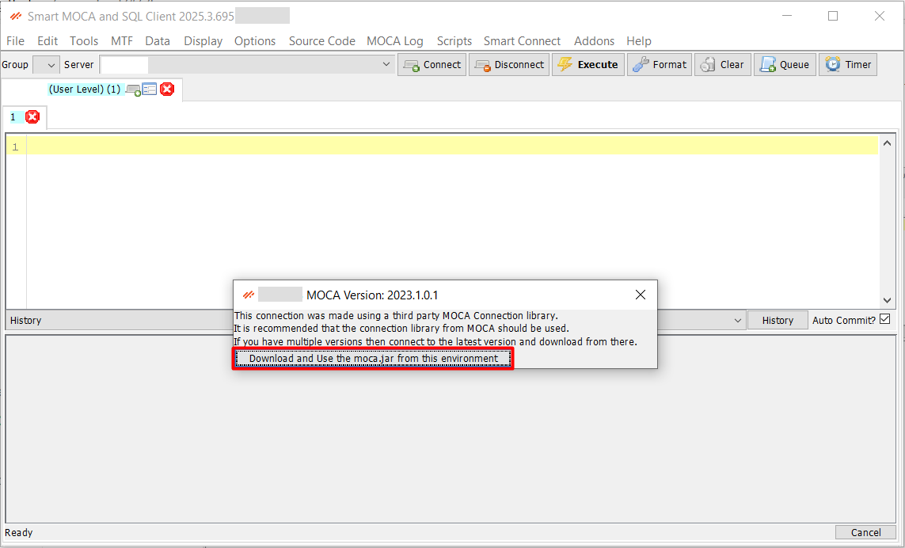

- Click on the **Download and Use the `moca.jar` from this environment** button and the system will begin downloading the moca.pending_jar file .

  
  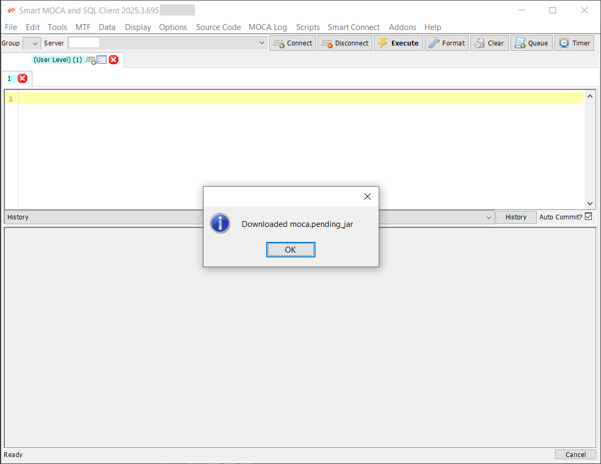

- Navigate to the directory and ensure that the **moca.pending_jar** file has been successfully downloaded.

  

- Now click on **OK** button and **restart** Smart MOCA Client. The system will automatically rename **moca.pending_jar** to **moca.jar** and will use `moca.jar` instead of labelzoom.jar.

  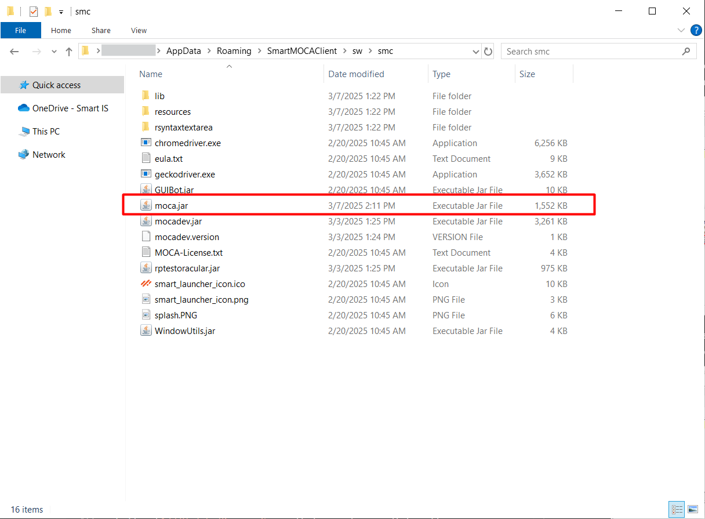

- Finally, verify the usage of `moca.jar` by navigating **Help --> About Smart MOCA and SQL Client**.

  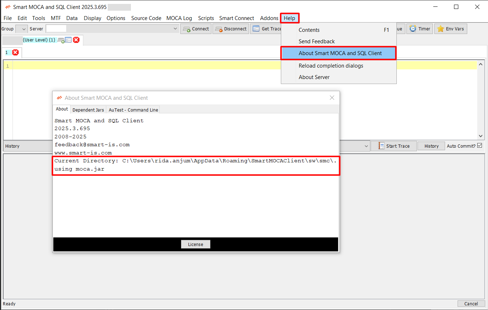

### Download via Tools Menu

- If you have skipped [Download upon Server Connection](#download-upon-server-connection), then you can download the `moca.jar` later by navigating to **Tools --> Download moca.jar**.

  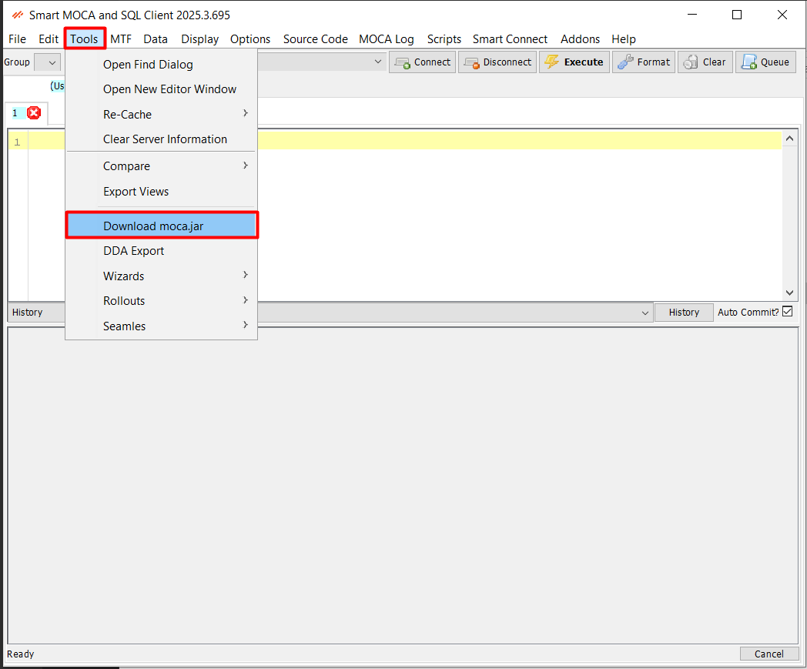

<mark>**Note:** *moca.jar should be compatible with current java version.*</mark>