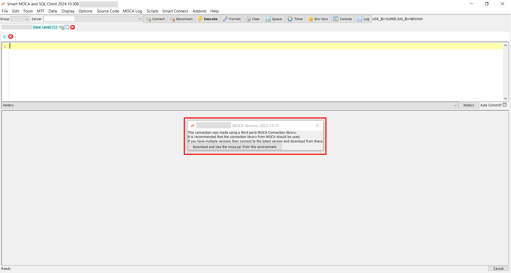
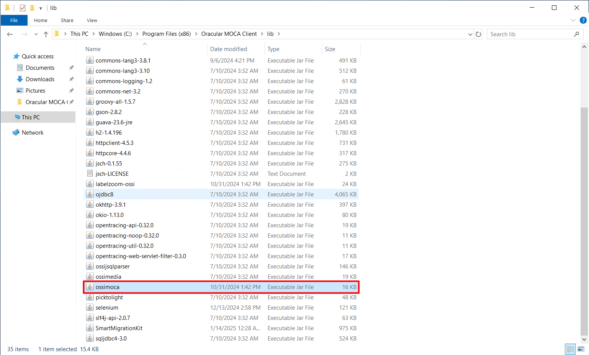
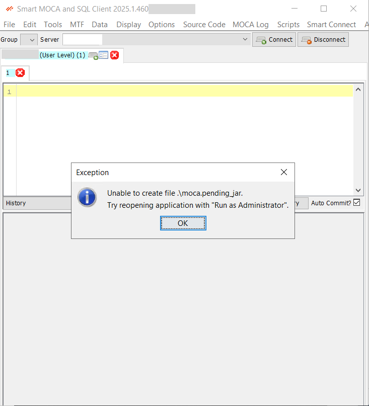
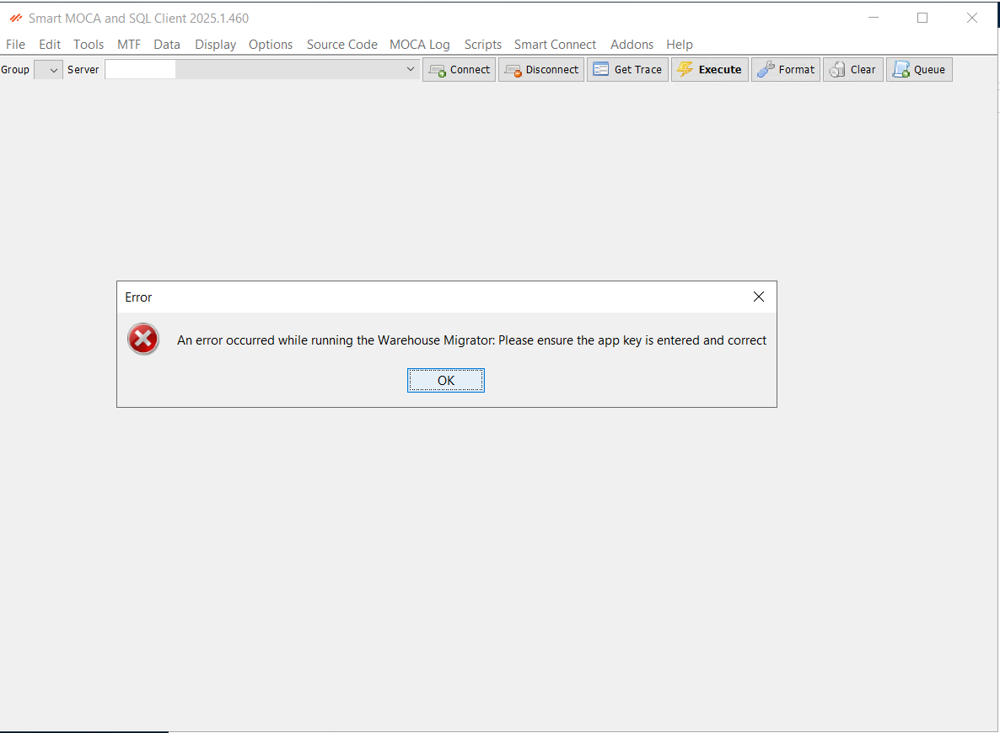

# Get started with Smart MOCA Client-Legacy

This guide walks you through downloading, installing, and launching the legacy Smart MOCA Client.

## Download Smart MOCA Client
       
- Visit the [Smart IS](https://www.smart-is.com/what-we-do/smart-product/smart-is-moca-client/) website and navigate to **Our Products > MOCA Client.**
       
  

- Click the **Get MOCA Client** button. Complete the form that appears with your information to download the latest version of the installer.

  

- After filling out the form, you will receive an email with a link to the download page.

  

- Now open an email you received from Smart IS and click the **Download MOCA Client** link provided in the email to navigate to the download page and click on **Download MOCA Client** button.

  

### Run the Installer
   
- Unzip the downloaded zip folder (mocaclient<**version**>.zip) and open it. 
 
  
 
- Now right click on (mocaclient<**version**>.exe) file and run this installer by clicking on **Run as Administrator**.

  

- Choose an option `Install for all users(recommended)` and it will be installed at the location `C:\Program Files (x86)` to be accessible for all users.
      
  

- Now follow the on-screen instructions to complete the installation process.

  
  
  
  
  
  
   
   

#### Verify Installation

- The folder named `Oracular MOCA Client` should be created at following paths:

  
  
  
  
## Launch Smart MOCA Client
   
- Once installed, launch Smart MOCA Client by double-clicking on desktop icon or search for it in the start menu.

- Once the application starts, you will see the following interface:

  

Note: *Follow [Password Security](./connections/secure-server-connections.md) for an information about **Security** popup*.

## Add Server

Follow [Add/Update/Remove Server](./connections/add-connect-remoteserver.md) to add server in Smart MOCA Client.

## Use moca.jar instead of labelzoom.jar

It is recommended to use BlueYonder's moca.jar instead of labelzoom.jar.

Following are the methods to use `moca.jar` in Smart MOCA Client:

1. Download upon Server Connection
2. Download via Tools Menu
3. Manual placement of 'moca.jar' file

### Download upon Server Connection

- Right-click on MOCA Client launcher from desktop or start menu and click on **Run as Administrator**.

  

- Upon the first server connection, the Smart MOCA Client detects the absence of `moca.jar` and following popup appears:

  

- Click on the **Download and Use the moca.jar from this environment** button and the system will begin downloading the moca.pending_jar file.

  
  
  

- After the download completes, close MOCA Client and reopen it as an **administrator**. Now the system will automatically rename moca.pending_jar to `moca.jar` and show following popup:

  
  

- Now when you restart the application, the system will use `moca.jar` instead of ossimoca.jar.

### Download via Tools Menu

- If you have skipped [Get moca.jar from Smart MOCA Client](#1-get-mocajar-from-smart-moca-client), then you can download the moca.jar later by navigating to **Tools --> Download moca.jar**.

  

<mark>**Note:** *Please launch Smart MOCA Client as an Administrator and connect to server to download moca.jar successfully.*</mark>

### Manual placement of 'moca.jar'

Follow the steps below to manually place `moca.jar`:

1. Navigate to the `C:\Program Files (x86)\Oracular MOCA Client/lib` and remove the existing `ossimoca.jar` file.

    

2. Now place Blue Yonder's `moca.jar` file at `C:\Program Files (x86)\Oracular MOCA Client`

    

This process will allow you to use the necessary `moca.jar` file with the Smart MOCA Client.

## Typical Installation Issues - Smart MOCA Client 

1. If you download `moca.jar` without launching MOCA Client as an administrator, and get the following error:

    

    **Solution:**

     - Right-click on MOCA Client launcher from desktop or start menu and click on **Run as Adminstrator** to download `moca.jar`

2. If you download `moca.jar` by navigating `Tools->Download moca.jar` without adding server connections and get the following error:

    

    **Solution:**

     - Follow [Add/Update/Remove Server](../connections.md) to add server information for the connection in Smart MOCA Client.

3. If you get following error while downloading `moca.jar`

    

    **Solution:**

     - It is necessary to restart MOCA Client twice as `Run as administrator` as mentioned in [Get moca.jar from Smart MOCA Client](#1-get-mocajar-from-smart-moca-client). 

4. If `moca.jar` is downloaded but MOCA Client is not using it and you are getting issues related `moca.jar` like tracing etc.

    

    **Solution:**

     - Restart MOCA Client as an Administrator at least once to use `moca.jar` and verify it by navigating to **Help -> About Smart MOCA and SQL Client**. 

    

5. If MOCA Client launcher shortcut is not created at desktop/start menu or it is throwing an error.

    **Solution:**

     - Create shortcut using mocadev.jar or launch directly. 

      

6. If you navigate to Addons -> Warehouse Migrator and get following error:

    

    **Solution:**

     - Follow [Smart Apps](https://apps.smart-is.com/profile) to save generated app key in MOCA Client by navigating to **Smart Connect -> Cloud Connect**.

      

7. If you get following error on adding server:

    

    **Solution:**

     - Restart MOCA Client and add the server information again.
