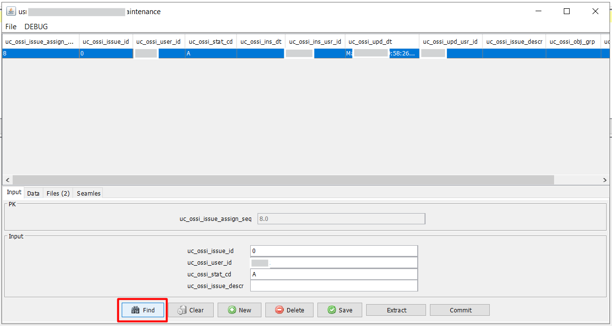

# Issue Assignment

The **Issue Assignment** feature in the Smart MOCA Client is a powerful and structured tool designed to facilitate the assignment, tracking, and resolution of issues throughout the software development and deployment lifecycle. It enables users to assign specific tasks or bugs to team members, define priorities, and monitor the status and progress of each issue ensuring timely delivery and improved project management.

This interface plays a critical role in maintaining accountability and streamlining team collaboration by organizing work items in a centralized environment.

## Main Components

Each tab within the Issue Assignment window provides specialized functionalities to help users effectively track and manage different aspects of an issue:

### 1. Input 

The Input tab is used for entering key details when creating or updating an issue. Users can specify:

- User ID: Indicates the individual to whom the issue is assigned.
- Issue Sequence: A unique identifier for tracking the issue.
- Status: Denotes the current state of the issue (e.g., Active, In Progress, Inactive).
- Description: A brief summary of the issue, providing context and clarity on what needs to be addressed.

This section forms the foundational information of an issue and is essential for proper assignment, documentation, and filtering.

### 2. Data
The Data tab provides a robust interface to track and review changes made to database tables that are associated with the issue. It allows users to:

- View inserted, updated, or deleted records.
- Understand the impact of the issue on the system’s data layer.
- Ensure that database-related concerns are being properly logged and monitored.

This is particularly valuable for troubleshooting data integrity issues and validating whether database transactions are aligned with expected application behavior.

### 3. Files
The Files tab enables tracking of any file-level changes relevant to the issue. This may include:

- Source code files.
- Configuration files.
- Supporting documentation or scripts.

Users can compare changes, maintain version control, and document all file modifications in one place. This ensures that development efforts are clearly recorded and facilitates rollback or audit when necessary.

### 4. Seamles
The Seamles tab (typically associated with Seamless Integrations) is specifically tailored to capture changes made within the Integrator module of the application. It is used to:

- Monitor integration-specific changes or transformations.
- Track data flows between systems.
- Ensure consistency and completeness of integration tasks related to the issue.

This is especially useful in environments where Smart MOCA is integrated with external applications, helping teams manage those interfaces effectively.

### 5. Commit Changes
The Commit Changes functionality is crucial for finalizing updates associated with an issue. It allows users to:

- Commit all related files or data updates in a single, traceable action.
- Ensure that changes are versioned and linked directly to the specific issue.
- Maintain a clear and auditable change history for better traceability and accountability.

This step helps enforce best practices around source control and change management by ensuring all updates are properly recorded and committed before resolution.

