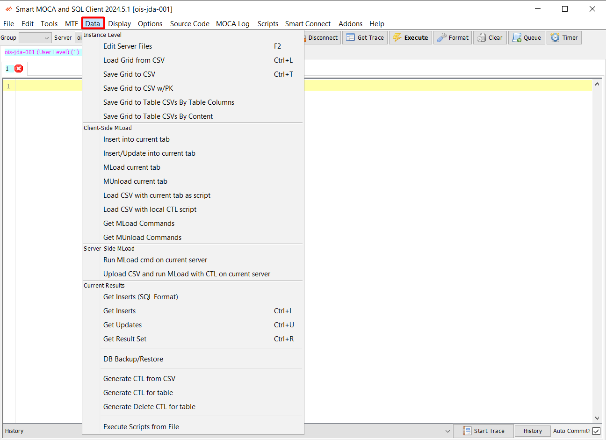

## Data Menu

The Data menu in Smart MOCA Client provides tools for managing and manipulating data at different levels. 

### Data Menu Components

Below are the components of the Data menu categorized based on their functionality:

#### Instance Level

 Edit Server Files 

 Load Grid from CSV 

 Save Grid to CSV 

 Save Grid to CSV w/PK 

 Save Grid to Table CSVs by Table Columns 

 Save Grid to Table CSVs by Content 

---

#### Client-Side MLoad

 Insert into current tab 

 Insert/Update into current tab 

 MLoad current tab 

 MUnLoad current tab 

 Load CSV with current tab as script 

 Load CSV with local CTL script 

 Get MLoad Commands 

 Get MUnLoad Commands 

---

#### Server-Side MLoad

 Run MLoad cmd on current server 

 Upload CSV and run Mload with CTL on current server 

---

#### Current Results

 Get Inserts (SQL Format) 

 Get Inserts 

 Get Updates 

 Get Result Set 

 DB Backup/Restore 

 Generate CTL from CSV 

 Generate CTL for table 

 Generate Delete CTL for table 

 Execute Scripts from File 

