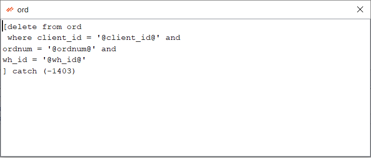

## Data Menu Overview

The Data menu in Smart MOCA Client provides tools for managing and manipulating data at different levels. 

## Components

Below are the components of the Data menu categorized based on their functionality:

## Instance Level

### Edit Server Files

This function is developed to provide a way of reading the files on a remote server if we do not have telnet access. The start directory is $LESDIR/src/cmdsrc.

### Load Grid from CSV

This option allows us to load the table from a .csv file. To perform this operation, click on it and choose your file.

### Save Grid to CSV

This option allows us to save grid/table into csv file. 

### Save Grid to CSV w/PK

Saves the table to a .csv file with each row in its own file.

### Save Grid to Table CSVs by Table Columns

Save all rows to separate CSVs, using first column as filename. Only columns returned in ‘list table columns’ are included.

### Save Grid to Table CSVs by Content

This option allows us to save all rows to separate CSVs, using first column as filename. All columns with data are added to the file (allows you to have wh_id even if the table doesn’t have it)

---

## Client-Side MLoad

### Insert into current tab

Generates insert statements and execute them on the current tab.

### Insert/Update into current tab

Generates insert statements and execute them on the current tab. If it already exists, does an update.

### MLoad current tab

Generated sl_change_gen_maint commands and execute them on current tab to load the data in the .csv’s selected into the environment of the current tab. Filenames are expected to be the table name to load, have the table name after 2 underscores (i.e. USR-DDA__dda_mst.csv), or have the table name then a dash (i.e prtmst-30870.csv). Any errors will be displayed in a popup box.

### MUnLoad current tab

Generated sl_remove_gen_maint commands and works same as MLoad, but removes the data instead.

### Load CSV with current tab as script

Execute each row of .csv through the script in current tab. Uses the tab’s text as though it were a .ctl file and processes each line of the file through it. This is useful for loading large CSVs as the entire file is not loaded, just line-by-line. The progress is shown in the status bar.

### Load CSV with local CTL script

Choose a .ctl script on your computer and process each line of a .csv file through it. It is same as “Load CSV with current tab as script”, but the script comes from the file you chose rather than the current tab’s text.

### Get MLoad Commands

Copies sl_change_gen_maint commands to the clipboard for current tab table data.

### Get MUnLoad Commands

Copies sl_remove_gen_maint commands to the clipboard for current tab table data.

---

## Server-Side MLoad

### Run MLoad cmd on current server

Execute os command of 'mload'. The .csv and .ctl file must reside on the server in db/data/load.

### Upload CSV and run Mload with CTL on current server

Execute os command of 'mload' after uploading csv.

---

## Current Results

### Get Inserts (SQL Format)

Uses the active table to create insert statements for each row of the table using SQl format.

### Get Inserts

Uses the active table to create insert statements for each row of the table with an error catch.

### Get Updates

Copies sl_change_gen_maint commands to the clipboard for each row of an active table.

### Get Result Set

Copies publish data commands to the clipboard for an active table.

### DB Backup/Restore

It is used for copying selected tables to .zip or restore from .zip. It opens a dialog of tables to include/exclude from the backup, then writes them in CSV form to a ZIP file when you click “Start Backup”. You can also restore a backup made previously by optionally truncating the existing table and inserting the rows in the file.

### Generate CTL from CSV

Generates Add/Update .ctl script in pop up window for chosen .csv file data. If record already exists, update it else insert new entry.

### Generate CTL for table

Generates Add/Update .ctl script for active table or selected table. If record already exists, update it else insert new entry.

### Generate Delete CTL for table

Generates Delete .ctl script for selected table.

### Execute Scripts from File

Executes script from chosen file.