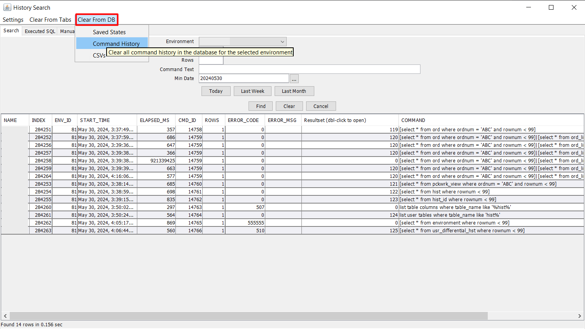

## Edit Menu Overview

The Edit menu in Smart MOCA Client provides tools for manipulating and editing scripts and commands. 

## Components

Below are the components of the Edit menu along with their descriptions:

### Find/Replace

The Find/Replace tool allows users to search for and replace specific words or phrases within their script. 

- Enter the text you want to search for in the "Find" text field and navigate through the search results using the 'Find Next' and 'Find Previous' buttons.
- Enter the replacement text in the 'Replace with' field and 'Replace' to replace the current instance or 'Replace All' to replace all instances of the search text within the document.

  

---

### Load Command from History

The Load Command from History option enables users to load commands from the command history. To load a command from history, click the "Find" button in the dialogue box and select the desired command. 

- To clear history from tabs, navigate to Clear from Tabs and select environment to delete history from tabs.

     

- To clear history from DB, navigate to Clear from DB --> Command History and select environment to delete history from DB.

     

##### Additional information:

- Error Code: Indicates error status, with 0 for no error, a non-zero number for a specific error, and ! =0 for any error.
- Rows: Indicates the number of rows, with 0 for no rows, >0 for non-zero rows, and any number for a specific number of rows.
- Command Text: Allows searching for commands containing specific text (e.g., "%order%" to display any command with "order" in it).
- Min Date: Specifies the minimum date in YYYY-MM-DD HH:MI:SS format. Utilize the date picker dialog accessible via the button next to the textbox.
- History Storage: Starting from version 2022, the history is stored in an H2 database. Searching populates the "Executed SQL" tab, while the "Manual Query" tab allows execution of more advanced queries.

---

### To UPPERCASE

To UPPERCASE option converts selected text to uppercase. To perform this action, select the text from the script and choose this option.

---

### To LOWERCASE 

To LOWERCASE option converts selected text to lowercase. To perform this action, select the text from the script and choose this option.

---

### SQL

The SQL – Convert joins to ISO99 syntax option allows users to convert joins into ISO99 syntax for improved readability and standardization of SQL queries.

---

####  Convert joins to ISO99 syntax
    
The SQL – Convert joins to ISO99 syntax option allows users to convert joins into ISO99 syntax for improved readability and standardization of SQL queries.

> Steps for Join Conversion

1. Open Join Converter: Navigate to the Join Converter tool and open it. On the left side of the window, you'll find a text area where you can write the code containing the joins that need to be converted.

2. Write Code: In the text area on the left side, input the code containing the joins that you want to convert into ISO99 syntax. Ensure that the code is correctly formatted and includes all necessary join statements.

3. Convert: Once you've written the code, click on the "Convert" button. The Join Converter tool will analyze the code and convert the join syntax into ISO99 format.

4. Output: After clicking the "Convert" button, the converted code will appear on the right side of the window. Review the converted code to ensure that the joins have been accurately converted into ISO99 syntax.

    

---

### Queue

The Queue menu in Smart MOCA Client provides tools for managing tasks and operations in the queue. 

1. Clear Queue
    
    The Clear Queue option allows users to clear all items from the queue. This action removes any pending tasks or operations from the queue, providing a clean slate for new tasks to be added.

2. Add Multiple to Queue
    
    The Add Multiple to Queue option enables users to add multiple tasks or operations to the queue simultaneously. This feature is useful for batching similar tasks or executing a sequence of operations in a specific order. Users can select multiple items or commands to be added to the queue, streamlining workflow and increasing efficiency.

    

    

