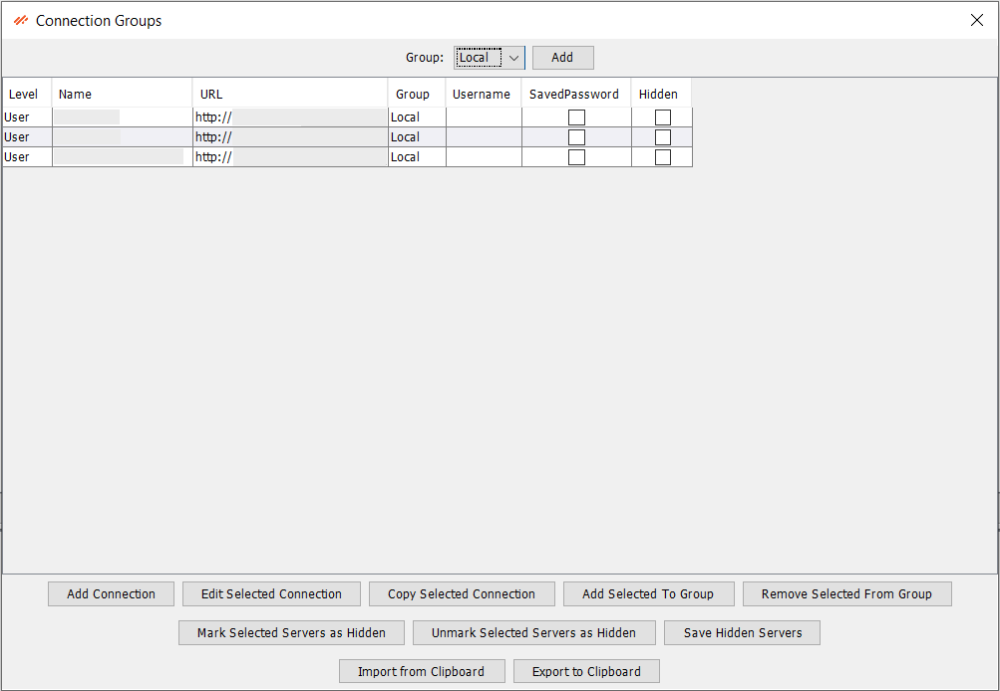
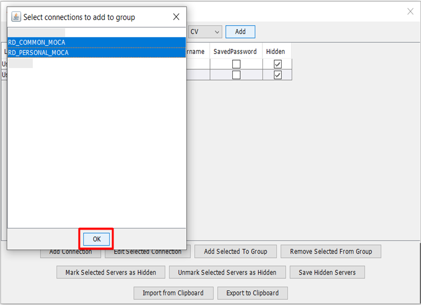

# File Menu Overview

The File Menu in Smart MOCA Client is designed to give you quick access to essential file operations and settings, ensuring efficient management of your projects and data.

## Components

Below is an overview of the components available under the File Menu, each serving a specific function to enhance your workflow.

### Edit Connection Groups

This screen is used to maintain groups for connections.

a. Adding New Connection Group
- For adding a new connection group, simply press on Add button, and add the name of group in dialog box and press OK.

    

- Now it will ask for which connection you want to add in that group then choose connections from this screen and press OK.

    

- The new group will be added to connection after you press OK button.

    

b. Add Connection 
- For adding a new connection, simply press on Add Connection button, enter your connection information and press “Add/Update” button.

    

c. Edit Selected Connection 
- To edit connection, select the connection and press “Edit selected connection” button. After editing the connection, press “Add/Update” button.

    

d. Add Selected to Group 
- To add connection to group, select the connection and press “Add Selected To Group” button. After choosing group, press “OK” button.

    

e. Remove Selected from Group 
- To remove connection from group, select the connection and press “Remove Selected from Group” button. After choosing group, press “OK” button.

    

---

### Edit Servers

This screen also allows us to manage connection information of servers. To edit, simply add your desired information and press “Add/Update” button.

---

### Open MSQL in new tab

This option allows us to load MSQL files into MOCA. To load a MSQL file, simply select this option after making connection and choose your MSQL file. Then press “open “and it will load up your file in new tab.

---

### Save MSQL in current tab

This option allows us to save current tab MSQL into Computer. To save a file just select this option and give your desired name and press “save”. It will save the code of the current tab into your computer. 

---

### Load State

This option allows us to load previously saved tabs from .dbs files. To load state, select this option and choose the previously saved states, and press open.

---

### Save State
This option allows us to save tabs in. dbs format. Simply select this option and press save.

---

### Load Previous Session

This option allows us to load previous sessions of MOCA, so you can easily jump into where you were previously. To load previous sessions, press this option and choose your session and click open button, your session will be loaded.

---

### Open Smart MOCA and SQL client User Directory

By selecting this option, you can open the user directory of Smart MOCA client where all user files are placed.

---

### Open Smart MOCA and SQL client Shared Directory

By selecting this option, you can open the shared directory of Smart MOCA client. This contains Scripts, Variable Commands, Icons, etc.

---

### Print Table

This option allows us to print table results using printer.

---

### Save as a Script

This option allows us to save code used to retrieve data as script in script folder.

---

### Save as MOCA Command

This option allows us to save code used to retrieve data as MOCA command.

