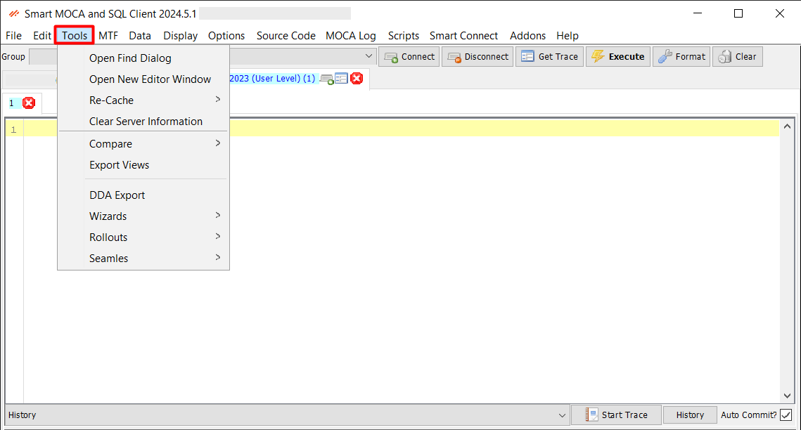

## Tools Menu Overview

The Tools menu in Smart MOCA Client provides a comprehensive set of utilities and functionalities to enhance productivity and streamline various tasks related to development, deployment, and integration. 

## Components

Below are the components of the Tools menu along with their descriptions:

### Open Find Dialog

This option allows us to find commands, policies, DDA's by searching by filename or text. To find anything simply go on tab and add the filename, or command name or DDA id etc, and press find.

---
### Open New Editor Window

The Open New Editor Window option in Smart MOCA Client allows you to open a MOCA Editor (not tied to any server). This feature provides a flexible and versatile environment for writing and testing your MOCA commands, scripts, and queries independently of any server connection.

---

### Re-Cache

The Re-Cache feature in Smart MOCA Client is designed to enhance your productivity by ensuring that the most up-to-date information is available in the completion dialogs and other interactive components of the application. This functionality is essential for keeping your development environment synchronized with the latest database schema and command structures.

1. Re-Cache Commands
    
    This option allows you to reload the list of available commands used in completion dialogs and other areas within the Smart MOCA Client. Keeping the command list updated ensures that you have access to the latest commands, including any new additions or modifications.

- To use this feature, navigate to Re-Cache > Re-Cache Commands. The system will automatically refresh the list of commands, making sure you have the most current information at your fingertips.

2. Re-Cache Tables
    
    This option allows you to reload the list of tables available in your database. Keeping the table list updated is crucial for accurately reflecting the current database schema, especially after making changes such as adding or removing tables.

 - To refresh the list of tables, go to Re-Cache > Re-Cache Tables. The application will update the table list, ensuring that your completion dialogs and other tools display the most accurate and current table information.

3. Re-Cache Table Columns
    
    This option allows you to reload the list of tables available in your database. Keeping the table list updated is crucial for accurately reflecting the current database schema, especially after making changes such as adding or removing tables.

- To update the list of table columns, select Re-Cache > Re-Cache Table Columns. The system will refresh the column information, making sure your development tools have access to the latest column structures.

---

### Clear Server Information

The Clear Server Information option in Smart MOCA Client enables you to clear cached information about the servers without affecting the cached commands, tables, or columns. 

This feature is particularly useful for maintaining an accurate and up-to-date connection with your servers, especially after making changes to server configurations or experiencing connection issues..

---

### Compare

The Compare feature in Smart MOCA Client is designed to help you efficiently identify differences and similarities between datasets, whether they reside on different servers or within local files. This functionality is crucial for tasks such as data validation, synchronization, and troubleshooting.

1. Compare Tables Between Instances
    
    This option allows you to compare data between two servers. By selecting two different server instances, you can quickly identify discrepancies and ensure data consistency across your environments.

- To use this feature, navigate to Compare > Compare Tables Between Instances, and follow the prompts to select the tables and instances you wish to compare. The results will highlight any differences, allowing you to take corrective action as needed.

2. Diff 2 Local Files
    
    This option allows you to compare data between two local files. Whether you need to check for changes in script versions, configuration files, or data exports, this tool provides a detailed comparison to help you understand the differences between the files.

- To utilize this feature, go to Compare > Diff 2 Local Files, and select the two files you wish to compare. The tool will generate a detailed report of the differences, allowing you to review and address any discrepancies efficiently.

---

### Export Views

The Export Views tool in Smart MOCA Client allows you to export database views to .sql script files. This functionality is essential for sharing, backing up, or deploying your database views across different environments.

---

### DDA Exports

The DDA Export tool in Smart MOCA Client facilitates the export of DDA (Dynamic Data Access) data into CSV files. This feature enables you to extract and save DDA data in a format that is easily readable and usable in various applications and platforms.

---

### Wizards

Wizards in Smart MOCA Client provide convenient and guided processes for performing specific tasks efficiently. These wizards streamline complex procedures and help users generate CSV files for various purposes with ease. Below are the wizards available:

1. DDA Wizard
    
    The DDA Wizard enables users to generate CSV files for new DDAs (Dynamic Data Access). By adding required data in the fields and pressing "add", users can quickly create CSV files containing dynamic data sets. 

2. Label Wizard
    
    The Label Wizard allows users to generate CSV files for new labels. With this tool, users can easily create CSV files containing label data for various purposes such as printing, labeling, or organizing items.

3. Report Wizard
    
    The Report Wizard empowers users to generate CSV files for new reports. This tool simplifies the process of report generation by guiding users through the steps required to specify report parameters and generate corresponding CSV files.

---

### Rollouts

Rollouts in Smart MOCA Client provide powerful tools for managing and organizing deployment tasks efficiently. These tools streamline the process of generating, merging, and analyzing rollout files. Below are the rollouts tools available:

1. Rollout Generator
    
    The Rollout Generator tool allows users to create rollout files easily. Follow these steps:

    > Steps for Rollout Generator

    1. Add Files: Drag files from Windows Explorer and drop them into the Rollout Generator.
    2. Name Rollout: Enter a name for the rollout.
    3. Generate: Click the "Generate" button to create a new rollout in the Oracular MOCA Client\Rollouts folder.
        -  All files in the list are added to the rollout
        -  db/data files are followed by a LOADDATA statement
        -  db/ddl files are followed by a RUNSQL/RUNMSQL/RUNSQLIGNOREERRORS statement

2. Rollout Merger
    
    The Rollout Merger tool enables users to merge files into one rollout according to the specified order. Follow these steps:

    > Steps for Rollout Merger

    1. Open Tool: Access the Rollout Merger from the Oracular MOCA Client Tools menu.
        - If the current server lacks the file $LESDIR/scripts/ossi_rollout.pl, an error will be reported, and the tool will close.
    2. Add Folders: Drag and drop folders into the window that appears.
    3. Specify Destination: Enter a destination directory into the text box.
    4. Generate: Click the "Generate" button.
        - All files from the rollouts in the list are merged into one rollout following the order specified.
        - The generated script contains REPLACE statements for each file not removed by the end of the list.
        - RUNSQL/RUNMSQL/RUNSQLIGNOREERRORS statements are included for each db/ddl file based on the extension.
        - LOADDATA *.csv statements are added for each db/data directory.
        - The script concludes with MBUILD and REBUILD LES.
        - %LESDIR/scripts/ossi_rollout.pl is downloaded and saved as rollout.pl in the merged rollout directory.
    5. Open Directory: The merged rollout directory opens.

3. Rollout Log Parser
    
    The Rollout Log Parser tool in Smart MOCA Client enables users to parse log files generated during rollout processes, allowing them to identify and analyze errors and issues within rollout files. This feature is essential for troubleshooting and debugging rollout operations, ensuring the successful deployment of changes and updates.

---

### Seamles

Seamles tools in Smart MOCA Client provide functionalities for parsing various types of files produced by the Integrator module. These tools streamline the process of analyzing and extracting information from Seamles logs and SLExp files. Below are the Seamles tools available:

1. Parse Seamles Log
    
    The Parse Seamles Log tool enables users to parse log files produced by the Integrator module. This tool is essential for analyzing Seamles integration processes and diagnosing any issues or errors encountered during integration tasks.

2. Parse SLExp
    
    The Parse SLExp tool allows users to parse .slexp files generated by the Integrator module. SLExp files contain exported data and configurations from Seamles integration tasks, and parsing these files enables users to extract and analyze the exported data and settings.

