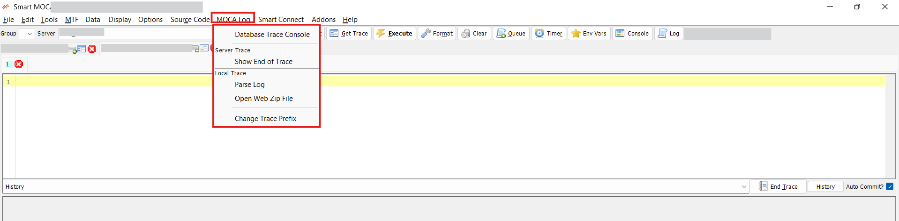
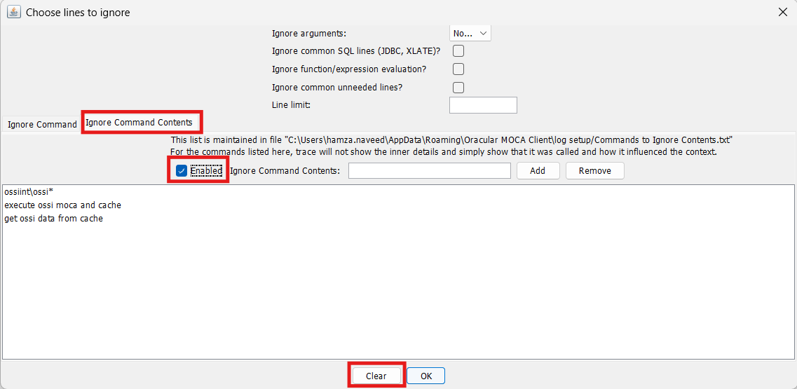

# MOCA Log
The **MOCA Log** section in the Smart MOCA Client provides a set of tools for analyzing, parsing, and interacting with trace and log files generated by the MOCA.

- To access the log tools, click on **MOCA Log** from the main toolbar to open the **Log Menu**.

    

## Database Trace Console
The **Database Trace Console** allows users to parse trace files located on the server and load their contents into structured database tables for further analysis

- This functionality is especially useful when dealing with large or complex trace logs, where manual inspection would be inefficient.
    

**Key Features:**
- Supports parsing of server-side trace files.
- Automatically structures log data into custom database tables.
- Enhances visibility into system-level database interactions.
- Assists in debugging and performance tuning efforts.

## Show End of Trace
The **Show End of Trace** function allows users to quickly view the tail end of a trace file.
- This is particularly useful when monitoring the most recent entries in a log to troubleshoot live or recent events.

    

**How to Use:**
- Enter the name of the trace file in the input field.
- Click on OK to load and view the most recent portion of the file.

    

## Parse Log
The **Parse Log** tool opens a dedicated window for parsing a selected trace or log file. 
- Within this interface, users can configure parsing options, such as excluding certain default selections, to tailor the analysis output.

    

**Steps:**
- Uncheck default selections (e.g., unnecessary checkboxes) to refine the parsing criteria.
- Open the trace file for parsing based on the updated options.

    
    

**Purpose:**

- Breaks down trace files into structured formats for detailed analysis.
- Filters out noise and focuses on the most relevant sections of the log.

## Open Web Zip File

The **Open Web Zip File** option enables users to open a .zip file containing logs or traces that were downloaded or saved from a web-based interface or external source.

- Opens ZIP files with logs or traces from external sources.
    

**Usage:**

- Browse your local system to select and open the zipped file.
- Useful when logs are exported from different environments or shared for offline analysis.

**Benefits:**

- Provides an easy way to access and inspect archived log data.
- Supports seamless integration with logs retrieved via web portals or diagnostic exports.

## Change Trace Prefix
The Change Trace Prefix tool allows users to modify the prefix of a trace file. 

- This feature is helpful for organizing trace files by naming conventions or distinguishing between multiple logs during troubleshooting.

    

**How to Use:**

- Enter the name of the trace file for which the prefix needs to be changed.
- Click on OK to apply the new prefix.

    

**Advantages:**

- Simplifies log management by maintaining consistent and identifiable file names.
- Avoids overwriting or confusion between different trace sessions.
- Helps in categorizing logs by function, user, or session.

