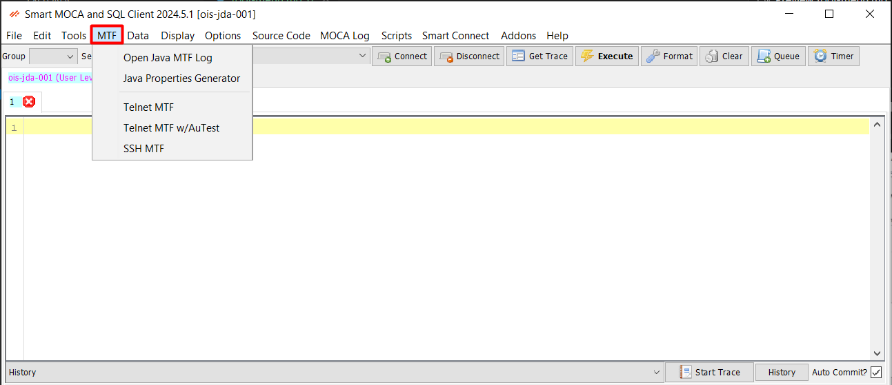

## MTF Menu

The MTF menu in Smart MOCA Client provides tools for managing various tasks related to MTF (Multi-Tasking Facility) operations. 

### MTF Menu Components

Below are the components of the MTF menu along with their descriptions:

 Open Java MTF Log 

The Open Java MTF Log tool allows users to open MTF Java logs for analysis and troubleshooting. This feature provides insights into Java-related activities within the MTF environment, helping users diagnose issues and optimize performance.

 Java Properties Generator 

The Java Properties Generator is a graphical user interface (GUI) tool used to set the layout in a .properties file. Follow these steps to use the Properties Generator:

> Steps for Properties Generator

1. Start by entering the frm_id in the text field on top, then select Add -> Entry Field for each entry field on the form.
2. Select Add -> Label for each label on the form.
3. Position the entry fields and labels by clicking on the blue box (hold Ctrl to select multiple fields).
4. Drag to move the fields; use the left key to reduce width and the right key to increase width.
5. Use Edit -> Justify to change the justification of the text to Left, Center, or Right.
6. If a field is dragged outside the form bounds, edit the .properties file manually.
7. Select File -> Save when done to save it to a .properties file.

 Telnet MTF 

The Telnet MTF tool allows users to open Telnet connections, facilitating communication with remote systems or devices. This feature is useful for performing administrative tasks, accessing command-line interfaces, or troubleshooting network issues.

 Telnet MTF w/AuTest 

The Telnet MTF w/AuTest tool allows users to open Telnet connections with AuTest support. AuTest is a testing framework that enables automated testing of Telnet-based applications, enhancing efficiency and reliability in testing scenarios.

 SSH MTF 

The SSH MTF tool allows users to open SSH (Secure Shell) connections, providing secure access to remote systems or devices over a network. SSH is widely used for secure command-line access, file transfer, and tunneling capabilities, ensuring data confidentiality and integrity during communication.

