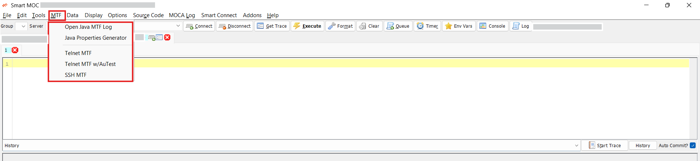
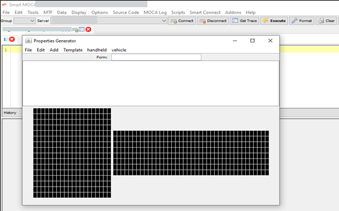
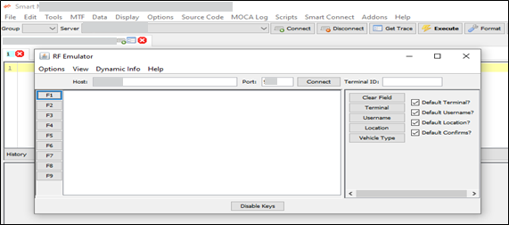
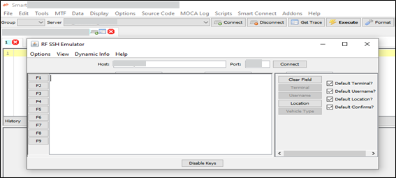

# MTF Menu

The MTF menu in Smart MOCA Client provides tools for managing various tasks related to MTF (Multi-Tasking Facility) operations. 

## MTF Menu Components

Below are the components of the MTF menu along with their descriptions:
- **Open Java MTF Log**
- **Java Properties Generator**
- **Telnet MTF**
- **Telnet MTF w/AuTest**
- **SSH MTF**

Each of these tools is explained in detail below.

## Open Java MTF Log:

The Open Java MTF Log tool enables users to open and review Java log files generated by the MTF system. These logs are critical for diagnosing application issues, analyzing system behavior, and understanding the flow of operations at a Java level.

### Key Features:

- Provides visibility into backend Java processes and command executions.
- Useful for debugging errors, performance bottlenecks, or unexpected behavior within MTF-based applications.
- Helps identify exceptions, log traces, and event timelines for better root cause analysis.
- Supports system optimization by revealing potential configuration or processing inefficiencies.

This tool is invaluable for developers and support teams needing deep insight into the internal workings of the Java runtime environment within Smart MOCA.

## Java Properties Generator:

The Java Properties Generator is a graphical user interface (GUI)-based utility that allows users to create and manage the layout of UI forms within a .properties file. This file format is used to define how entry fields and labels are visually arranged on forms used in Smart MOCA applications.

### Steps for Properties Generator

- Start by entering the **frm_id** in the text field on top, then select **Add** -> **Entry Field for each entry field** on the form.
- Select **Add** -> **Label for each label** on the form.
- Position the entry **fields** and **labels** by clicking on the **blue box** (hold Ctrl to select multiple fields).
- Drag to move the fields, use the left key to reduce width and the right key to increase width.
- Use **Edit** -> **Justify** to change the justification of the text to **Left**, **Center**, or **Right**.
- If a field is dragged outside the form bounds, edit the .properties file manually.
- Select **File** -> **Save** when done to save it to a .properties file.

## Telnet MTF:

The Telnet MTF tool provides a built-in interface for opening Telnet sessions from within the Smart MOCA Client. Telnet is a protocol used to remotely connect to servers or devices using a command-line interface.

### Key Use Cases:

- Perform system-level administrative operations on remote servers.
- Execute MOCA commands directly on backend environments.
- Troubleshoot network-connected devices or services in real time.
- Quickly test connectivity or validate service responses via terminal.

Although Telnet is considered less secure than SSH, it remains a useful tool in controlled environments for rapid, command-line interaction without encryption overhead.

## Telnet MTF w/AuTest:

The Telnet MTF w/AuTest tool extends the functionality of a regular Telnet session by integrating with AuTest, an automated testing framework tailored for Telnet-based interactions.

### Benefits and Features:

- Enables scripted, repeatable testing scenarios for Telnet-connected systems.
- Reduces manual effort by automating input commands and validating responses.
- Ideal for regression testing of Telnet-based applications and interfaces.
- Enhances reliability and test coverage across deployments and environments.

This tool is particularly useful for QA engineers and developers who need to validate the behavior of applications under test conditions, ensuring stability across releases.

## SSH MTF:

The SSH MTF tool allows users to initiate SSH (Secure Shell) sessions directly from Smart MOCA, providing secure, encrypted access to remote systems.

### Why Use SSH MTF:

- Ensures secure communication via encrypted data transmission.
- Supports command-line access for administrative and development purposes.
- Allows for secure file transfers using SCP/SFTP protocols.
- Can be used for remote configuration, monitoring, or troubleshooting tasks.

SSH is a best-practice standard for remote system access, offering confidentiality, integrity, and secure authentication—making this tool ideal for production environments and sensitive operations.

