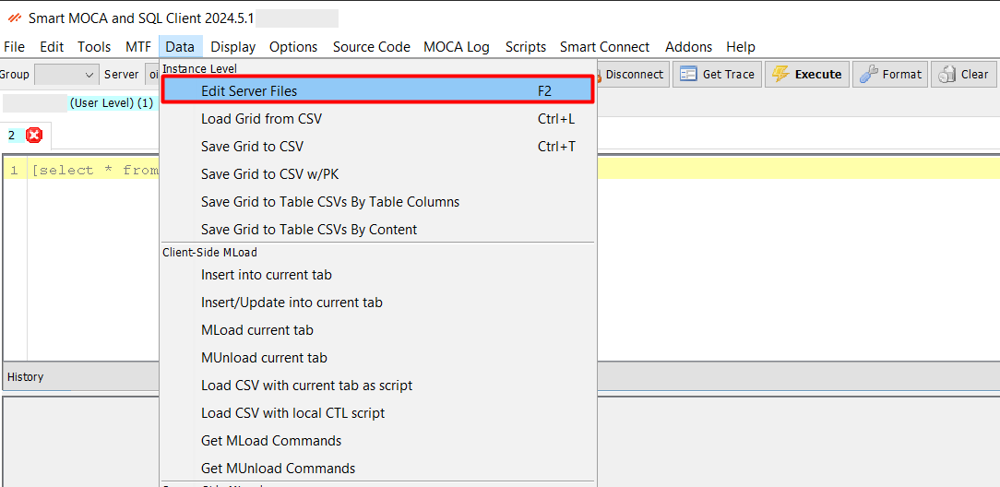
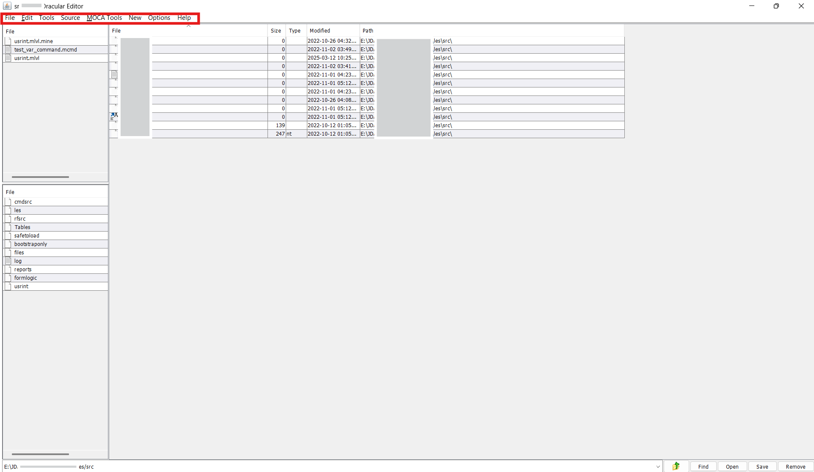
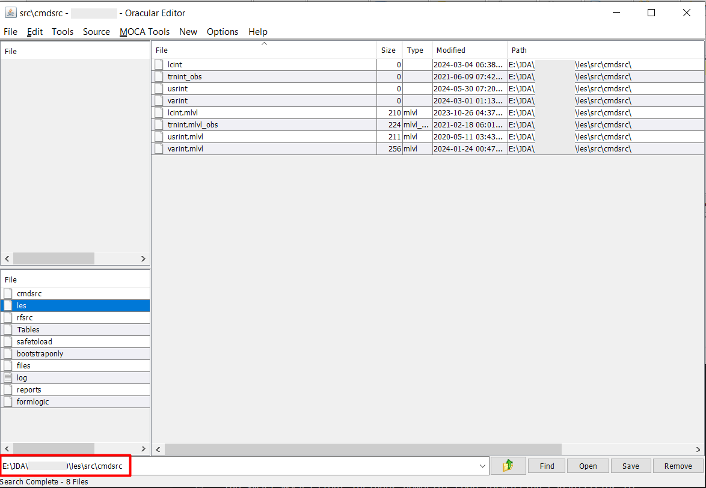

# Oracular File Manager
The Oracular File Manager in the Smart MOCA Client provides a comprehensive set of functionalities that support efficient file navigation, organization, and management.

## Maintaining File System Objects
This section outlines how users can effectively utilize the File Browser for accessing and managing file system objects like commands, reports, logs, and custom scripts.

### File Navigation

- Navigate to **Data** --> **Edit Server Files** or press **F2** to launch **File Browser**. 

  

- File Browser will get open where you can see all the directories and files.

- Within this window, users can easily view and manage **Files**, **Folders**, **Commands**, **Reports**, **Logs**, and more.

  

### Functions in the File Browser

- At the top of the File Browser, several tabs are available to enhance user productivity:

    - **File:** Open, close, or save new and existing files.
    - **Edit:** Perform standard editing operations such as cut, copy, paste, convert text to uppercase or lowercase, and more.
    - **Tools:** Used for actions such as creating new directories.
    - **Source:** Allows users to shift text, convert character sets, or remove non-ASCII characters from the file content.
    - **MOCA Tools:** Offers options to add arguments, define exceptions, validate, and format MOCA commands.
    - **New:** Provides options to create new MOCA objects like commands, triggers, tables, and even modify schema by adding or dropping columns.
    - **Options:** Modify interface settings such as enabling enter key modifiers or adjusting font size multipliers.
    - **Help:** Provides assistance and reference material related to File Browser usage.

    

### Understanding Directories and File Structure.

- The start directory is $LESDIR/src/cmdsrc.
- Within this directory, you’ll find key subfolders such as: 

    - **usrint:** Contains all custom commands developed by users for project-specific enhancements or extensions.

    - **varint:** Standard system commands provided by the application or created by system administrators. This directory should generally remain unmodified to maintain system stability.

    - **usrint.mlvl / varint.mlvl:** These define the command levels and execution sequences. For example, you can determine which custom or standard command runs first during a transaction or trigger.

    

### Working with usrint Directory

- For any customizations or new command development, the usrint directory is used.

- This is where modified versions of existing commands or entirely newly created commands can be placed.

    

### Working with varint Directory

- varint directory serves as the location for all predefined system commands

- This directory should remain unchanged to preserve the integrity of system defaults.

    

- usrint and varint lvls can define the levels for command and trigger execution, which command to be executed first and which is next.

### Key Features 

- Browse directories and files seamlessly.
- Perform various file operations such as opening, editing, deleting, and moving files.
- Access detailed file information and properties.
- Execute file-related commands directly from the browser.

This feature provides an intuitive interface for users to efficiently manage their files and directories, ensuring easy access and organization.

