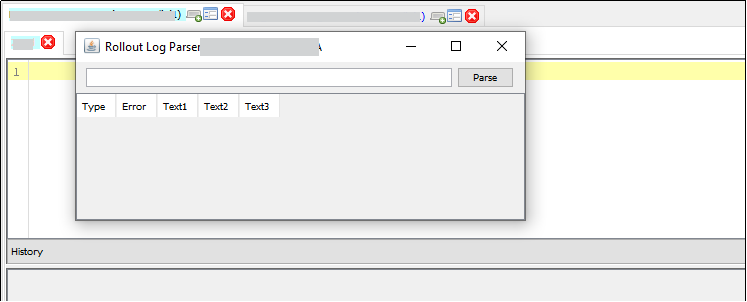

# Rollouts

A **Rollout** in the **Smart MOCA Client** is a structured package that consolidates all essential elements such as commands, files, tables, triggers, and configurations—that are required to be deployed as part of a release or system update.

## Accessing Rollouts from MOCA
- To begin working with rollouts in MOCA:

    - Navigate to Tools in the menu bar.
    - Click on Rollouts, which presents three primary rollout tools:
        1. **Rollout Generator:** Used to create rollout packages by bundling selected files and configurations.
        2. **Rollout Merger:** Combines multiple rollout files into a single consolidated package, preserving their order and dependencies.
        3. **Rollout Log Parser:** Enables parsing of rollout log files for identifying and analyzing errors or inconsistencies in deployment.

    

## Rollout Generator

The Rollout Generator provides a user-friendly interface to create rollout packages from selected development components.

### Steps to Generate a Rollout:
- **Drag & Drop Files:**
    - Open Windows Explorer and drag the required files (commands, scripts, configurations, etc.) into the Rollout Generator window.

    

- **Assign Rollout Name:**
    - Enter a meaningful name for the rollout in the input field.

- **Generate the Rollout:**
    - Click the Generate button. A new rollout package will be created and stored in the following location: SmartMocaClient\config\swm

    

## Rollout Merger

The Rollout Merger tool is used to consolidate multiple rollout files into a single, well-structured rollout package.

### Steps to Merge Rollouts:

- Open this from Oracular MOCA Client Tools menu.
    - If the server does not contain the required file $LESDIR/scripts/ossi_rollout.pl, the tool will display an error and exit.
    
    

- **Drag & Drop Rollout Folders:**
    - Drop your desired rollout folders into the active window.

- **Specify Destination Directory:**
    - Enter the path where the merged rollout should be saved.

- Click **"Generate":**

    - The tool merges the contents of all rollout files in the specified order and performs the following:
        - Generates REPLACE statements for all unique files.
        - Adds appropriate RUNSQL, RUNMSQL, or RUNSQLIGNOREERRORS statements for database scripts based on their file extensions.
        - Includes LOADDATA *.csv commands for all CSV files in the db/data directories.
        - Appends MBUILD and REBUILD LES to finalize the rollout.
        - Downloads and saves the script %LESDIR/scripts/ossi_rollout.pl as rollout.pl in the merged rollout directory.
- Once completed, the merged rollout directory will automatically open for review and further actions.

## Rollout Log Parser
- The Rollout Log Parser is a diagnostic utility used to parse and examine log files generated during rollout execution.

    - It helps in identifying any errors, skipped commands, or processing issues that occurred during the rollout.

    - This tool enhances debugging and validation, ensuring successful deployment.

    

## Rollout DB 

The Rollout DB interface allows for direct management of rollout entries, including the manual addition of rollouts and version control operations.

### Accessing Rollout DB:

- Navigate to Addons → Smart Innovations → Rollouts to open the Rollout DB management window.

    

### Available Actions in Rollout DB:

- Add: Manually add a new rollout by providing a rollout name and confirming with the OK button.
- Delete: Remove selected rollouts from the list.
- Build Local: Compile and apply rollout changes locally within the environment.
- Build Remote: Deploy rollout changes to a remote environment.
- Remove Selected: Unlink or delete selected rollout entries from the system.

    

### Manual Rollout Creation:

- Enter the **Name** of the new rollout in the input field.
- Click **OK** to save and add it to the rollout database.

    

