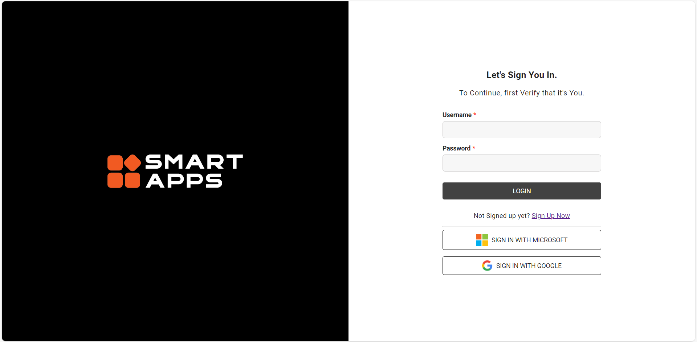
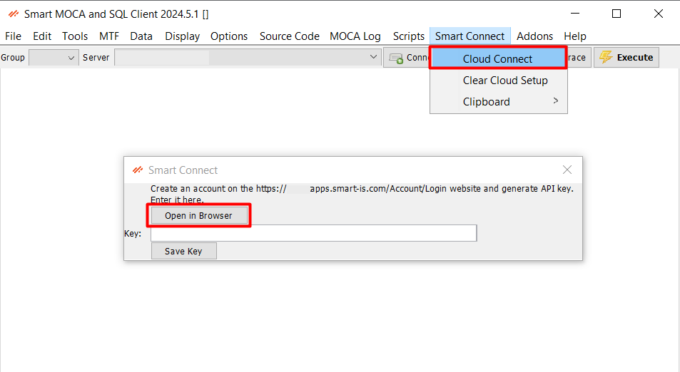
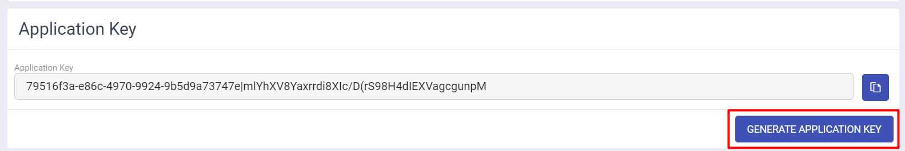
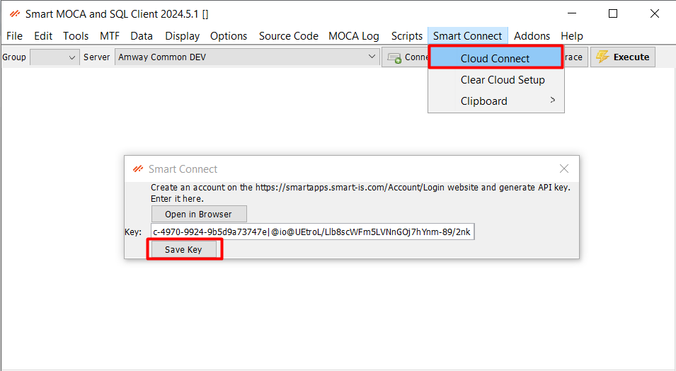

## Smart Apps Connectivity

The **Cloud Connect** feature in Smart MOCA Client simplifies the process of managing licenses and accessing key information for add-ons. 

By following the steps outlined in this documentation, users can easily generate and use app keys to ensure their software is fully licensed and up-to-date.

### Key Features

- **Seamless Integration**: Direct access to the AppSmart website from within Smart MOCA Client.
- **Profile Management**: Navigate to your profile page on AppSmart to view and update your information.
- **App Key Generation**: Generate an app key that includes all the license information for your user account and add-ons.
- **License Management**: Keep track of licenses for different features and add-ons within Smart MOCA Client.

---

## Register on SmartApps

- Visit the [SmartApps registration page](https://apps.smart-is.com/).
- Fill out the registration form with the required information.
- Verify your email address to complete the registration process.

  

### Generating Your App Key

- From the Smart Connect menu, select the "Cloud Connect" option and press **Open in Browser** button. This will open a new browser tab and redirect you to the Smart Apps website.
  
  

- Now enter your login credentials to access your smart app account.
- Once logged in, navigate to your profile page. This is usually found in the user menu, accessible by clicking on your username or profile icon.
- Click the "Generate App Key" button. This action will create a new app key containing all your license information. Once the app key is generated, copy it to your clipboard.

  

### Using the App Key in Smart MOCA Client

- Go to the Smart Connect --> Cloud Connect from dropdown menu and enter key which is generated from website and press **Save Key** button.

  

- Smart MOCA Client will now have access to all the licensed features and add-ons associated with your account.

---

## Troubleshooting

- **Unable to Access AppSmart**: Ensure you have an active internet connection and that the AppSmart website is not experiencing downtime.
- **App Key Generation Issues**: If you encounter errors while generating the app key, contact AppSmart support for assistance.
- **License Activation Problems**: If the app key does not activate the expected features, verify that the key was copied correctly and try again.

Note: For further assistance, please refer to the Smart MOCA Client support resources or contact our support team.
