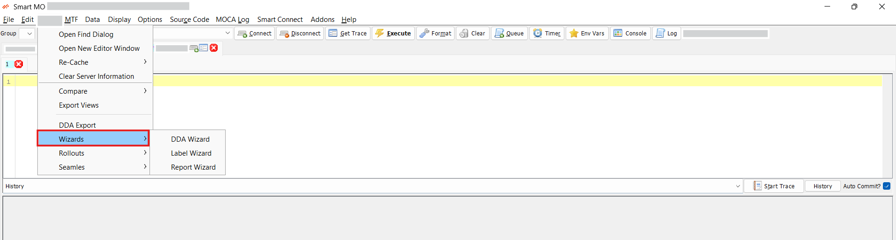
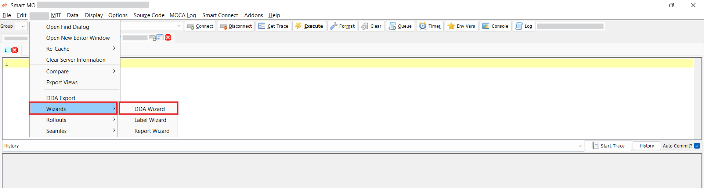
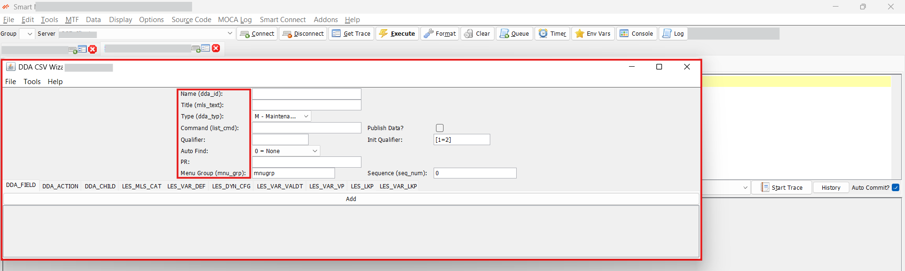
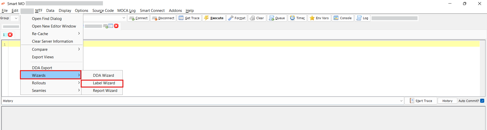
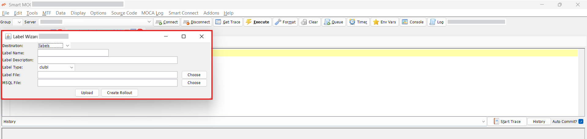
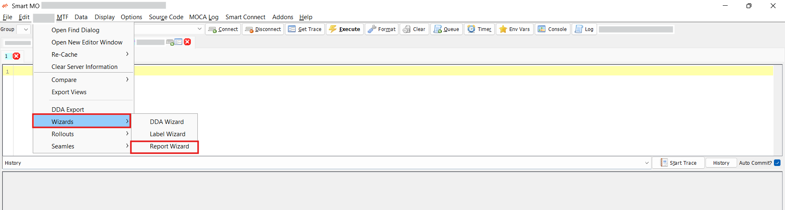
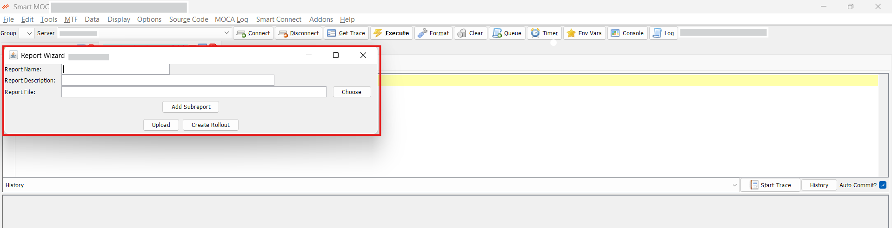

## Wizards

Smart MOCA Wizards enable the creation of **Data Driven Applications (DDAs)** for tasks like exporting data to CSV. Using a guided, no-code interface, users can define queries, configure output fields, and generate CSV files directly from the application simplifying data extraction without custom development.

### Accessing Wizards from MOCA
- To begin working with Wizard in MOCA:

    - Navigate to **Tools** in the menu bar.
    - Click on **Wizard**, which presents three primary Wizard tools:
        1. **DDA Wizard:** This tool allows us to generate CSVs for a new DDA, to do so add required data in fields and press add.
        2. **Label Wizard:** This tool allows us to generate csv for new labels.
        3. **Report Wizard:** This tool allows us to generate csv files for new reports.

    

### DDA Wizard

Facilitates the creation of CSV files for new Data Driven Applications by entering the necessary details and submitting the form.

#### Steps for DDA Wizard

- **Open the Wizard:**
    - Navigate to **Tools** > **Wizard** > **DDA Wizard**.
        
    - A new window will open, providing a form where you can input the required information for your new DDA.

- **Enter the Required Details:**
    - **Name:** The internal identifier for the DDA.
    - **Title:** The display name that users will see in the interface.
    - **Type:** Specifies the nature of the application (e.g., query, maintenance, etc.).
    - **Command:** Defines the controller command that executes the desired backend logic.
    - **Group:** Categorizes the DDA for organization and access control.

    

- **Add the DDA:**
    - Once all the required fields are filled out, click on the **Add** button to generate the CSV file and create the DDA entry.

### Label Wizard

Designed to export structured CSVs for defining new labels within the application.

#### Steps for Label Wizard

- **Open the Wizard:**
    - Navigate to **Tools** > **Wizard** > **Label Wizard**.
        
    - A new dialog will open prompting you to fill in the label details.

- **Enter the Required Details:**

    - **Destination:** The target module or system where the labels will be used.
    - **Name:** A unique identifier for the label.
    - **Description:** A brief explanation of the label’s purpose.
    - **Type:** Specifies the type of label (e.g., static, dynamic, etc.).
    - **File Upload:** Upload label definition files such as .label or .msql files.

    

- **Upload the Label Data:**
    - After entering the information and attaching the relevant files, click the Upload button to create the CSV file and import the label definitions into the system.

### Report Wizard

Streamlines the setup of new reports by generating corresponding CSV files for easy configuration and import.

#### Steps for Report Wizard
- **Open the Wizard:**
    - Navigate to **Tools** > **Wizard** > **Report Wizard**.
        
    - A new window will open where you can input the necessary report details.

- **Enter the Required Details:**

    - **Name:** A unique identifier for the report.
    - **Description:** A brief explanation of what the report contains or is intended to show.
    - **File Upload:** Attach the file containing the report definition (typically a CSV, XML, or compatible configuration file).

    

- **Upload the Report:**
    - After filling in the necessary information and uploading the appropriate file, click the Upload button to generate the report configuration in the system.

